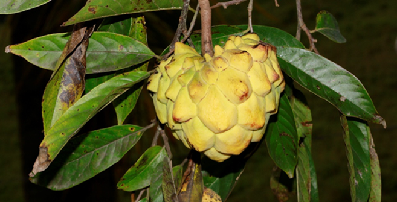
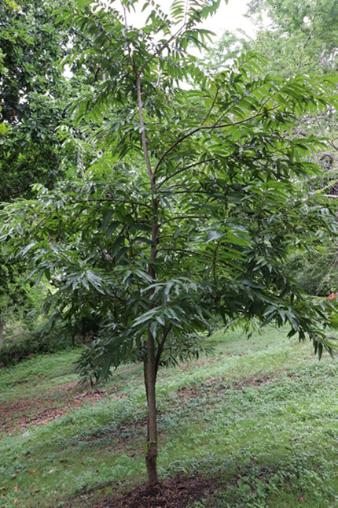
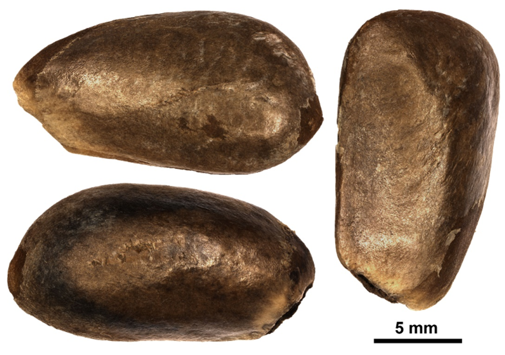
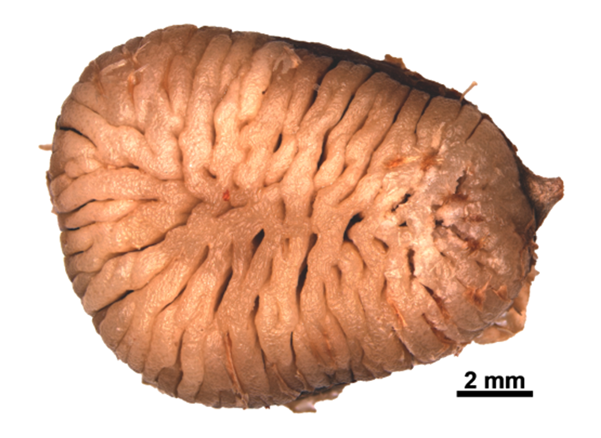
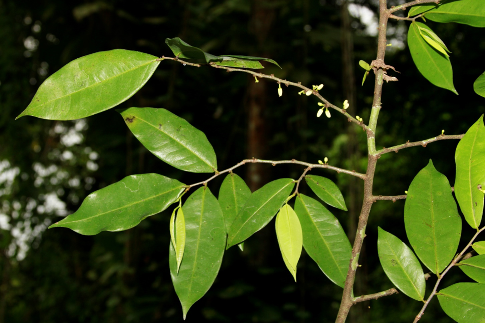
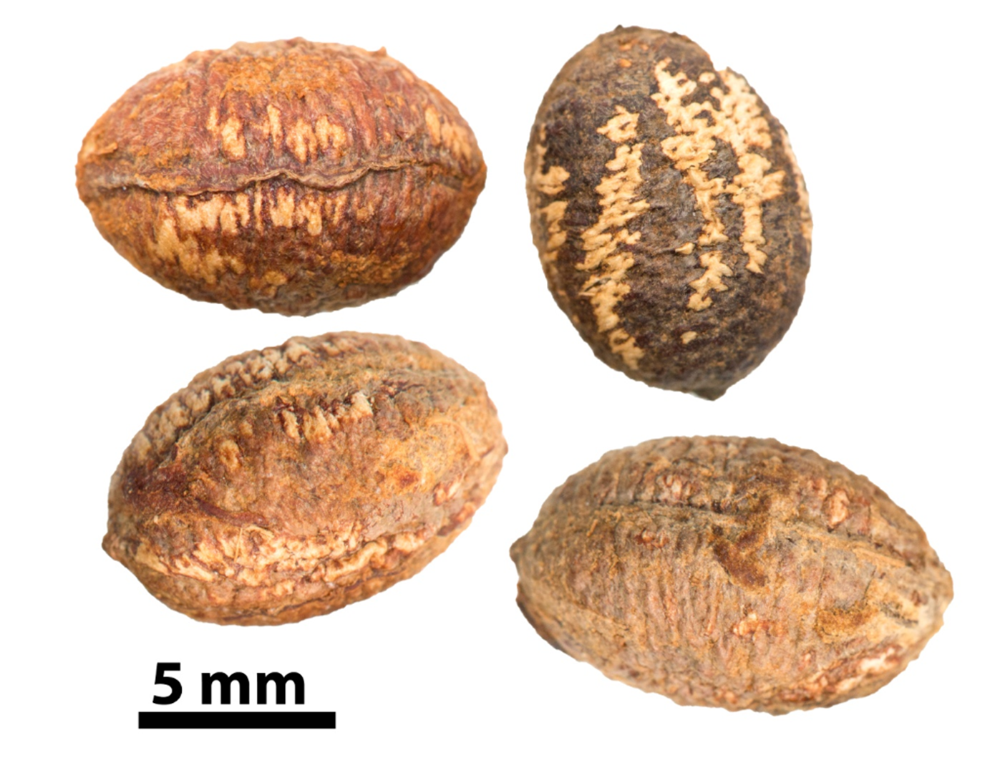

# (PART\*) FICHAS {.unnumbered}

# Annonaceae {.unnumbered}

## *Annona mucosa* Jacq. {#mucosa .unnumbered}

::: {.blackbox data-latex=""}
**Candongo, candón, aguacatillo, anón**
:::

<br>

**Sinónimos**: *Rollinia mucosa* (Jacq.) Baill., *Annona obtusifolia* DC., *Rollinia deliciosa* Saff.

**Forma de vida**: árbol o arbolito.

**Estatus** **biogeográfico**: nativa de Mesoamérica, el norte de América del Sur, las islas La Española y Puerto Rico.

**Estado de conservación**: [En Peligro (EP/EN).]{style="color: red;"}

Las poblaciones se han reducido drásticamente debido a la destrucción de su ambiente.

**Usos**: maderable y comestible. La madera es amarillenta, dura, fuerte y pesada. El fruto es comestible con pulpa babosa.

```{r,echo=FALSE,fig.cap="Fruto de *Annona mucosa* (Foto: F. Jiménez, JBN)",out.width = "100%"}


```

### DESCRIPCIÓN DE LA PLANTA {.unlisted -}

Árbol o arbolito de hasta 15 m. Hojas elípticas a lanceoladas de 12-25 cm, agudas estrechadas hacia el ápice. Inflorescencia opuesta a las hojas, sentadas, sépalos redondo-aovados, agudos. Corola de 2-3 cm de diámetro, blancuzca. Frutos globulosos, un sincarpo de hasta 10 cm de diámetro, areolado-tuberculado.

**Floración y fructificación**: flores de septiembre a marzo y frutos de mayo a diciembre.

**Distribución**: provincias de Elías Piña, Monseñor Nouel, San Cristóbal, San José de Ocoa, Sánchez Ramírez y Santiago Rodríguez.

**Hábitat**: bosques húmedos.

```{r,echo=FALSE,fig.cap="Árbol de *A. mucosa* (Foto: B. Peguero, JBN)",out.width = "100%"}

```

### CONSERVACIÓN DE LAS SEMILLAS {.unlisted -}

**Colecta de semillas:** de septiembre a diciembre

**Procesamiento y manejo:** las semillas se extraen de los frutos con una despulpadora y agua potable para eliminar la pulpa. Luego usando tamices de 3.35 mm se separan los residuos frotándolas suavemente con un tapón de hule o goma.

**Tolerancia a la deshidratación:** las semillas toleran la desecación, son ortodoxas, aunque el porcentaje de germinación es menor del 41.3% en el lote usado en este estudio, lo que podría deberse a condiciones no óptimas de germinación.

```{r,echo=FALSE,out.width = "100%"}

```

```{r,echo=FALSE,fig.cap="Semillas con (arriba) y sin testa (abajo) de *A. mucosa* (Foto: P. Gómez Barreiro, RBG Kew)",out.width = "100%"}

```

### PROPAGACIÓN {.unlisted -}

**Dormancia y pretratamientos:** las semillas requieren ser sumergidas en agua durante un día antes de la siembra. Germinación, siembra y propagación: en condiciones de laboratorio, las semillas presentan una viabilidad del 93%, y una germinación del 88%. La germinación se inicia entre los 32-48 días y finaliza a los 24-27 días después.

**Propagación y comportamiento en vivero:** las semillas se siembran directamente en macetas (aprox. 30 cm) con sustrato formazo por tierra negra, aserrín y estiércol (2:1:1) o en camas de arena de 1.4 mm. Esta especie es muy exigente en términos de humedad y puede crecer en suelos húmedos o muy húmedos, arcillosos y de roca caliza. Se puede sembrar todo el año. Cuando las plantas están bien desarrolladas, es posible moverlas a macetas más grandes si es necesario, o directamente en el suelo, lo que permite el correcto desarrollo de las raíces. Se sugiere aplicar riego cada 1-2 días. La adición de limo o fertilizantes orgánicos puede mejorar el establecimiento y crecimiento. La siembra en campo se realiza entre los 2-3 meses, cuando alcanza una altura de 35 a 45 cm.

**Propagación vegetativa:** se puede reproducir por injerto.

### COMERCIO {.unlisted -}

Los frutos se venden en los mercados populares, son muy sabrosos y tienen mucha demanda.

## *Oxandra laurifolia* (Sw.) A. Rich. {#oxandra .unnumbered}
 
::: {.blackbox data-latex=""}
**Yaya, yaya blanca**
:::

<br>

**Sinónimos:** *Uvaria laurifolia* Sw. 

**Forma de vida:** árbol.

**Estatus biogeográfico:** nativa de las islas del Caribe.

**Estado de conservación:** sin evaluar.

**Usos:** maderable, medicinal y forraje. La madera es de uso común en carpintería y ebanistería, carbón y leña.

```{r,echo=FALSE,fig.cap="Detalle de rama fértil de *Oxandra laurifolia* (Foto: F. Jiménez, JBN)",out.width = "100%"}

```


### DESCRIPCIÓN DE LA PLANTA {.unlisted -}

Árbol de hasta 25 m. Hojas oblongo-elípticas de 8-19 cm, acuminadas. Flores axilares, lóbulos de cáliz semiovales, pétalos exteriores oblongos y oblongo-elípticos de 6-7 mm. Baya elipsoidal de 15-17 mm de longitud.

**Floración y fructificación:** Flores de mayo a agosto y frutos de agosto a octubre.

**Distribución:** frecuente en toda la isla.

**Hábitat:** bosque húmedo de baja o mediana elevación.

```{r,echo=FALSE,fig.cap="Árbol de *O. laurifolia* (Foto: P. Gómez Barreiro, RBG Kew)",out.width = "100%"}
knitr::include_graphics("figures/oxandra_laurifolia2.png")
```

### CONSERVACIÓN DE LAS SEMILLAS {.unlisted -}

**Colecta de semillas:** de octubre a noviembre.

**Procesamiento y manejo:** las semillas se extraen de los frutos con una despulpadora y agua potable durante 30 segundos para eliminar la pulpa. Luego usando un tamiz de 3.36 mm se separan los residuos frotándolas suavemente con un tapón de hule o goma.

**Tolerancia a la deshidratación:** no hay datos disponibles en la literatura para la especie, sin embargo las semillas de Oxandra lanceolata parecen tolerar la desecación. Se requiere más investigación sobre el comportamiento de almacenamiento de estas semillas.

```{r,echo=FALSE,fig.cap="Semillas de *O. laurifolia* (Foto: P. Gómez Barreiro, RBG Kew)",out.width = "100%"}

```

### PROPAGACIÓN {.unlisted -}

**Dormancia y pretratamientos:** las semillas requieren ser sumergidas en agua durante un día antes de la siembra.

**Germinación, siembra y propagación:** en condiciones de laboratorio, las semillas presentan una viabilidad del 96% y una germinación del 74% en semillas frescas. Esta especie inicia la germinación entre los 18-23 días y finaliza a los 17-25 días después.

**Propagación y comportamiento en vivero:** las semillas se siembran directamente en macetas (aprox. 30 cm) con un sustrato de tierra negra, aserrín y estiércol (2:1:1) o en camas con arena de 1.40 mm. Esta especie es muy exigente en términos de humedad y puede crecer en suelos húmedos o muy húmedos, arcillosos y de roca caliza. Se puede sembrar todo el año. Cuando las plantas están bien desarrolladas, es posible moverlas a macetas más grandes si es necesario, o directamente en el suelo, lo que permite el correcto desarrollo de las raíces. Se sugiere aplicar riego cada 1-2 días. La adición de limo o fertilizantes orgánicos puede mejorar el establecimiento y crecimiento. La siembra en campo se realiza entre los 3-4 meses, cuando alcanza una altura de 35 a 45 cm.

**Propagación vegetativa:** no se han sometido a estudios de propagación vegetativa y no se conocen protocolos.

### COMERCIO {.unlisted -}

No se conoce comercio registrado.


