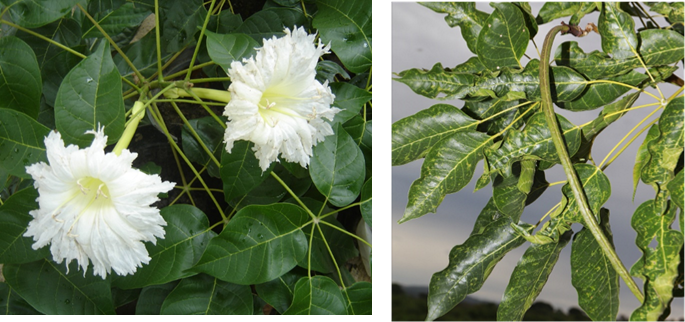
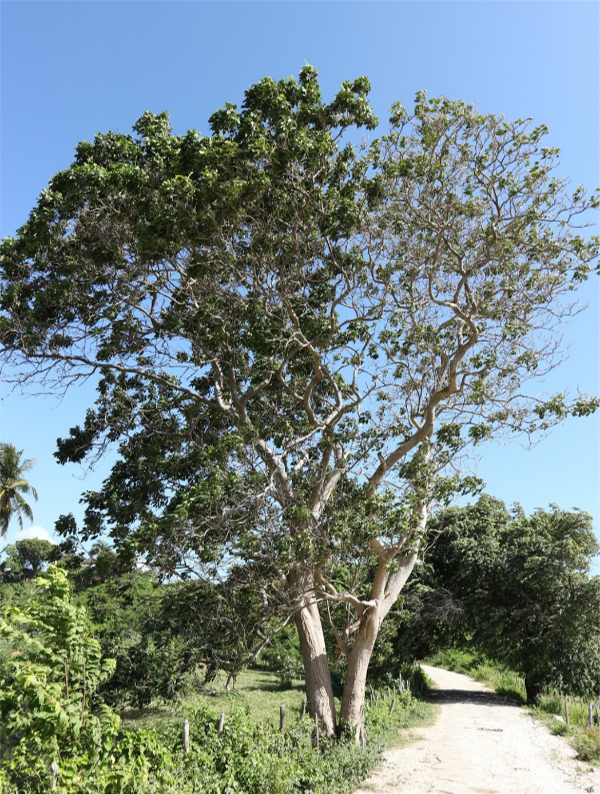
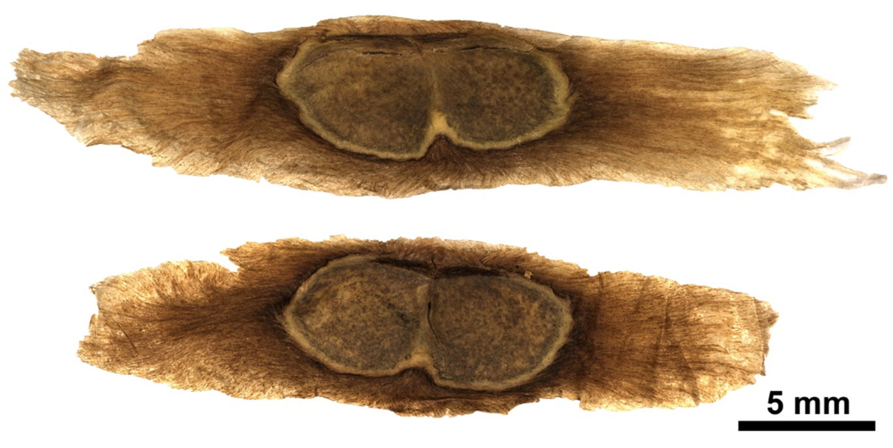
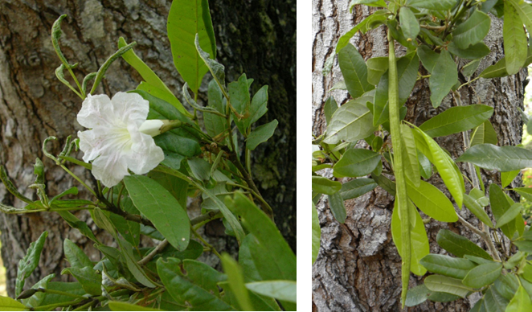
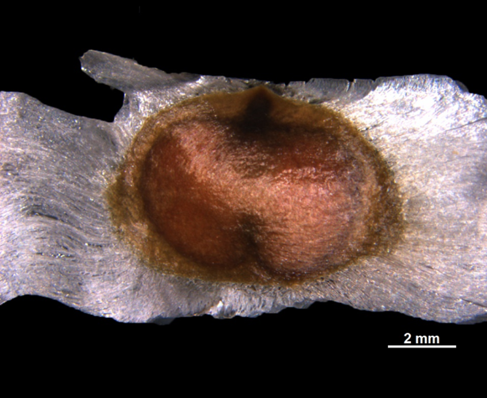
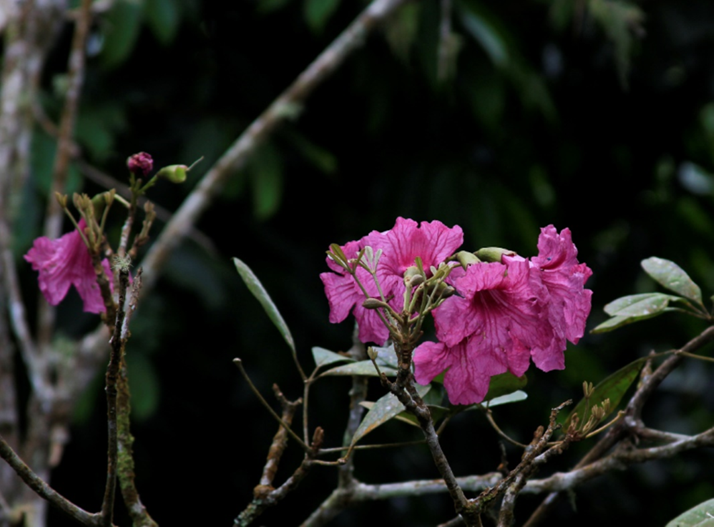
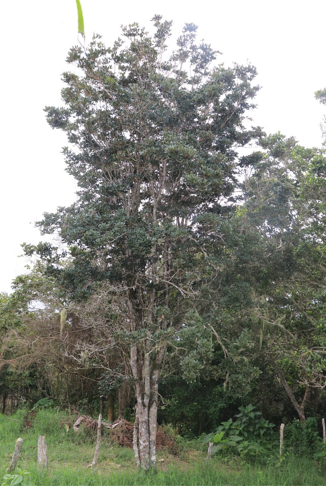
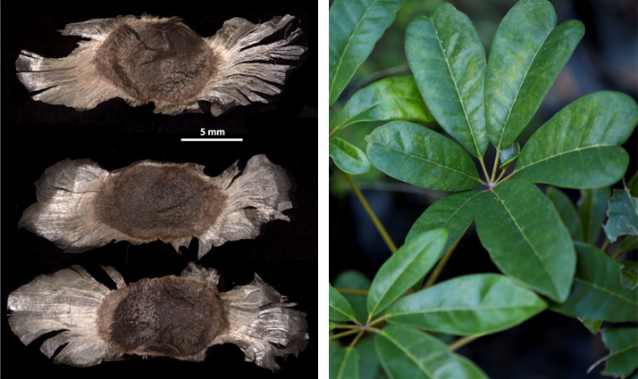
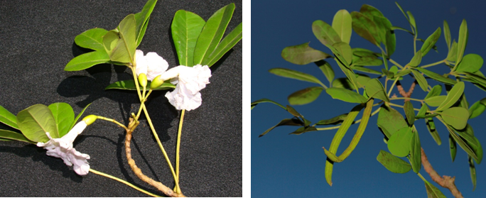
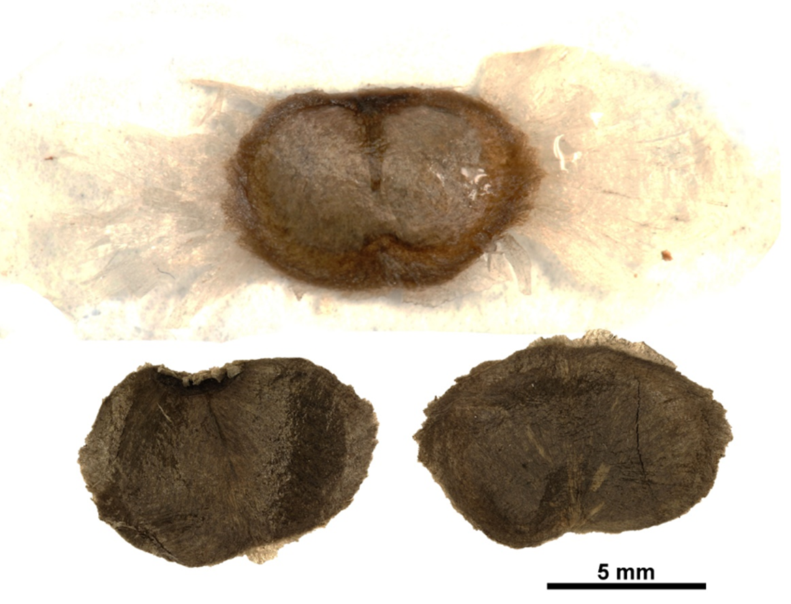

# Bignoniaceae {.unnumbered}

## *Ekmanianthe longiflora* (Griseb.) Urb. {#ekmani .unnumbered}

::: {.blackbox data-latex=""}
**Robillo, roble de Puerto Rico**
:::

<br>

**Sinónimos:** *Tabebuia longiflora* (Griseb.) Greenm, *T. grisebachii* Urb., *Tecoma longiflora* Griseb.

**Forma de vida:** árbol.

**Estatus biogeográfico:** nativa de las islas La Española y Cuba.

**Estado de conservación**: [Peligro Crítico (PC/CR).]{style="color: red;"}

Las poblaciones se han reducido drásticamente debido a la destrucción de su ambiente.

**Usos:** medicinal, maderable y ornamental. Su madera es muy buena para ebanistería. Se hace carbón con sus ramas. Se extrae la corteza para uso en la medicina popular contra el cáncer.


```{r,echo=FALSE,fig.cap="Flor (izq) y fruto (der) de *Ekmanianthe longiflora* (Foto: F. Jiménez, JBN)",out.width = "100%"}

```

### DESCRICIÓN DE LA PLANTA {.unlisted -}

Árbol de 8 a 15 m. Ramas pardo-furfuráceas, hojas palmaticompuestas con 5 folíolos, elíptico-oblongos, acuminados de hasta 12 cm, reticulados. Inflorescencias en corimbos, el terminal con pocas flores; cáliz tubular de 2.25 cm con 5 dientes pequeños. Corola blanca de 20-25 cm, tubo cilíndrico, lóbulos incisos; fruto en cápsula, linear-lanceolado de 12-13 cm.

**Floración y fructificación:** durante todo el año.

**Distribución:** es una especie nativa de República Dominicana y Cuba. Crece en las provincias de Azua, Bahoruco, Barahona, Elías Piña, Independencia, Pedernales y San Juan.

**Hábitat:** bosque seco y semihúmedo a baja elevación.

```{r,echo=FALSE,fig.cap="Árbol de *E. longiflora* (Foto: F. Jiménez, JBN)",out.width = "100%"}

```

### CONSERVACIÓN DE LAS SEMILLAS {.unlisted -}

**Colecta de semillas:** de septiembre a marzo

**Procesamiento y manejo:** las semillas se extraen de los frutos mecánicamente y se eliminan las capsulas leñosas dehiscentes de los frutos, utilizando pinzas y un tamiz de 3.35 mm para separarlas.

**Tolerancia a la deshidratación:** las semillas tienen tolerancia a la desecación con un porcentaje de germinación de 73.25% y por tanto se consideran ortodoxas.

```{r,echo=FALSE,fig.cap="Semillas de *E. longiflora* (Foto: P. Gómez Barreiro, RBG Kew)",out.width = "100%"}

```

### PROPAGACIÓN {.unlisted -}

**Dormancia y pretratamientos:** basándose en los datos del banco de semillas del JBN, esta especie no requiere de tratamientos especiales para la germinación. Germinación, siembra y propagación: en condiciones de laboratorio, las semillas presentan una viabilidad del 98%, y se obtiene una germinación del 92.3%. La germinación comienza a los 7 días y finaliza a los 21 días.

**Propagación y comportamiento en vivero:** las semillas se siembran directamente en macetas (aprox. 30 cm) con una mezcla de sustrato formada por tierra negra, aserrín y estiércol (2:1:1) o en camas de arena de 1.4 mm. No es muy exigente en términos de humedad y puede crecer en suelos secos y semi-secos. Se puede sembrar todo el año. Cuando las plantas están bien desarrolladas, es posible moverlas a macetas más grandes si es necesario, o directamente en el suelo, lo que permite el correcto desarrollo de las raíces. Se sugiere aplicar riego cada dos días. La adición de limo o fertilizantes orgánicos puede mejorar el establecimiento y crecimiento. La siembra en campo se realiza entre los 3-4 meses, cuando alcanza una altura de 25 a 40 cm.

**Propagación vegetativa:** no se han sometido a estudios de propagación vegetativa y no se conocen protocolos, aunque se han observado estacones retoñando.

### COMERCIO {.unlisted -}

Actualmente no se registra venta de madera debido a la escasez.

## *Tabebuia berteroi* (DC.) Britton {#tberte .unnumbered}

::: {.blackbox data-latex=""}
**Aceituno, cenizoso, palo cenizo**
:::

<br>

**Sinónimos:** *Tabebuia anisophylla* Urb., *Tecoma berteroi* DC.

**Forma de vida:** árbol.

**Estatus biogeográfico:** nativa de las islas La Española y Cuba.

**Estado de conservación:** sin evaluar.

**Usos:** maderable y ornamental. Los palos tienen usos rurales como madera redonda. Las ramas finas (charamicos) sirven para hacer arbolitos de Navidad. La madera es muy buena en aserrío.

**Floración y fructificación:** tanto flores como frutos se pueden encontrar casi todo el año.

**Distribución:** en toda la isla de La Española.

**Hábitat:** bosques húmedos, secos, semihúmedos y a una elevación baja y mediana.

```{r,echo=FALSE,fig.cap="Flor (izq) y fruto (der) de *Tabebuia berteroi* (Foto: F. Jiménez, JBN)",out.width = "100%"}

```


### DESCRICIÓN DE LA PLANTA {.unlisted -}

Árbol de hasta 25 m de alto y con un diámetro 40 cm. Las hojas  tienen de 3 a 7 folíolos, oblongo-lanceolados y blancuzcos por debajo. La corola de 3-4 cm es rosado pálido o blanca. Fruto en silicua alargado y delgado. La madera es blanca y bastante resistente; los palos tienen usos rurales como madera redonda, pero es muy buena para acerero. 

**Floración y fructificación:** tanto flores como frutos se pueden encontrar casi todo el año.

**Distribución:** en toda la isla de La Española.

**Hábitat:** bosques húmedos, secos, semihúmedos y a una elevación baja y mediana.

```{r,echo=FALSE,fig.cap="Árbol de *T. berteroi* (Foto: F. Jiménez, JBN)",out.width = "100%"}
knitr::include_graphics("figures/tabebuia_berteroi2.png")
```

### CONSERVACIÓN DE LAS SEMILLAS {.unlisted -}

**Colecta de semillas:** durante todo el año.

**Procesamiento y manejo:** las semillas se extraen de los frutos mecánicamente y se eliminan las cápsulas leñosas dehiscentes de los frutos utilizando pinzas y tamices de 2.36 mm para separarlas.

**Tolerancia a la deshidratación:** de acuerdo con los ensayos realizados, las semillas de esta especie parecen tener tolerancia a la desecación con un porcentaje de germinación del 64.6%. Al obtener porcentajes bajos de germinación se necesita realizar más ensayos para obtener conclusiones definitivas.

```{r,echo=FALSE,fig.cap="Semillas de *T. berteroi* (Foto: P. Gómez Barreiro, RBG Kew)",out.width = "100%"}

```

### PROPAGACIÓN {.unlisted -}

Dormancia y pretratamientos: basándose en los datos del banco de semillas del JBN esta especie no requiere tratramientos especiales para la germinación. Germinación, siembra y propagación: en condiciones de laboratorio, las semillas presentan una viabilidad del 98% y una germinación del 93%. La germinación se inicia a los 6 días y finaliza a los 16 días.

**Propagación y comportamiento en vivero:** las semillas se siembran directamente en macetas (aprox. 30 cm) con una mezcla de tierra negra, aserrín y estiércol (2:1:1) o en camas de arena de 1.4 mm. No es muy exigente en términos de humedad del suelo y puede crecer en suelos calizos en el medio silvestre. Se puede sembrar todo el año. Cuando las plantas están bien desarrolladas, es posible moverlas a macetas más grandes si es necesario, o directamente en el suelo, lo que permite el correcto desarrollo de las raíces. Se sugiere aplicar riego cada dos o tres días evitando las inundaciones. La adición de limo o fertilizantes orgánicos puede mejorar el establecimiento y crecimiento. La siembra en campo se realiza entre los 3-4 meses, cuando alcanza una altura de 25 a 40 cm.

**Propagación vegetativa:** no se han sometido a estudios de propagación vegetativa y no se conocen protocolos.

### COMERCIO {.unlisted -}

Aunque actualmente no tiene comercio registrado, antiguamente se vendía la madera para leña y carbón.

## *Tabebuia domingensis* (Urb.) & Britton {#tdomi .unnumbered}

::: {.blackbox data-latex=""}
**Palo de yuca**
:::

<br>

**Sinónimos:** *Tecoma domingensis* Urb.

**Forma de vida:** árbol.

**Estatus biogeográfico:** endémica de la República Dominicana.

**Estado de conservación:** [Peligro Crítico (PC/CR).]{style="color: red;"} 

Esta especie era muy abundante, pero sus poblaciones se han reducido drásticamente debido a la destrucción de su ambiente para diferentes usos del suelo.

**Usos:** maderable y ornamental. Su madera se ha usado para la construcción de viviendas rurales y para leña. Debido a su follaje y sus vistosas flores, posee potencial ornamental.


```{r,echo=FALSE,fig.cap="Flor de *Tabebuia domingensis* (Foto: F. Jiménez, JBN)",out.width = "100%"}

```


### DESCRICIÓN DE LA PLANTA {.unlisted -}

Árbol de hasta unos 12-15 m. Ramas lepidotas. Hojas compuestas, pecíolos de 2.5-6 cm, folíolos obovado-cuneados de 4-8 por 2.5-4 cm. Los folíolos externos son más pequeños, redondeados a oblícuamente sub-truncados en el ápice. Pecíolos lepidotos, especialmente en el envés, coriáceos, diminutamente reticulado-venosos. Inflorescencias corimbosas, apicales, paucifloras, con una o tres flores muy vistosas y lepidotas. Corola rojo vino de 6-7 cm, glabra por fuera.

**Floración y fructificación:** desde abril a julio.

**Distribución:** sólo se encuentra a medianas elevaciones llegando a 1,300 m en la Sierra de Bahoruco, Suroeste de República Dominicana.

**Hábitat:** bosque húmedo y muy húmedo, a mediana elevación.

```{r,echo=FALSE,fig.cap="Árbol de *T. domingensis* (Foto: M.C. Novas, JBN)",out.width = "100%"}

```


### CONSERVACIÓN DE LAS SEMILLAS {.unlisted -}

**Colecta de semillas:** de mayo a julio.

**Procesamiento y manejo:** las semillas se extraen mecánicamente de los frutos, eliminando las cápsulas leñosas dehiscentes. Para la separación de las mismas se usan pinzas y tamices de 2.36 mm.

**Tolerancia a la deshidratación:** las semillas tienen tolerancia a la desecación con porcentajes de germinación del 86%, son ortodoxas.

```{r,echo=FALSE,fig.cap="Semillas (izq) y detalle de las hojas (der) de *T. domingensis* (Foto: P. Gómez Barreiro, RBG Kew)",out.width = "100%"}

```

### PROPAGACIÓN {.unlisted -}

**Dormancia y pretratamientos:** esta especie no requiere de tratamientos especiales para la germinación.

**Germinación, siembra y propagación:** en condiciones de laboratorio, las semillas presentan una viabilidad del 97%, y una germinación del 94%. La germinación comienza a los 5 días y termina 12 días después.

**Propagación y comportamiento en vivero:** las semillas se siembran directamente en macetas (aprox. 30 cm) con una mezcla de sustrato de tierra negra, aserrín y estiércol (2:1:1) o en camas de arena de 1.4 mm. No es muy exigente en términos de humedad del suelo; puede crecer en suelos rocosos, calizos y arcillosos, pobres en nutrientes. Se puede sembrar todo el año. Cuando las plantas están bien desarrolladas, es posible moverlas a macetas más grandes si es necesario, o directamente en el suelo, lo que permite el correcto desarrollo de las raíces. Se sugiere aplicar riego cada 2-3 días evitando inundaciones. La adición de limo o fertilizantes orgánicos puede mejorar el establecimiento y crecimiento de las plantas. La siembra en campo se realiza en los meses 2-3, cuando alcanza una altura de 25-35 cm.

**Propagación vegetativa:** no se han sometido a estudios de propagación vegetativa y no se conocen protocolos.

### COMERCIO {.unlisted -}

Actualmente no se registra comercio, pero antiguamente existió la venta de madera para su uso en construcción, decoración de interiores, botes, artesanías, cajas y embalajes y también para su uso como tacones de zapatos.

## *Tabebuia polyantha* Urb. & Ekman {#tpoly .unnumbered}

::: {.blackbox data-latex=""}
**Muñeco, palo de muñeco, flor blanca**
:::

<br>

**Sinónimos:** *Tabebuia dolichopoda* Urb. & Ekman, *Tabebuia nivea* Alain.

**Forma de vida:** árbol.

**Estatus biogeográfico:** endémica de la isla La Española.

**Estado de conservación:** [En Peligro (EP/EN).]{style="color: red;"} 

Las poblaciones se han reducido drásticamente debido a la destrucción de su ambiente y corte de las plantas.

**Usos:** maderable y ornamental. Su madera se ha usado para la construcción de viviendas rurales y para leña.

```{r,echo=FALSE,fig.cap="Flores (izq) y frutos (der) de *Tabebuia polyantha* (Foto: F. Jiménez, JBN)",out.width = "100%"}

```

### DESCRICIÓN DE LA PLANTA {.unlisted -}

Árbol de hasta 30 m, usualmente más bajo; pecíolos apicales de hasta 15 cm, laterales de hasta 3 cm y basales de 0.3-2 cm; las hojas son compuestas con 3-5 folíolos. Los folíolos son obovados a oblanceolados y de redondeados a obtusos en la base; el nervio medio está hundido en el haz; los laterales obsoletos en el haz, todos prominentes en el envés, y las venas reticuladas. Las inflorescencias son terminales sésiles o pedunculadas de hasta 5 mm, corimbosas, usualmente con muchas flores, de hasta 15 cm; pedicelos de hasta 3 cm; corola blanca a rosada, vistosa, de 4-8 cm; el fruto es una silicua.

**Floración y fructificación:** flores y frutos desde enero a noviembre.

**Distribución:** provincias de Dajabón, Monseñor Nouel, La Vega, Puerto Plata, Samaná y San Cristóbal.

**Hábitat:** bosque húmedo y muy húmedo, a mediana elevación.

**Usos:** maderable y ornamental.

```{r,echo=FALSE,fig.cap="Árbol (izq) y frutos abiertos (der) de *T. polyantha* (Foto: W. Encarnación JBN y B. Peguero, JBN)",fig.show="hold",out.width = "49%"}
library(magick)
img1 <- image_read("figures/tabebuia_polyantha2_1.png")
img2 <- image_read("figures/tabebuia_polyantha2_2.png")
tabebuia_polyantha2_1_border <- image_border(img1, "white", "5x0")
tabebuia_polyantha2_2_border <- image_border(img2, "white", "5x0")
image_write(tabebuia_polyantha2_1_border, "figures/tabebuia_polyantha2_1_border.png")
image_write(tabebuia_polyantha2_2_border, "figures/tabebuia_polyantha2_2_border.png")
knitr::include_graphics(c("figures/tabebuia_polyantha2_1_border.png","figures/tabebuia_polyantha2_2_border.png"))
```

### CONSERVACIÓN DE LAS SEMILLAS {.unlisted -}

**Colecta de semillas:** de agosto a diciembre.

**Procesamiento y manejo:** las semillas se extraen mecánicamente y se eliminan las cápsulas leñosas dehiscentes de los frutos. Se usan pinzas y tamices de 2.36 mm para separarlas.

**Tolerancia a la deshidratación:** las semillas tienen tolerancia a la desecación con porcentajes de germinación del 83.5% y por tanto son ortodoxas.

```{r,echo=FALSE,fig.cap="Semillas de *T. polyantha* (Foto: P. Gómez Barreiro, RBG Kew)",out.width = "100%"}

```

### PROPAGACIÓN {.unlisted -}

**Dormancia y pretratamientos:** basándose en los datos del banco de semillas del JBN, esta especie no requiere de tratamientos especiales para la germinación.

**Germinación, siembra y propagación:** en condiciones de laboratorio, las semillas presentan una viabilidad del 99%, y una germinación del 96%. La germinación se inicia a los 5 días y termina a los 13 días.

**Propagación y comportamiento en vivero:** las semillas se siembran directamente en macetas (aprox. 30 cm) con una mezcla de sustrato de tierra negra, aserrín y estiércol (2:1:1) o en camas de arena de 1.4 mm. No es muy exigente en término de humedad del suelo y puede crecer en suelos calizos y arcillosos. Se puede sembrar todo el año. Cuando las plantas están bien desarrolladas, es posible moverlas a macetas más grandes si es necesario, o directamente en el suelo, lo que permite el correcto desarrollo de las raíces. Se sugiere aplicar un riego cada 2-3 días para un buen desarrollo de las hojas, evitando las inundaciones. La adición de limo o fertilizantes orgánicos pueden mejorar el establecimiento y crecimiento de las plantas. La siembra en campo se realiza en los 3-4 meses cuando alcanzan una altura de 25 - 40 cm.

**Propagación vegetativa:** no se han sometido a estudios de propagación vegetativa y no se conocen protocolos.

### COMERCIO {.unlisted -}

Existe la venta de su madera para construcción: decoración de interiores, muebles finos, pisos, gabinetes, chapas decorativas, botes, ruedas de carreta, artesanías, cajas y embalajes. También se vende para leña y tacones de zapatos.


