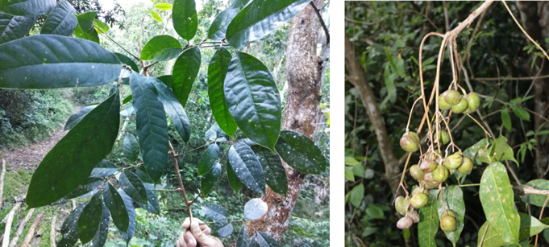
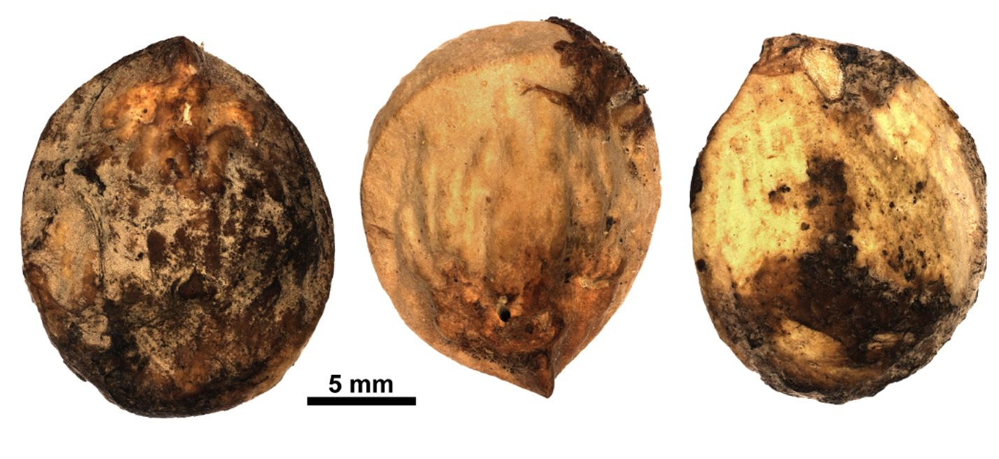

# Burseraceae {.unnumbered}

## *Tetragastris balsamifera* (Sw.) Oken.^[*Nomen conservandum* (nombre conservado)]  {#tetragastris .unnumbered}

::: {.blackbox data-latex=""}
**Amacey, amacey hembra**
:::

<br>

**Nombre aceptado:** *Protium balsamiferum* (Sw.) Daly & P.Fine

**Forma de vida:** árbol.

**Estatus biogeográfico:** nativa de las islas del Caribe.

**Estado de conservación:** Preocupación Menor (PM/LC). 
Pronto puede llegar a una categoría de amenaza, puesto que se está destruyendo su hábitat aceleradamente.

**Usos:** maderable, comestible y medicinal. La madera es dura, fuerte y fragante, usada en carpintería y ebanistería. El arilo de los frutos es comestible, dulce y con buen sabor.

```{r,echo=FALSE,fig.cap="Detalle de las hojas (izq) y frutos (der) de *Tetragastris balsamífera* (Foto: W. Encarnación, JBN, F. Jiménez, JBN)",out.width = "100%"}

```

### DESCRIPCIÓN DE LA PLANTA {.unlisted -}

Árbol de hasta 20 m de altura y 45 cm de diámetro. Hojas de 20-25 cm, folíolos de 3-9 pares, lanceolados a elípticos de 7-15 cm, acuminados y reticulados por debajo. Inflorescencia de hasta 35 cm, diente del cáliz agudo, corola de 2.5-3 mm. Ovario glabro. Fruto en drupa de 1.7 . La madera es de color rojizo.

**Floración y fructificación:** flores de abril a noviembre y frutos casi todo el año.

**Distribución:** provincias de Barahona, Dajabón, Distrito Nacional, El Seibo, Hato Mayor, La Altagracia, La Vega, La Romana, Monseñor Nouel, Monte Plata, Peravia, Puerto Plata, Samaná, San Cristóbal y Santiago.

**Hábitat:** bosque húmedo y muy húmedo de baja o mediana elevación.

```{r,echo=FALSE,fig.cap="Árbol de *T. balsamifera* (Foto: W. Encarnación, JBN)",out.width = "100%"}
knitr::include_graphics("figures/tetragastris_balsamifera2.png")
```

### CONSERVACIÓN DE LAS SEMILLAS {.unlisted -}

**Colecta de semillas:** de septiembre a mayo.

**Procesamiento y manejo:** las semillas se extraen de los frutos con una despulpadora con agua potable durante 30 segundos. Luego con un tamiz de 5.6 mm de calíbre se separan los residuos del fruto, frotándolas suavemente con un tapón de hule o goma.

**Tolerancia a la deshidratación:** las semillas secas no toleran la desecación con una germinación del 0%. Se necesita más investigación para especificar la tolerancia a la desecación, las semillas pierden la viabilidad rápidamente.


```{r,echo=FALSE,fig.cap="Semillas de *T. balsamifera* (Foto: P. Gómez Barreiro, RBG, Kew)",out.width = "100%"}

```

### PROPAGACIÓN {.unlisted -}

**Dormancia y pretratamientos:** esta especie no requiere de tratamientos especiales para germinar.
Germinación, siembra y propagación: en condiciones de laboratorio, las semillas presentan una viabilidad del 98% y una germinación del 93%. La germinación comienza entre los 4-6 días y finaliza a los 25 días.

**Propagación y comportamiento en vivero:** las semillas se siembran directamente en macetas (aprox. 30 cm) con una mezcla de sustrato formado de tierra negra, asserín y estiércol (2:1:1) o en camas con arena de 1.4 mm. No es muy exigente en términos de humedad del suelo y puede crecer en suelos húmedos, pobres en nutrientes y materia orgánica, de roca caliza y arenosos. Se puede sembrar todo el año. Cuando las plantas están bien desarrolladas, es posible moverlas a macetas más grandes si es necesario, o directamente en el suelo, lo que permite el correcto desarrollo de las raíces. Se sugiere aplicar riego todos los días. La adición de limo o fertilizantes orgánicos puede mejorar el establecimiento y crecimiento. La siembra en campo se realiza entre los meses 3-4, cuando alcanza una altura de 35 a 45 cm.

**Propagación vegetativa:** no se han sometido a estudios de propagación vegetativa y no se conocen protocolos.

### COMERCIO {.unlisted -}
No tiene comercio reconocido.
