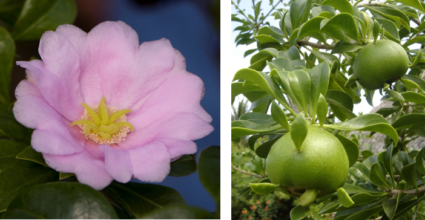
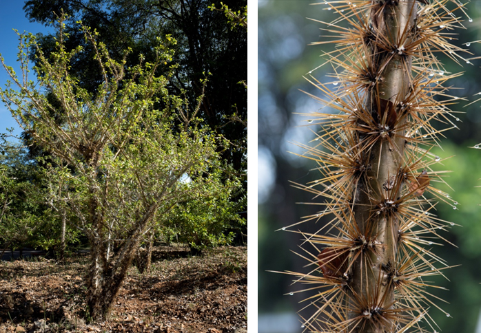
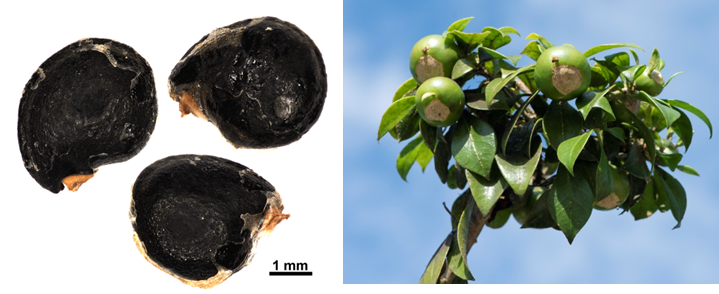

# Cactaceae {.unnumbered}

## *Pereskia quisqueyana* Alain^[*Nomen conservandum* (nombre conservado)]  {#pereskia .unnumbered}

::: {.blackbox data-latex=""}
**Rosa de Bayahíbe, mata de chele**
:::

<br>

**Nombre aceptado:** *Leuenbergia quisqueyana* (Alain) Lodé

**Forma de vida:** arbolito o arbusto.

**Estatus biogeográfico:** endémica de la isla La Española.

**Estado de conservación:** [Peligro Crítico (PC/CR).]{style="color: red;"}

Se conocen dos poblaciones con un número bajo de individuos; una en la playa de Bayahíbe y otra a 4 ó 5 km antes de llegar a ese poblado. Su hábitat es destruído y fragmentado.

**Usos:** ornamental (Flor Nacional de República Dominicana).

```{r,echo=FALSE,fig.cap="Flor (izq) y fruto (der) de *Pereskia quisqueyana* (Foto: P. Gómez Barreiro , RBG Kew y F. Jiménez, JBN)",out.width = "100%"}

```

### DESCRIPCIÓN DE LA PLANTA {.unlisted -}

Arbolito o arbusto de 3-4 m de altura y hasta 10 cm de diámetro. La corteza es verdosa y está recubierta de espinas que brotan de un mismo lugar llamado aréola. Espinas rectas y de color pardo, 2-5 cm de largo. Hojas elípticas o obovado-elípticas y oblaceoladas más pequeñas en las ramas viejas y más largas y anchas en las ramas jóvenes. Flores axilares, solitarias, pétalos de color rosado intenso. La flor masculina tiene muchos estambres rosados con las anteras amarillas.

**Floración y fructificación:** flores de mayo a diciembre y frutos de nombiembre a marzo.
**Distribución:** provincia de La Atagracia (Bayahíbe).
**Hábitat**: bosque costero.

```{r,echo=FALSE,fig.cap="Arbolito (izq) y detalle del tronco (der) de *P. quisqueyana* (Foto: P. Gómez Barreiro, RBG Kew )",out.width = "100%"}

```

### CONSERVACIÓN DE LAS SEMILLAS {.unlisted -}

**Colecta de semillas:** de junio a octubre.

**Procesamiento y manejo:** las semillas se extraen con una despulpadora para eliminar la pulpa del fruto y luego se usa un tamiz de 1.4 mm de calibre para separar los residuos frotándolas suavemente con un tapón de hule o goma. También se usan coladores de acero inoxidable o una maya para eliminar la solución acuosa del fruto junto con agua. Las semillas se secan en tela.

**Tolerancia a la deshidratación:** las semillas secas obtuvieron un porcentaje de germinación del 88.5%, son tolerantes a la desecación para la conservación y por tanto se denominan ortodoxas.


```{r,echo=FALSE,fig.cap="Semillas (izq) y ramillete de frutos (der) de *P. quisqueyana* (Foto: P. Gómez Barreiro, RBG Kew)",out.width = "100%"}

```

### PROPAGACIÓN {.unlisted -}

**Dormancia y pretratamientos:** Basándose en los datos del banco de semillas del JBN, esta especie no requiere ningún tratamiento pre-germinación.

**Germinación, siembra y propagación:** en condiciones de laboratorio, las semillas frescas presentan una viabilidad del 99% y una germinación del 96%. La germinación comienza a los 4 días y finaliza a los 7 días.

**Propagación y comportamiento en vivero:** las semillas se siembran directamente en macetas (aprox. 30cm) con un sustrato formado por tierra negra, aserrín y estiércol (2:1:1) o en camas de arena de 1.4 mm. No es muy exigente en términos de humedad del suelo y puede crecer en suelos arenosos y rocosos de origen calizo. Se puede sembrar todo el año. Cuando las plantas están bien desarrolladas, es posible moverlas a macetas más grandes si es necesario, o directamente en el suelo, lo que permite el correcto desarrollo de las raíces. Se sugiere aplicar riego cada 2-3 días. La adición de limo o fertilizantes orgánicos puede mejorar el establecimiento y crecimiento. La siembra en campo se realiza entre los meses 4-5, cuando alcanza una altura de 25 a 35 cm.

**Propagación vegetativa:** esta especie se puede propagar vegetativamente, usando esquejes o estacones.

### COMERCIO {.unlisted -}

No existe comercio reconocido. Se usa como planta ornamental en jardinería y viviendas, pero se suele distribuir por donaciones.


