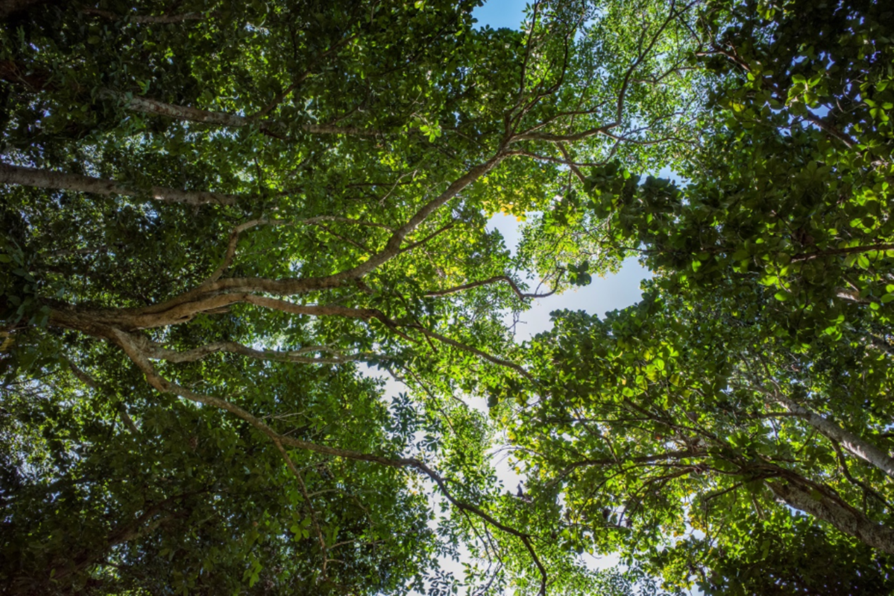

# Clusiaceae {.unnumbered}

## *Mammea americana* L. {#mamey .unnumbered}

::: {.blackbox data-latex=""}
**Mamey, mamey de Santo Domingo**
:::

<br>

**Forma de vida:** árbol.

**Estatus biogeográfico:** nativa de las islas del Caribe, sur y este de México, Guatemala, y Florida.

**Estado de conservación:** [En Peligro (EP/EN).]{style="color: red;"}

Fue muy usada en el pasado por su madera. Las poblaciones han disminuido debido a la destrucción de su ambiente.
Usos: maderable, medicinal y comestible. Los frutos se consumen en crudo o en dulces o conserva. Las flores se usan para hacer licor. El látex gomoso de la corteza y semillas se usan como insecticida y para animales domésticos.

```{r,echo=FALSE,fig.cap="Flor (izq) y fruto (der) de *Mammea americana* (Foto: F. Jiménez, JBN)",out.width = "100%"}

```

### DESCRIPCIÓN DE LA PLANTA {.unlisted -}

Árbol de hasta 25 m de altura. Hojas elípticas a elíptico-obovadas de 8-16 cm. Flores solitarias, cáliz de 8-10 mm, pétalos blancos obovados de hasta 2 cm. El fruto es una drupa globosa apicarada de 5-8 cm de diámetro. Madera de color rojizo.

**Floración y fructificación:** flores de mayo a junio y de agosto a septiembre y frutos durante casi todo el año.

**Distribución:** provincias de Azua, Barahona, Distrito Nacional, La Altagracia, Monte Plata, Puerto Plata y San Cristóbal.

**Hábitat:** bosque húmedo a baja elevación.

```{r,echo=FALSE,fig.cap="Árbol (izq) y semillas (der) de *M. americana* (Foto: F. Jiménez JBN, P. Gómez Barreiro, RBG Kew)",,fig.show="hold", out.width = "49%"}
library(magick)
img1 <- image_read("figures/mammea2_1.png")
img2 <- image_read("figures/mammea2_2.png")
mammea2_1_border <- image_border(img1, "white", "5x0")
mammea2_2_border <- image_border(img2, "white", "5x0")
image_write(mammea2_1_border, "figures/mammea2_1_border.png")
image_write(mammea2_2_border, "figures/mammea2_2_border.png")
knitr::include_graphics(c("figures/mammea2_1_border.png","figures/mammea2_2_border.png"))
```

### CONSERVACIÓN DE LAS SEMILLAS {.unlisted -}

**Colecta de semillas:** de febrero a noviembre.

**Procesamiento y manejo:** las semillas se extraen con una despulpadora y agua potable. Se usa un tamiz de 5.6 mm de diámetro para separar los residuos del fruto frotándolas suavemente con un tapón de hule o goma.

**Tolerancia a la deshidratación:** las semillas no toleran la desecación y pierden viabilidad rápidamente cuando se deshidratan, son recalcitrantes. Sin embargo, se pueden almacenar a 5°C (65% humedad) durante 6 meses sin que pierdan viabilidad.


### PROPAGACIÓN {.unlisted -}

**Dormancia y pretratamientos:** Basándose en los datos del banco de semillas del JBN, esta especie no requiere de tratamientos especiales previos a la germinación.

**Germinación, siembra y propagación:** en condiciones de laboratorio, las semillas frescas presentan una viabilidad del 98%, y se obtiene una germinación de 95.8%. La germinación comienza a los 40-50 días y finaliza a los 3-4 meses.

**Propagación y comportamiento en vivero:** las semillas se siembran directamente en macetas (aprox. 30 cm) con un sustrato de tierra negra, aserrín y estiércol (2:1:1) o en camas con arena de 1.4 mm. Esta especie es muy exigente para germinar en término de humedad de suelo y puede crecer en suelos derivados de rocas sedimentarias e ígneas y suelos húmedos. Las plantas se suelen desarrollar en suelos arcillosos con nutrientes. Se puede sembrar todo el año. Cuando las plantas están bien desarrolladas, es posible moverlas a macetas más grandes si es necesario, o directamente en el suelo, lo que permite el correcto desarrollo de las raíces. Se sugiere aplicar riego todos los días para un buen desarrollo de las hojas y crecimiento general de la planta. La siembra en campo se realiza entre el segundo o tercer mes, cuando alcanza una altura de 35 a 45 cm.

**Propagación vegetativa:** se puede propagar por injerto y por esquejes o estacas.


```{r,echo=FALSE,fig.cap="Dosel forestal o canopia de *M. americana* (Foto: P. Gómez Barreiro, RBG Kew)",out.width = "100%"}

```

### COMERCIO {.unlisted -}

Existe la venta de frutos, compotas, mermeladas, helados y licor perfumado en los mercados. También se comercializan los insecticidas a partir del látex y los taninos presentes en la planta. La venta de madera para carpintería forma parte del comercio de productos del mamey.


