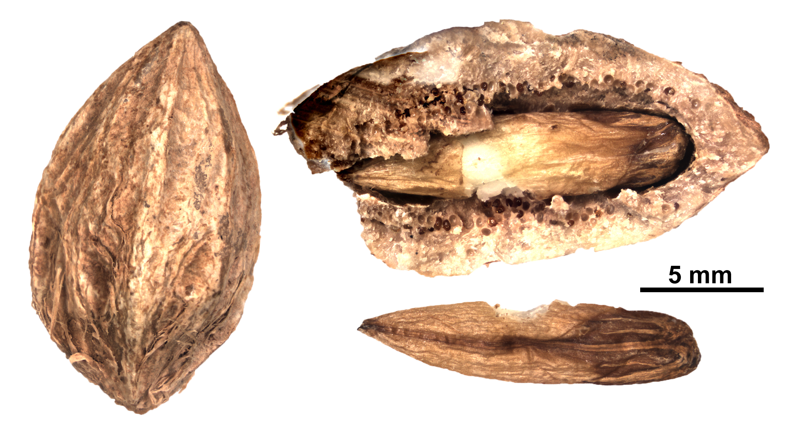

# Combretaceae {.unnumbered}

## *Buchenavia tetraphylla* (Aubl.) R.A. Howard^[*Nomen conservandum* (nombre conservado)] {#buchenavia .unnumbered}

::: {.blackbox data-latex=""}
**Guaraguao, fuquete, fruta de palo, palo amarillo**
:::

<br>

**Nombre aceptado:** *Terminalia tetraphylla* (Aubl.) Gere & Boatwr. 

**Forma de vida:** árbol.

**Estatus biogeográfico:** nativa de la isla La Española, Cuba, Puerto Rico y el norte de América del Sur.

**Estado de conservación:** sin evaluar.

**Usos:** maderable y ornamental. La madera es dura y fuerte, usada para muebles, vigas y ebanistería. Se usa también como árbol ornamental y de sombra.

```{r,echo=FALSE,fig.cap="Frutos de *Buchenavia tetraphylla* (Foto: F. Jiménez, JBN)",out.width = "100%"}

```
### DESCRIPCIÓN DE LA PLANTA {.unlisted -}

Árbol de hasta 20 m. Hojas de 4-6.5 cm, obovadas a emarginadas. Inflorescencia en cabezuelas, cáliz glabro. La drupa es apiculada de 2 cm. Madera de color marrón amarillento.

**Floración y fructificación:** flores en abril y frutos de agosto a enero.

**Distribución:** en toda la isla.

**Hábitat:** bosque húmedo y muy húmedo, desde alta a baja altitud o medianas montañas.

```{r,echo=FALSE,fig.cap="Árbol de *B. tetraphylla* (Foto: F. Jiménez, JBN)",out.width = "100%"}

```

### CONSERVACIÓN DE LAS SEMILLAS {.unlisted -}

**Colecta de semillas:** de noviembre a febrero.

**Procesamiento y manejo:** las semillas se extraen utilizando una despulpadora para eliminar la pulpa de los frutos con agua potable durante 30 segundos. Con un tamiz de 5.6 mm de calibre se separan los residuos frotándolas suavemente con un tapón de hule o goma.

**Tolerancia a la deshidratación:** el lote usado en este estudio tuvo una germinación baja y las semillas secas obtuvieron un porcentaje de germinación del 47.2%, parecen tolerar la descación. Al obtener porcentajes bajos de germinación se necesita realizar más ensayos para obtener conclusiones definitivas.

```{r,echo=FALSE,fig.cap="Semillas de *B. tetraphylla* (Foto: P. Gómez Barreiro, RBG Kew)",out.width = "100%"}

```

### PROPAGACIÓN {.unlisted -}

**Dormancia y pretratamientos:** las semillas requieren estar sumergidas en agua durante un día antes de la siembra.

**Germinación, siembra y propagación:** en condiciones de laboratorio, las semillas fescas presentan una viabilidad del 88% y una germinación de 82%. La germinación se inicia a los 25-30 días y finaliza a los 85-90 días.

**Propagación y comportamiento en vivero:** las semillas se siembran directamente en macetas (aprox. 30 cm) con una mezcla de sustrato de tierra negra, aserrín y estiércol (2:1:1) o en camas con arena de 1.4 mm. Esta especie crece en suelos húmedos y muy húmedos, arcillosos, arenosos y de roca caliza. Se puede sembrar todo el año. Cuando las plantas están bien desarrolladas, es posible moverlas a macetas más grandes si es necesario, o directamente en el suelo, lo que permite el correcto desarrollo de las raíces. Se sugiere aplicar riego cada 2 días. La adición de limo o fertilizantes orgánicos puede mejorar el establecimiento y crecimiento. La siembra en campo se realiza entre el tercer y cuarto mes, cuando alcanza una altura de 35 a 45 cm.

**Propagación vegetativa:** no se han sometido a estudios de propagación vegetativa y no se conocen protocolos, aunque se han observado estacones retoñando.

### COMERCIO {.unlisted -}

No se conoce comercio registrado.


