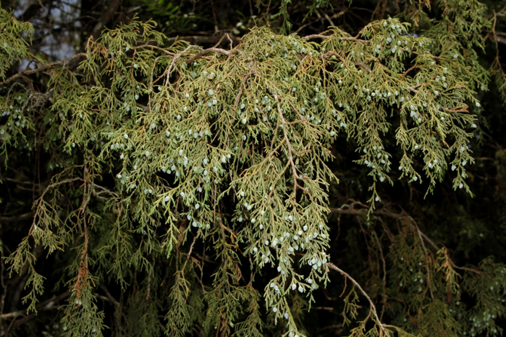
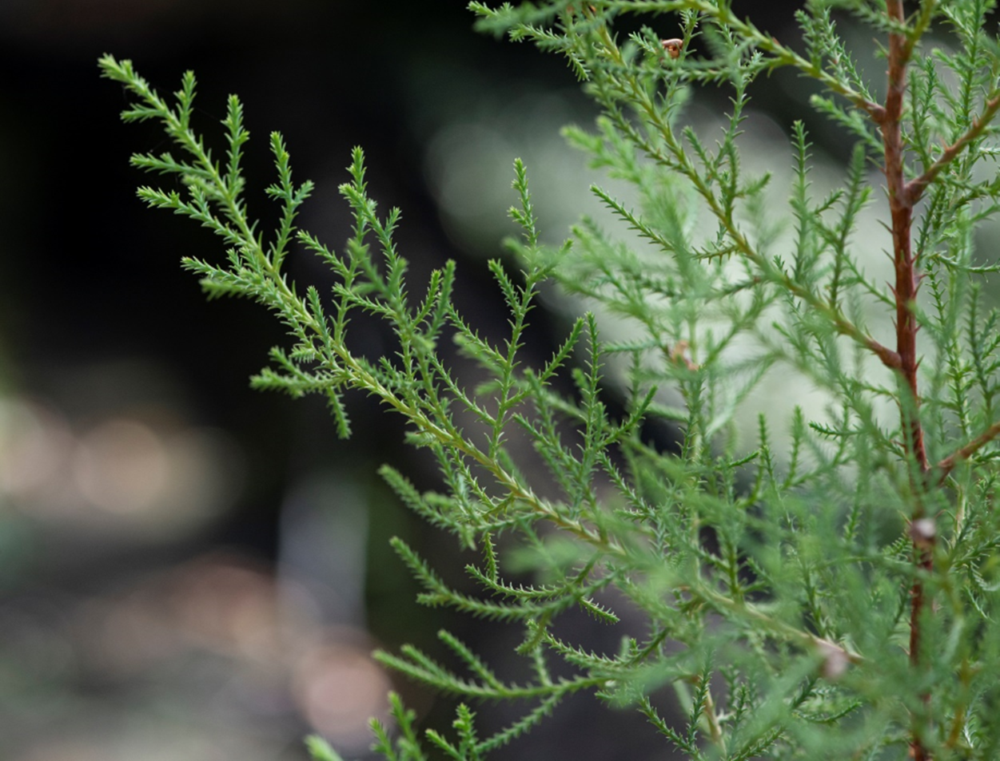

# Cupressaceae {.unnumbered}

## *Juniperus gracilior* Pilg. {#juniperus .unnumbered}

::: {.blackbox data-latex=""}
**Sabina, sabina de olor**
:::

<br>

**Forma de vida:** árbol.

**Estatus biogeográfico:** endémica de La Española

**Estado de conservación:** [Peligro Crítico (PC/CR).]{style="color: red;"}

Las poblaciones se han reducido drásticamente debido al uso irracional de su madera.

**Usos:** maderable y ornamental. La madera se usa para muebles y trabajos finos de ebanistería. Muy valiosa en República Dominicana.

```{r,echo=FALSE,fig.cap="Fruto de *Juniperus gracilior* (Foto: F. Jiménez, JBN)",out.width = "100%"}

```

### DESCRIPCIÓN DE LA PLANTA {.unlisted -}

Árbol de hasta 30 m de altura. Hojas delgadas, decurrentes, triangulares y agudas de 4-4.5 mm. Los estróbilos microsporangiados (partes masculinas) son pequeños, redondeados y suborbiculares. Flores pistiladas terminales. Madera rojiza y olorosa.

**Floración y fructificación:** flores de agosto a octubre y frutos de septiembre a marzo.

**Distribución:** provincias de Azua, Independencia, La Vega, Monseñor Nouel, Pedernales, San José de Ocoa.

**Hábitat:** bosques de Pinus y de transición a seco en altas montañas.

```{r,echo=FALSE,fig.cap="Árbol (izq) y plántula (der) de *J. gracilior* (Foto: F. Jiménez JBN, P. Gómez Barreiro, RBG Kew)",,fig.show="hold", out.width = "49%"}
library(magick)
img1 <- image_read("figures/juniperus2_1.png")
img2 <- image_read("figures/juniperus2_2.png")
juniperus2_1_border <- image_border(img1, "white", "5x0")
juniperus2_2_border <- image_border(img2, "white", "5x0")
image_write(juniperus2_1_border, "figures/juniperus2_1_border.png")
image_write(juniperus2_2_border, "figures/juniperus2_2_border.png")
knitr::include_graphics(c("figures/juniperus2_1_border.png","figures/juniperus2_2_border.png"))
```

### CONSERVACIÓN DE LAS SEMILLAS {.unlisted -}

**Colecta de semillas:** de febrero a abril.

**Procesamiento y manejo:** las semillas se extraen utilizando tamices con un diámetro de 2.36 mm para separarlas de los restos del fruto. Con una sopladora de flujo laminar se eliminan las partículas y residuos.

**Tolerancia a la deshidratación:** el lote usado en el laboratorio presentaba porcentajes iniciales de germinación en semillas frescas y secas por debajo del 50% (40% y 23.1% respectivamente). Es necesario seguir investigando para obtener conclusiones sobre su tolerancia a la desecación.

```{r,echo=FALSE,fig.cap="Detalle de las hojas de *J. gracilior* (Foto: P. Gómez Barreiro, RBG Kew)",out.width = "100%"}

```

### PROPAGACIÓN {.unlisted -}

**Dormancia y pretratamientos:** las semillas se sumergen en agua durante un día antes de la siembra. También se pueden sumergir en agua caliente durante 25-30 segundos.

**Germinación, siembra y propagación:** en condiciones de laboratorio, las semillas presentan una viabilidad del 91%, y se obtiene una germinación de 78% . La germinación comienza a los 25-30 días y finaliza a los 75-80 días.

**Propagación y comportamiento en vivero:** las semillas se siembran directamente en macetas (aprox. 30 cm) con una mezcla de sustratos de tierra negra, aserrín y estiércol (2:1:1) o en camas con arena de 1.4 mm. Esta especie es muy exigente en términos de humedad del suelo y puede crecer en suelos húmedos a secos y de transición, pobres en nutrientes y materia orgánica, arenosos y de roca caliza. Se puede sembrar todo el año. Cuando las plantas están bien desarrolladas, es posible moverlas a macetas más grandes si es necesario, o directamente en el suelo, lo que permite el correcto desarrollo de las raíces. Se sugiere aplicar riego cada 2 días. La adición de limo o fertilizantes orgánicos puede mejorar el establecimiento y crecimiento. La siembra en campo se realiza entre los meses 4-5, cuando alcanza una altura de 25 a 30 cm.

**Propagación vegetativa:** no se han sometido a estudios de propagación vegetativa y no se conocen protocolos.


### COMERCIO {.unlisted -}

No tiene comercio registrado actualmente debido a la escasez de la especie.


