# Fabaceae {.unnumbered}

## *Abarema glauca* (Urb.) Barneby & J.W. Grimes^[*Nomen conservandum* (nombre conservado)] {#abarema .unnumbered}

::: {.blackbox data-latex=""}
**Caracolí, caracolillo, tabernan**
:::

<br>

**Nombre aceptado:** *Jupunba glauca* (Urb.) Britton & Rose

**Forma de vida:** árbol.

**Estatus biogeográfico:** nativa de la isla La Española, Cuba y las Bahamas.

**Estado de conservación:** [Vulnerable (VU).]{style="color: red;"}

Las poblaciones se han reducido drásticamente debido al uso indiscriminado de su madera y la destrucción del hábitat.

**Usos:** maderable y ornamental.

```{r,echo=FALSE,fig.cap="Fruto abierto (izq) y plántulas en el vivero (der) de *Abarema glauca* (Foto: F. Jiménez, JBN y W. Encarnación, JBN)",out.width = "100%"}
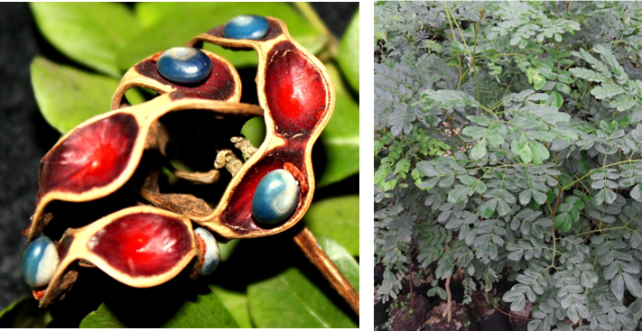
```

### DESCRIPCIÓN DE LA PLANTA {.unlisted -}

Árbol de hasta 20 m. Hojas compuestas con 3-6 pares de pinnas, folíolos con 4 a 11 pares de pinnas, obovados a subromboideos, redondeados a obtusos de 1.5-3 cm. Pedúnculo de 5-8 cm, flores blancas en racimos cortos y apretados. Cáliz de 3 mm y corola pelosa de 7 mm. Legumbre circinada de 7-8 mm de ancho.

**Floración y fructificación:** flores y frutos de mayo a octubre.

**Distribución:** provincias de Barahona, La Altagracia, La Romana, Pedernales y Puerto Plata.

**Hábitat:** bosque húmedo a baja elevación

### CONSERVACIÓN DE LAS SEMILLAS {.unlisted -}

**Colecta de semillas:** de septiembre a noviembre.

**Procesamiento y manejo:** las semillas se extraen mecánicamente con tamices de 1.40 mm de diámetro para separarlas de los frutos. Luego con una sopladora de flujo laminar se eliminan los residuos.

**Tolerancia a la deshidratación:** las semillas tienen tolerancia a la desecación con un porcentaje de germinación del 65.4% (misma germinación que en semillas húmedas) y por tanto son ortodoxas.

```{r,echo=FALSE,fig.cap="Árbol (izq) y semillas (der) de *A. glauca* (Foto: F. Jiménez JBN, P. Gómez Barreiro, RBG Kew)",out.width = "100%"}
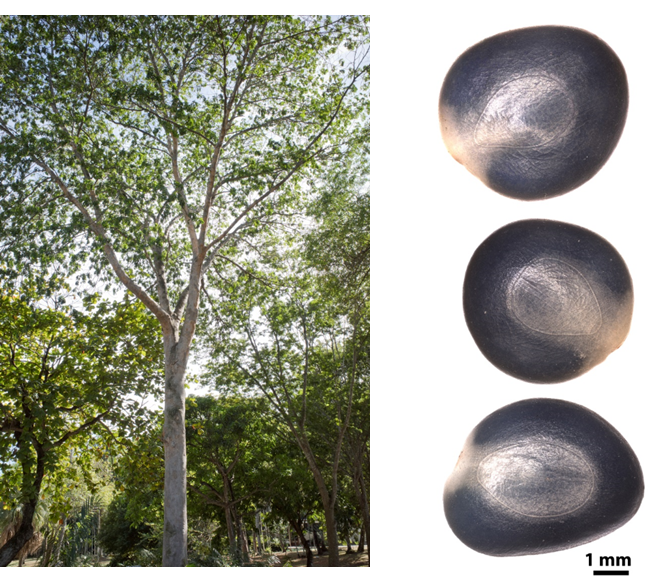
```

### PROPAGACIÓN {.unlisted -}

**Dormancia y pretratamientos:** las semillas limpias se sumergen en agua durante un día.

**Germinación, siembra y propagación:** en condiciones de laboratorio, las semillas frescas presentan una viabilidad del 97% y una germinación del 92.5% en semillas. La germinación empieza a los 22 días y finaliza a los 24-29 días.
Propagación y comportamiento en vivero: las semillas se siembran directamente en macetas (aprox. 30 cm) con tierra de aserrín de 2:1:1 (sustrato, estiércol, arena). Esta especie no es muy exigente en términos de humedad de suelo para germinar. Puede crecer en suelos arcillosos y arenosos, pobres en nutrientes y materia orgánica. Se puede sembrar todo el año. Cuando las plantas están bien desarrolladas, es posible moverlas a macetas más grandes si es necesario, o directamente en el suelo, lo que permite el correcto desarrollo de las raíces. Se sugiere aplicar riego cada día. La adición de limo o fertilizantes orgánicos puede mejorar el establecimiento y crecimiento. La siembra en campo se realiza entre los meses cuarto y quinto, cuando alcanza una altura de 35 a 45 cm.

**Propagación vegetativa:** no se han sometido a estudios de propagación vegetativa y no se conocen protocolos.

```{r,echo=FALSE,fig.cap="Detalle del tronco y copa de *A. glauca* (Foto: P. Gómez Barreiro, RBG Kew)",out.width = "100%"}
knitr::include_graphics("figures/abarema3.png")
```

### COMERCIO {.unlisted -}

No se conoce comercio debido a la escasez de la madera.


## *Arcoa gonavensis* Urb. {#arcoa .unnumbered}

::: {.blackbox data-latex=""}
**Tamarindo marrón, alquitrán**
:::

<br>

**Forma de vida:** árbol o arbusto dependiendo del suelo donde crece.

**Estatus biogeográfico:** endémica de La Española

**Estado de conservación:** [Peligro Crítico (PC/CR).]{style="color: red;"}

Las poblaciones se han reducido drásticamente debido a la destrucción de su ambiente.

**Usos:** su madera no es de buena calidad pero se usa principalmente para leña y carbón, así como para postes para empalizadas. También se considera ornamental.

```{r,echo=FALSE,fig.cap="Fruto (izq) y árbol (der) de *Arcoa gonavensis* (Foto: F. Jiménez, JBN)",out.width = "100%"}
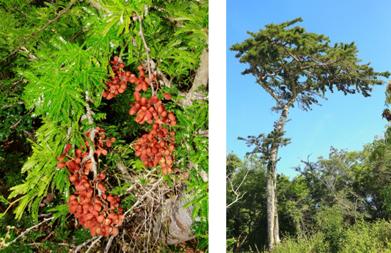
```

### DESCRIPCIÓN DE LA PLANTA {.unlisted -}

Árbol de hasta 20 m. Ramas horizontales que forman una copa irregular. Ramitas ferrugíneo-pubérulas, con nudos engrosados, espinas estipulares rectas de 5-17 mm. Hojas compuestas, folíolos 9-20 pares glanduliformes en la inserción, lineares a oblongo-lineares, redondeados en el ápice, glábros y pálidos en el envés. Inflorescencias de 15 flores o más. Pétalos sub-truncados, cóncavos de 6 mm. Fruto en legumbre pedunculada de 7 mm de largo con 1-6 semillas pardo-negruzcas.

**Floración y fructificación:** flores de marzo a abril y frutos de abril a junio.

**Distribución:** Isla Gonave, Haití. En República Dominicana se encuentra en la parte árida y semi-árida de Sierra de Bahoruco, Sierra de San Martín García y en la estribación Sur de la Cordillera Central.

**Hábitat:** en bosques secos sobre roca caliza.

```{r,echo=FALSE,fig.cap="Arbolito de *A. gonavensis* (Foto: P. Gómez Barreiro, RBG Kew)",out.width = "100%"}
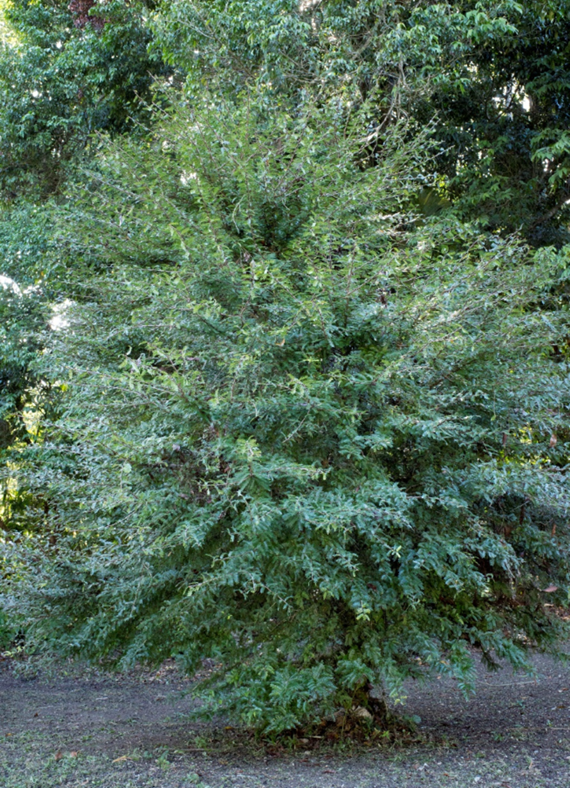
```

### CONSERVACIÓN DE LAS SEMILLAS {.unlisted -}

**Colecta de semillas:** de abril a junio.

**Procesamiento y manejo:** las semillas se extraen de los frutos. Se usa un molino para triturar los frutos o una licuadora con agua durante 30 segundos para eliminar la resina adhesiva que presentan los frutos y luego se utiliza un tamiz de 2.36 mm de diámetro para separar las semillas de los residuos frotándolas suavemente con un tapón de hule o goma. Finalmente se usa una sopladora de flujo laminar para eliminar las últimas partículas.

**Tolerancia a la deshidratación:** las semillas tienen tolerancia a la desecación para la conservación con un 70.6% de germinación y por tanto son ortodoxas.

```{r,echo=FALSE,fig.cap="Semillas (izq) y detalle de las hojas (der) de *A. gonavensis* (Foto: P. Gómez Barreiro, RBG Kew)",out.width = "100%"}
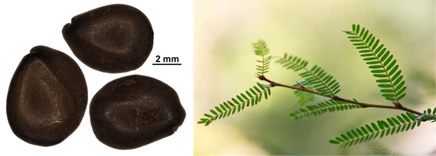
```

### PROPAGACIÓN {.unlisted -}

**Dormancia y pretratamientos:** Las semillas limpias se sumergen en agua durante un día antes de la siembra.

**Germinación, siembra y propagación:** en condiciones de laboratorio, las semillas frescas presentan una viabilidad del 98% y una germinación del 92%. La germinación comienza a los 6 días y finaliza a los 14-17 días.

**Propagación y comportamiento en vivero:** las semillas se siembran directamente en macetas (aprox. 30 cm) con una mezcla de sustrato formada por tierra negra, aserrín y estiércol (2:1:1) o en camas con arena de 1.4 mm. Esta especie es muy exigente en términos de humedad del suelo y puede crecer en suelos secos de baja pluviosidad sobre roca caliza. Se puede sembrar todo el año. Cuando las plantas están bien desarrolladas, es posible moverlas a macetas más grandes si es necesario, o directamente en el suelo, lo que permite el correcto desarrollo de las raíces. Se sugiere aplicar riego cada 2-3 días. La adición de limo o fertilizantes orgánicos puede mejorar el establecimiento y crecimiento. La siembra en campo se realiza entre los meses 4-5, cuando alcanza una altura de 25 a 30 cm.

**Propagación vegetativa:** no se han sometido a estudios de propagación vegetativa y no se conocen protocolos.


### COMERCIO {.unlisted -}

No tiene comercio registrado.


## *Hymenaea courbaril* L. {#hymenea .unnumbered}

::: {.blackbox data-latex=""}
**Algarroba, algarrobo**
:::

<br>

**Sinónimos:** *Hymenaea animifera* Stokes, *H. multiflora* Kleinhoonte, *H. retusa* Willd. ex Hayne.
**Forma de vida:** árbol.
**Estatus biogeográfico:** nativa del Caribe, este y sur de México y el norte de América del Sur
**Estado de conservación:** [Vulnerable (VU).]{style="color:red"}

Sus poblaciones se han reducido drásticamente debido al uso irracional de su madera.

**Usos:** melífera, frutal, medicinal y maderable. El duramen de la madera es de color marrón oscuro o rojizo, duro y resistente a las termitas. Las raíces y el tronco exudan una resina conocida como el copal de América del Sur.


```{r,echo=FALSE,fig.cap="Flores (izq) y frutos (der) de *Hymenaea courbaril* (Foto: F. Jiménez, JBN)",out.width = "100%"}
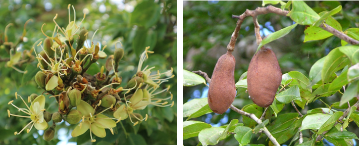
```

### DESCRIPCIÓN DE LA PLANTA {.unlisted -}

Árbol de 20 m o más. Tronco de hasta 2 m de diámetro, hojas compuestas con dos folíolos oblongos a lanceolados o aovados de 4-9 cm, agudos o acuminados. Flores en espículas cuyo tubo de cáliz es de 8 mm y segmentos de 15 mm. Los pétalos son blancos con puntos oscuros de 15 mm. El fruto es una legumbre marrón, rugosa de 5 a 10 cm.

**Floración y fructificación:** flores de marzo a julio y frutos de julio a abril.

**Distribución: **provincias de Distrito Nacional, El Seibo, Espaillat, Hato Mayor, La Altagracia, La Romana, La Vega, Monseñor Nouel, Monte Plata, Peravia, Santo Domingo, Puerto Plata, Samaná, San Cristóbal, San José de Ocoa y Sánchez Ramírez.

**Hábitat:** bosque húmedo de baja y mediana elevación.

```{r,echo=FALSE,fig.cap="Árbol de *H. courbaril* (Foto: F. Jiménez, JBN)",out.width = "100%"}
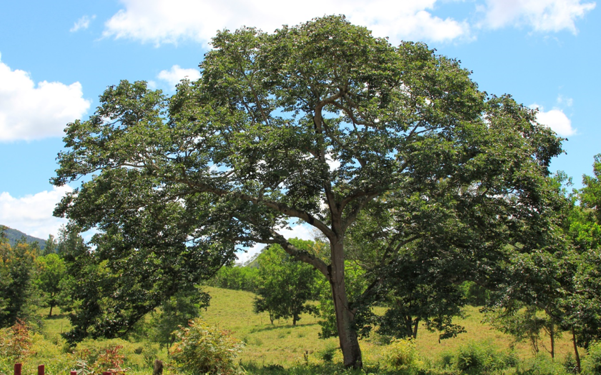
```

### CONSERVACIÓN DE LAS SEMILLAS {.unlisted -}

**Colecta de semillas:** de agosto a noviembre.

**Procesamiento y manejo:** las semillas se extraen utilizando un martillo para abrir la cubierta del fruto. Luego se separan en un tamiz de 5.60 mm de diámetro de acero inoxidable utilizando una goma de hule para separar el arilo de las semillas y luego se utiliza una lanilla humeda para eliminar los restos de fruto adheridos.

**Tolerancia a la deshidratación:** las semillas tienen tolerancia a la desecación y son ortodoxas de acuerdo con la literatura.

```{r,echo=FALSE,fig.cap="Semillas de *H. courbaril* (Foto: P. Gómez Barreiro, RBG Kew)",out.width = "100%"}
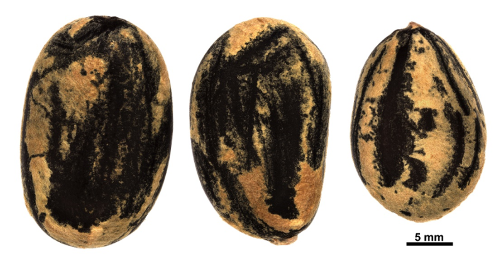
```

### PROPAGACIÓN {.unlisted -}

**Dormancia y pretratamientos:** las semillas requieren escarificación mecánica con tijera de podar en la zona opuesta al embrión y ponerlas en agua 48 h cambiando el agua dos veces al día. Se lijan hassta que pierdan el brillo natural y tengan un aspecto poroso. Después de este proceso se sumergen en agua un día más o también se pueden sumergir en agua caliente durante 25-30 segundos.
Germinación, siembra y propagación: en condiciones de laboratorio, las semillas frescas presentan una viabilidad del 99% y una germinación del 96%. La germinación empieza entre los 20-30 días y finaliza a los 30-40 días.

**Propagación y comportamiento en vivero:** las semillas se siembran directamente en macetas (aprox. 30 cm) con una mezcla de sustrato formada por tierra negra, aserrín y estiércol (2:1:1) o en camas con arena de 1.4 mm. Esta especie es muy exigente en términos de húmedad del suelo y puede crecer en suelos de húmedos a secos, pobres en nutrientes y materia orgánica. Se puede sembrar todo el año. Cuando las plantas están bien desarrolladas, es posible moverlas a macetas más grandes si es necesario, o directamente en el suelo, lo que permite el correcto desarrollo de las raíces. Se sugiere aplicar riego cada dos días. La adición de limo o fertilizantes orgánicos puede mejorar el establecimiento y crecimiento. La siembra en campo se realiza entre los meses 3-4, cuando alcanza una altura de 35 a 45 cm.

**Propagación vegetativa:** no se han sometido a estudios de propagación vegetativa y no se conocen protocolos, aunque se han observado estacones retoñando.


### COMERCIO {.unlisted -}

No se conoce comercio registrado.


## *Caesalpinia coriaria* (Jacq.) Willd^[*Nomen conservandum* (nombre conservado)] {#caesalpinia .unnumbered}

::: {.blackbox data-latex=""}
**Guatapaná, dividivi, libidibi, nasacol**
:::

<br>

**Nombre aceptado:** *Libidibia coriaria* (Jacq.) Schltdl.

**Sinónimos:** *Caesalpinia thomoaea* Spreng.

**Forma de vida:** árbol.

**Estatus biogeográfico:** nativa del Caribe y de México a Venezuela.

**Estado de conservación:** [En Peligro (EP/EN).]{style="color:red"}

Las poblaciones se han reducido drásticamente debido a la destrucción de su ambiente. También se ven afectadas por la recolección masiva de sus frutos y semillas.

**Usos:** melífera y maderable de uso común en tornería utilizada como fuente de materia colorante negra y de tanino. La industria farmacéutica la usa para elaborar enjuagues bucales. La corteza, los cogollos y las hojas son astringentes y las flores aromáticas se usan contra afecciones del corazón y dispepsia. Las raíces, se creen antisépticas contra la gangrena. Tanto los frutos y la corteza son ricos en taninos y se usan como curtientes y en medicina popular contra la diarrea.

```{r,echo=FALSE,fig.cap="Flores (izq) y fruto (der) de *Caesalpinia coriaria* (Foto: F. Jiménez, JBN)",out.width = "100%"}
knitr::include_graphics("figures/caesalpinia1.png")
```

### DESCRIPCIÓN DE LA PLANTA {.unlisted -}

Árbol de hasta 10 m. Hojas compuestas pequeñas, pinnas de 4-10 pares, comúnmente con puntos negros. Las flores están en racimos cortos con el cáliz de 5 mm. Los frutos son legumbres carnosas indehiscentes de 3-6 cm generalmente enroscadas. La madera es de color rojizo con venas oscuras casi negras.

**Floración y fructificación:** flores de mayo a octubre y frutos de enero marzo.

**Distribución:** provincias de Azua, Bahoruco, Barahona, Dejabón, Independencia, La Altagracía, Monte Cristi, Pedernales. Peravia, San José de Ocoa y Valverde.

**Hábitat:** bosque seco espinoso y semiseco.

```{r,echo=FALSE,fig.cap="Árbol de *C. coriaria* (Foto: F. Jiménez, JBN)",out.width = "100%"}
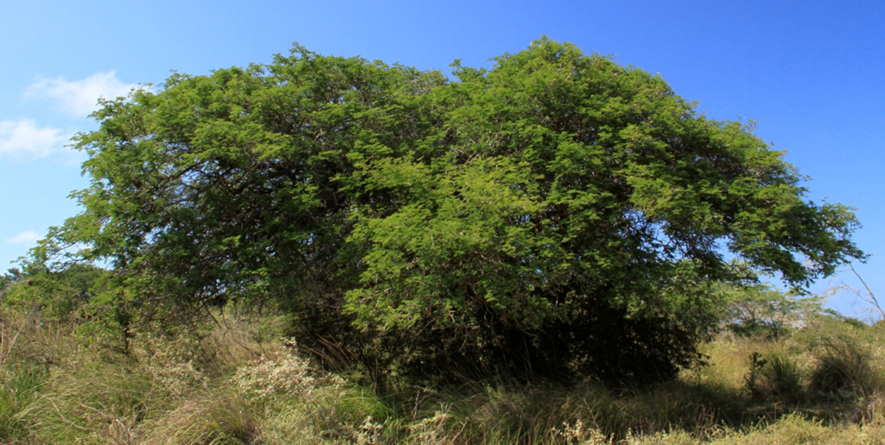
```

### CONSERVACIÓN DE LAS SEMILLAS {.unlisted -}

**Colecta de semillas:** de febrero a abril.

**Procesamiento y manejo:** las semillas se extraen de los frutos por trituración mecánica y se separan con un tamiz de 1.4 mm de diámetro. Finalmente se usa una sopladora de flujo para eliminar los últimos residuos.

**Tolerancia a la deshidratación:** las semillas tienen tolerancia a la desecación para la conservación con un 84.7% de germinación y por tanto son ortodoxas.

```{r,echo=FALSE,fig.cap="Semillas (arriba) y detalle de las hojas (abajo) de *C. coriaria* (Foto: P. Gómez Barreiro, RBG Kew)",out.width = "100%"}
knitr::include_graphics("figures/caesalpinia3.png")
```

### PROPAGACIÓN {.unlisted -}

**Dormancia y pretratamientos:** de acuerdo con los datos del banco de semillas del JBN, las semillas limpias se sumergen en agua durante un día antes de la siembra.

**Germinación, siembra y propagación:** en condiciones de laboratorio, las semillas frescas presentan una viabilidad del 96% y una germinación del 81%. La germinación comienza entre los 7-14 días y finaliza a los 15-18 días.

**Propagación y comportamiento en vivero:** las semillas se siembran directamente en macetas (aprox. 30 cm) con una mezcla de tierra negra, aserrín y estiércol (2:1:1) o en camas con arena de 1.4 mm. Esta especie es muy exigente en términos de humedad del suelo, necesita suelos secos de baja pluviosidad en el campo, preferiblemente arcillosos y arenosos. Se puede sembrar todo el año. Cuando las plantas están bien desarrolladas, es posible moverlas a macetas más grandes si es necesario, o directamente en el suelo, lo que permite el correcto desarrollo de las raíces. Se sugiere aplicar riego cada dos días. La adición de limo o fertilizantes orgánicos puede mejorar el establecimiento y crecimiento. La siembra en campo se realiza entre los meses 4-5, cuando alcanza una altura de 30 a 40 cm.

**Propagación vegetativa:** no se han sometido a estudios de propagación vegetativa y no se conocen protocolos, aunque se han observado estacones retoñando.


### COMERCIO {.unlisted -}

Los frutos se venden en los mercados populares.


## *Mora abbottii* Rose & Leonard {#mora .unnumbered}

::: {.blackbox data-latex=""}
**Cola, col, coi**
:::

<br>

**Forma de vida:** árbol.

**Estatus biogeográfico:** endémica de la República Dominicana.

**Estado de conservación:** [En Peligro (EP/EN).]{style="color:red"}

La destrucción de su ambiente y el corte para madera son sus principales amenazas.
Usos: maderable y medicinal.

```{r,echo=FALSE,fig.cap="Flor (izq) y fruto (der) de *Mora abbottii* (Foto: F. Jiménez, JBN)",out.width = "100%"}
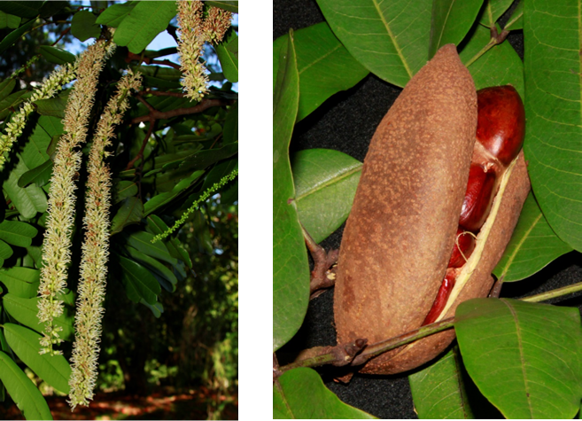
```

### DESCRIPCIÓN DE LA PLANTA {.unlisted -}

Árbol grande de hasta 15 m; hojas pinnadas con 3 pares de folíolos lanceolados de 10-25 cm, acuminados y reticulados; legumbre de 22 cm con muchas semillas. La madera es fuerte y resistente usada en construcciones.

**Floración y fructificación:** flores de enero a mayo y frutos de junio a septiembre.

**Distribución:** provincias de Distrito Nacional, Duarte, Espaillat, La Vega, Monseñor Nouel, Perevia, Salcedo, San Cristóbal y San José de Ocoa. También en la Cordillera Septentrional, Cordillera Central y Sierra de Yamasá.

**Hábitat:** bosque húmedo a baja y mediana elevación.

```{r,echo=FALSE,fig.cap="Árbol de *M. abbottii* (Foto: F. Jiménez, JBN)",out.width = "100%"}
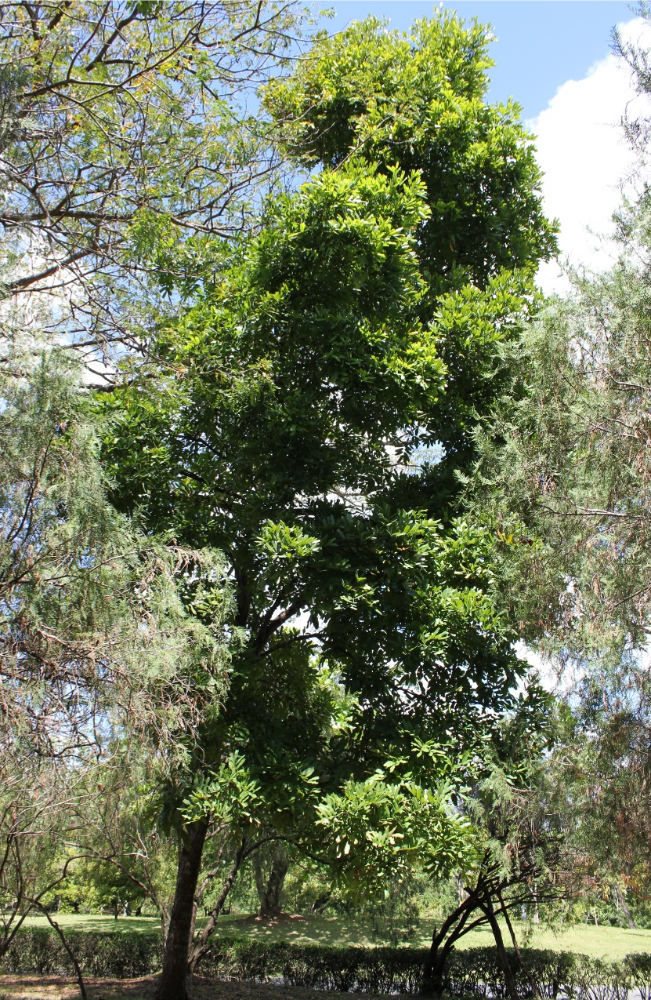
```

### CONSERVACIÓN DE LAS SEMILLAS {.unlisted -}

**Colecta de semillas:** de junio a septiembre.

**Procesamiento y manejo:** las semillas se extraen mecánicamente y se eliminan las cápsulas dehiscentes de los frutos.

**Tolerancia a la deshidratación:** las semillas no toleran la desecación, no se obtuvo germinación en estado seco (0%) por tanto son recalcitrantes.

```{r,echo=FALSE,fig.cap="Semillas de *M. abbottii* (Foto: P. Gómez Barreiro, RBG Kew)",out.width = "100%"}
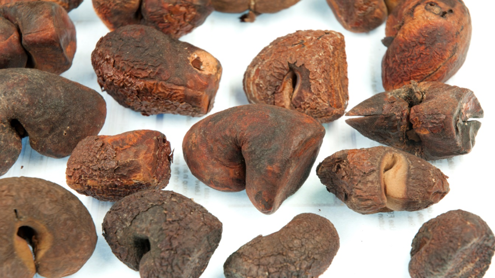
```

### PROPAGACIÓN {.unlisted -}

**Dormancia y pretratamientos:** con base en los datos del banco de semillas del JBN, esta especie no requiere de tratamientos especiales para la germinación.

**Germinación, siembra y propagación:** en condiciones de laboratorio, las semillas frescas presentan una viabilidad del 95% y una germinación entre el 90% a 98%. La germinación comienza a los 9-12 días y finaliza a los 31 días.
Propagación y comportamiento en vivero: las semillas se siembran directamente en macetas (aprox. 30 cm) con una mezcla sustrato formado por tierra negra, aserrín y estiércol (2:1:1) o en camas con arena de 1.4 mm. Esta especie es muy exigente para germinar y puede crecer en suelos derivados de rocas sedimentarias e ígneas y suelos húmedos a muy húmedos en el medio silvestre. Las plantas se suelen desarrollar en suelo rocoso con poca arcilla y nutrientes. Se puede sembrar todo el año. Cuando las plantas están bien desarrolladas, es posible moverlas a macetas más grandes si es necesario, o directamente en el suelo, lo que permite el correcto desarrollo de las raíces. Se sugiere aplicar riego todos los días para un buen desarrollo de las hojas y crecimiento general de la planta. La siembra en campo se realiza entre el primer y segundo mes, cuando alcanza una altura de 25 a 40 cm.

**Propagación vegetativa:** no se han sometido a estudios de propagación vegetativa y no se conocen protocolos.

### COMERCIO {.unlisted -}

Existe la venta de madera para ebanistería, carpintería y construcción en general.


## *Ormosia krugii* Urb. {#ormosia .unnumbered}

::: {.blackbox data-latex=""}
**Palo de peonía, palo de peronila**
:::

<br>

**Forma de vida:** árbol.

**Estatus biogeográfico:** nativa de La Española y las Islas de Sotavento.

**Estado de conservación:** sin evaluar.

**Usos:** maderable y forraje.

```{r,echo=FALSE,fig.cap="Fruto de *Ormosia krugii* (Foto: F. Jiménez, JBN)",out.width = "100%"}
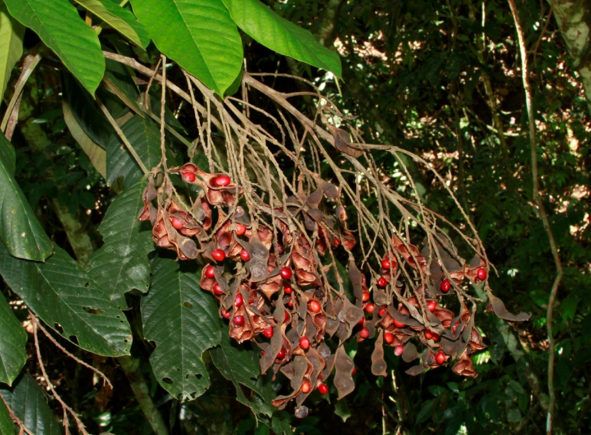
```

### DESCRIPCIÓN DE LA PLANTA {.unlisted -}

Árbol de hasta 25 m. Hojas compuestas de hasta 50 cm, 5-9 folíolos ovales a elípticos, coráceos de 7-20 cm. Panículas de unos 3 cm, con muchas flores. Cáliz indumentado de 1 cm, pétalos morado oscuro de 15 mm. Fruto en legumbre de 5-10 cm, estrechada entre las semillas. Semillas rojas, a veces con manchas negras, de 1 cm de largo. La madera es de color pardo claro y blanda.

**Floración y fructificación:** flores en octubre y frutos en febrero y entre junio y septiembre.

**Distribución:** Cordillera Central y Cordillera Septentrional.

**Hábitat:** bosque húmedo y muy húmedo a mediana elevación.

```{r,echo=FALSE,fig.cap="Árbol de *O. krugii* (Foto: W. Encarnación, JBN)",out.width = "100%"}
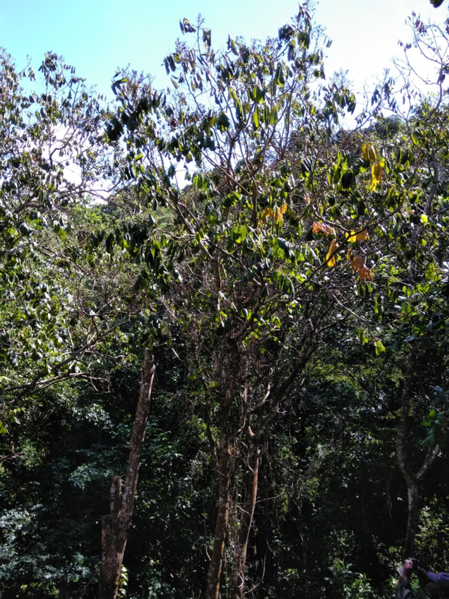
```

### CONSERVACIÓN DE LAS SEMILLAS {.unlisted -}

**Colecta de semillas:** de agosto a febrero.

**Procesamiento y manejo:** las semillas se extraen mecánicamente usando un tamiz de 3.35 mm de diámetro para separarlas de los desechos del fruto. Luego se usa una sopladora de flujo laminar para eliminar los residuos.

**Tolerancia a la deshidratación:** la germinación en semillas secas fue baja (8%) y por tanto parecen no tolerar la desecación. Se necesita más investigación para especificar la tolerancia a la desecación en esta especie.

```{r,echo=FALSE,fig.cap="Semillas de *O. krugii* (Foto: P. Gómez Barreiro, RBG Kew)",out.width = "100%"}
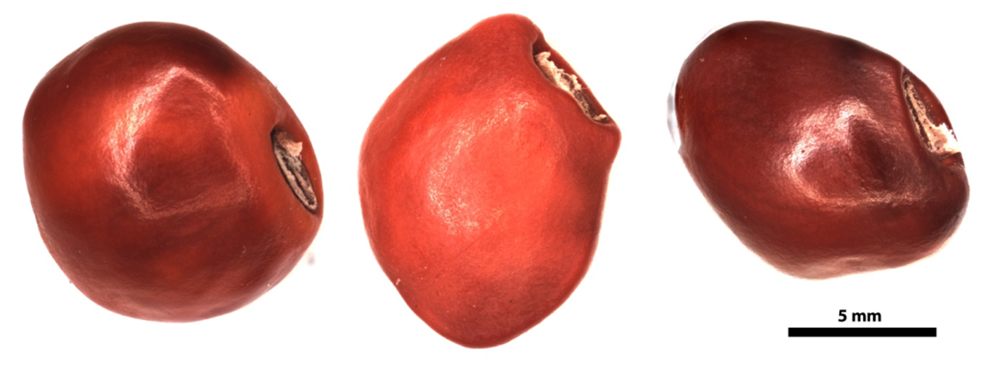
```

### PROPAGACIÓN {.unlisted -}

**Dormancia y pretratamientos:** las semillas limpias se sumergen en agua durante 12-24 horas antes de la siembra. También se pueden sumergir en agua caliente durante 25-30 segundos.

**Germinación, siembra y propagación:** en condiciones de laboratorio, las semillas frescas presentan una viabilidad del 96% y una germinación del 81%. La germinación se inicia a los 25-33 días y finaliza 29-38 días después.

**Propagación y comportamiento en vivero:** las semillas se siembran directamente en macetas (aprox. 30 cm) con una mezcla de sustrato formada por tierra negra, aserrín y estiércol (2:1:1) o en camas con arena de 1.4 mm. Esta especie es muy exigente en términos de humedad del suelo para germinar y puede crecer en suelos húmedos o muy húmedos, arcillosos y de roca caliza. Se puede sembrar todo el año. Cuando las plantas están bien desarrolladas, es posible moverlas a macetas más grandes si es necesario, o directamente en el suelo, lo que permite el correcto desarrollo de las raíces. Se sugiere aplicar riego cada 1-2 días. La adición de limo o fertilizantes orgánicos puede mejorar el establecimiento y crecimiento. La siembra en campo se realiza entre los 2-3 meses, cuando alcanza una altura de 25-35 cm.

**Propagación vegetativa:** no se han sometido a estudios de propagación vegetativa y no se conocen protocolos, pero se han observado estacones que han prosperado.


### COMERCIO {.unlisted -}

No se conoce comercio registrado.


## *Peltophorum dubium var. berteroanum* (Urb.) Barneby {#pelto .unnumbered}

::: {.blackbox data-latex=""}
**Abey hembra, guatapanal**
:::

<br>

**Forma de vida:** árbol.

**Estatus biogeográfico:** endémica de la isla La Española.

**Estado de conservación:** [Peligro Crítico (PC/CR).]{style="color:red"}

La destrucción de su ambiente y el corte para carbón son sus principales amenazas.

**Usos:** maderable. La madera es liviana, usada en ebanistería, carpintería y construcciones rurales.

```{r,echo=FALSE,fig.cap="Flores (izq) y fruto (der) de *Peltophorum dubium var. berteroanum* (Foto: F. Jiménez, JBN)",out.width = "100%"}
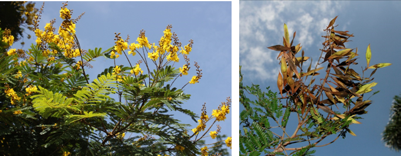
```

### DESCRIPCIÓN DE LA PLANTA {.unlisted -}

Árbol de más de 10-15 m. Hojas compuestas con 10-15 pinnas, los folíolos tienen 14-22 pares de pinnas lineal-oblongos de 4 mm. Flores con pétalos amarillos, obovados de 8-10 mm. Fruto en legrumbre, aplanada de 4-6.5 cm, pubescente. Madera de fibras rectas y regulares, de grano no muy grueso.

**Floración y fructificación:** flores de junio a septiembre y frutos de julio a octubre.

**Distribución:** provincias de Azua, Bahoruco, Pedernales, Peravia y Puerto Plata.

**Hábitat:** bosque seco a baja y mediana elevación.

```{r,echo=FALSE,fig.cap="Árbol de *P. dubium var. berteroanum* (Foto: F. Jiménez, JBN)",out.width = "100%"}
knitr::include_graphics("figures/peltophorum2.png")
```

### CONSERVACIÓN DE LAS SEMILLAS {.unlisted -}

**Colecta de semillas:** de agosto a septiembre.

**Procesamiento y manejo:** las semillas se extraen con un molino para triturar los frutos. Se usa un tamiz de 2.36 mm de diámetro para separar los restos frotando las semillas suavemente con una tapón de hule o goma. Finalmente se usa una sopladora de flujo laminar para eliminar las últimas partículas.

**Tolerancia a la deshidratación:** las semillas toleran la desecación con un porcentaje de germinación del 86% y por tanto son ortodoxas.

```{r,echo=FALSE,fig.cap="Frutos (arriba) y semillas (abajo) de *P. dubium var. berteroanum* (Foto: P. Gómez Barreiro, RBG Kew)",out.width = "100%"}
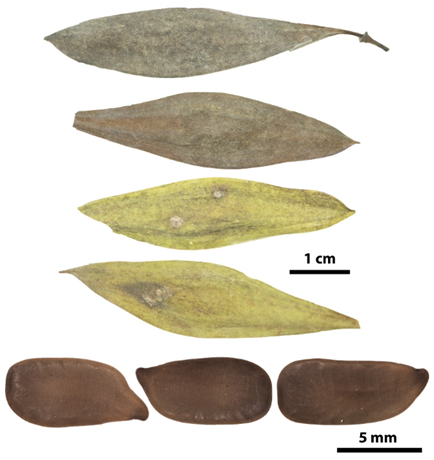
```

### PROPAGACIÓN {.unlisted -}

**Dormancia y pretratamientos:** las semillas limpias se sumergen en agua durante 12-24 h antes de la siembra.

**Germinación, siembra y propagación:** en condiciones de laboratorio, las semillas frescas presentan una viabilidad del 98% y una germinación de 96.2%. La germinación comienza a los 7 días y finaliza a los 45 días después.

**Propagación y comportamiento en vivero:** las semillas se siembran directamente en macetas (aprox. 30 cm) con una mezcla de sustrato formado por tierra negra, aserrín y estiércol (2:1:1) o en camas con arena de 1.4 mm. Esta especie crece en suelos secos y pobres en nutrientes. Se puede sembrar todo el año. Cuando las plantas están bien desarrolladas, es posible moverlas a macetas más grandes si es necesario, o directamente en el suelo, lo que permite el correcto desarrollo de las raíces. Se sugiere aplicar riego cada dos días evitando inundaciones para un buen desarrollo de las hojas y crecimiento general de la planta. La siembra en campo se realiza entre el cuarto o quinto mes, cuando alcanza una altura de 25 a 35 cm.

**Propagación vegetativa:** no se han sometido a estudios de propagación vegetativa y no se conocen protocolos.

```{r,echo=FALSE,fig.cap="Plántula en vivero de *P. dubium var. berteroanum* (Foto: P. Gómez Barreiro, RBG Kew)",out.width = "100%"}
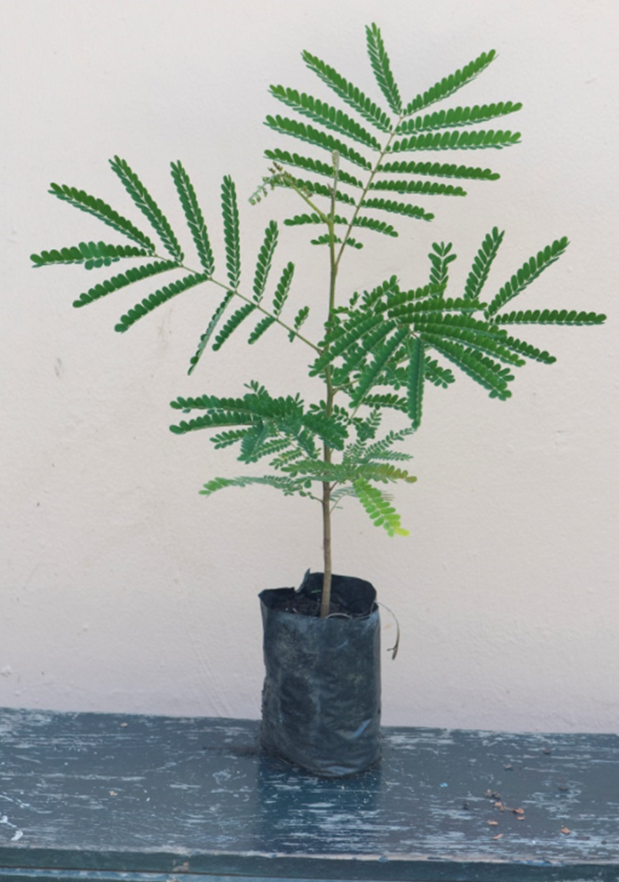
```

### COMERCIO {.unlisted -}

Existe la venta de madera para ebanistería.


## *Vachellia cucuyo* (Barneby & Zanoni) Seigler & Ebinger {#vachellia .unnumbered}

::: {.blackbox data-latex=""}
**Cucuyo, erizo**
:::

<br>

**Sinónimos:** *Acacia cucuyo* Barneby & Zanoni.

**Forma de vida:** árbol.

**Estatus biogeográfico:** endémica de la República Dominicana.

**Estado de conservación:** [Pelígro Crítico (PC/CR).]{style="color:red"}

Las poblaciones están disminuyendo debido a que su hábitat se encuentra en zonas donde hay muchas amenazas y presiones.

**Usos:** maderable. La madera es dura, resistente y pesada. Su mayor uso es como madera redonda para trabajos de carpintería aunque se puede aserrar.

```{r,echo=FALSE,fig.cap="Flores (izq) y frutos (der) de *Vachellia cucuyo* (Foto: F. Jiménez, JBN)",out.width = "100%"}
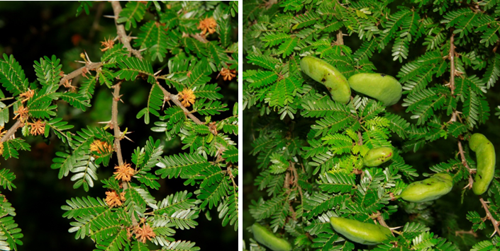
```

### DESCRIPCIÓN DE LA PLANTA {.unlisted -}

Árbol de 15 m o más. Las ramas son lenticeladas, armadas con un par de estípulas espinosas aciculares (2-8 mm) debajo de las hojas. Las hojas tienen 1-2 pares de pinnas, con una glándula entre los pares de pinnas. Las pinnas tienen 8-14 pares de foliolos, linear-oblongos de 4-7 x 1-2 mm obtusos o apiculados. El pedúnculo es fasciculado de 6-13 mm; flores con el cáliz campanulado, de 1-1.4 mm; la corola anaranjado-amarilla, de 2.6-2.8 mm. Los frutos son legumbres, 1-2 por cabezuela, sésiles, oblongo-elisoideas, de 2.5-6.5 cm por 11-17 mm; semillas pardas lentiformes, de 3.3-4 mm.

**Floración y fructificación:** flores de febrero a abril y frutos de mayo a agosto, pero puede variar en función del régimen de lluvia.

**Distribución:** provincias de Azua, Barahona y Pedernales.

**Hábitat:** bosque seco sobre sustrato de roca caliza, principalmente próximo a la costa a baja elevación.

```{r,echo=FALSE,fig.cap="Árbol (izq) y detalle del tronco (der) de *V. cucuyo* (Foto: P. Gómez Barreiro, RBG Kew)",out.width = "100%"}
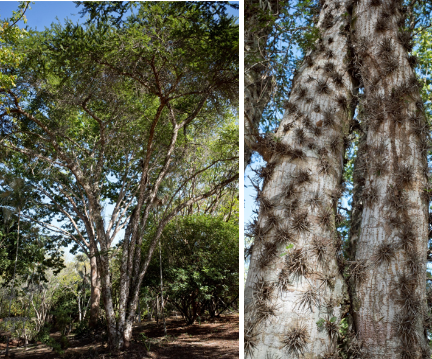
```

### CONSERVACIÓN DE LAS SEMILLAS {.unlisted -}

**Colecta de semillas:** de junio a julio.

**Procesamiento y manejo:** las semillas se extraen utilizando un molino para triturar los frutos. Se separan con un tamiz de 1.4 mm de diámetro frotando suavemente con un tapón de goma o hule. Luego se usa una sopladora de flujo laminar para eliminar las últimas partículas.

**Tolerancia a la deshidratación:** las semillas tienen tolerancia a la desecación con un porcentaje de germinación del 66.8% y por tanto son ortodoxas.

```{r,echo=FALSE,fig.cap="Semillas (izq) y plántula de vivero (der) de *V. cucuyo* (Foto: P. Gómez Barreiro, RBG Kew)",out.width = "100%"}
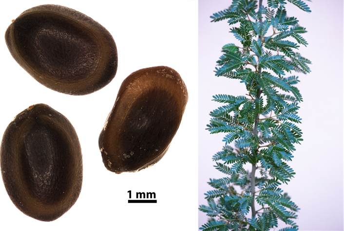
```

### PROPAGACIÓN {.unlisted -}

**Dormancia y pretratamientos: **las semillas limpias se sumergen en agua durante un día.

**Germinación, siembra y propagación:** en condiciones de laboratorio, las semillas frescas presentan una viabilidad del 97% y una germinación del 90%. La germinación empieza a los 29 días y finaliza 16 días después.

**Propagación y comportamiento en vivero:** las semillas se siembran directamente en macetas (aprox. 30 cm) con un sustrato formado por tierra negra, aserrín y estiércol (2:1:1) o en camas con arena de 1.4 mm. No es muy exigente en términos de humedad del suelo y puede crecer en suelos rocosos y arenosos, pobres en nutrientes y materia orgánica. Se puede sembrar todo el año. Cuando las plantas están bien desarrolladas, es posible moverlas a macetas más grandes si es necesario, o directamente en el suelo, lo que permite el correcto desarrollo de las raíces. Se sugiere aplicar riego cada día. La adición de limo o fertilizantes orgánicos puede mejorar el establecimiento y crecimiento. La siembra en campo se realiza entre los meses 3-4, cuando alcanza una altura de 30 a 40 cm.

**Propagación vegetativa:** no se han sometido a estudios de propagación vegetativa y no se conocen protocolos.

### COMERCIO {.unlisted -}

No se conoce comercio, la madera se extrae directamente en su medio natural para la elaboración de carbón.
