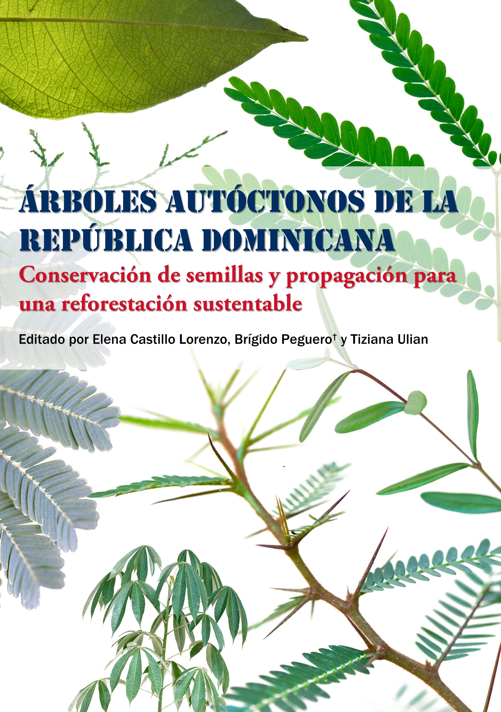

<meta name="google-site-verification" content="_wbR-WmQRrawhpO1O123wV8TJhby5wqCIBgXrDfP8zA" />

# Portada {.unnumbered}

 

El libro **Árboles autóctonos de la República Dominicana: Conservación de semillas y propagación para una reforestación sustentable** contiene 35 fichas de especies de árboles importantes para la sostenibilidad de las comunidades y reforestación de los bosques de la República Dominicana.

La versión original en formato pdf de este libro puede descargarse haciendo click en el botón PDF de la barra de herramientas situada en la parte superior (junto al botón de búsqueda y ajuste de formato de fuente).

### Sugerencia de referencia del libro {.unlisted .unnumbered}

**Castillo-Lorenzo, E., Peguero, B., Jiménez, F., Encarnación, W., Gómez Barreiro, P., Clase, T., García, R., Ulian, T. (2022)** *Árboles autóctonos de la República Dominicana: Conservación de semillas y propagación para una reforestación sustentable.* Editado por Castillo-Lorenzo, E., Peguero, B. y Ulian, T. Santo Domingo, República Dominicana.

 
 

------------------------------------------------------------------------

Versión en línea y PDF disponible en: <https://pgomba.github.io/arbolesRD>

Se autoriza la reproducción total o parcial de esta obra para fines no comerciales citando a la fuente original. Creative Commons License: CC-BY-NC-ND

{width="148"}

© Royal Botanic Gardens, Kew y Jardín Botánico Nacional Dr. Rafael M. Moscoso, 2022

*Versión 1.0.0. Última actualización: `r format(Sys.time(), '%d/%m/%Y')`*
