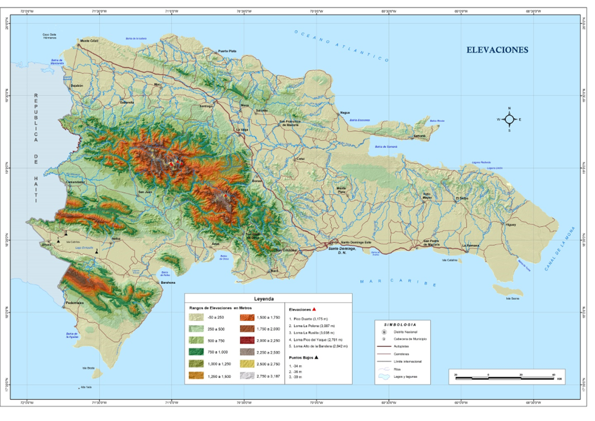
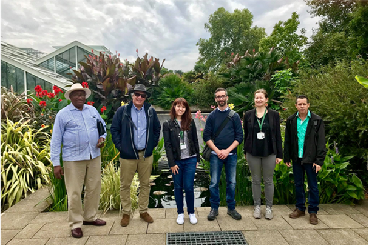

# Introducción {.unnumbered}

Las islas del Caribe son zonas de riqueza en biodiversidad vegetal a nivel global (13,000 especies de las cuales 6550 son endémicas). Dentro del Caribe, la segunda isla con más superficie es La Española que tiene más de 76,000 km² y está dividida en dos naciones, Haití y la República Dominicana (Mattana et al., 2017). En la isla de La Española, la población crece continuamente y los bosques están amenazados principalmente por el cambio de uso de las tierras, como la agricultura, la expansión urbana, y la tala insostenible para la producción de carbón vegetal. Por lo tanto, la deforestación es la principal amenaza para los medios de vida en la isla, y actualmente Haití ha perdido cerca del 97% de la cobertura forestal y República Dominicana el 60% (Kanojia 2018). Los bosques protegen y mantienen los recursos utilizados para la obtención de agua potable y para el riego y por eso las medidas de conservación deben activarse para proteger los bosques y sus ecosistemas. Sin embargo, a pesar de su importancia, ampliamente documentada, el éxito de la conservación de los boques necesita superar una considerable cantidad de desafíos.

La colaboración entre el Real Jardín Botánico de Kew (<abbr title="Royal Botanic Gardens Kew (El Real Jardín Botánico de Kew)">RBG Kew</abbr>) y el Jardín Botánico Nacional 'Dr. Rafael M. Moscoso' de Santo Domingo (<abbr title="Jardín Botánico Nacional Dr. Rafael M. Moscoso">JBN</abbr>) empezó en el 2007 bajo el consorcio de Kew "Millennium Seed Bank Partnership" (MSBP) y con un Acuerdo de Acceso y Distribución de los Beneficios (ABSA) para la conservación y uso sostenible de la flora nativa de La Española. Como parte de esta colaboración, en el 2017 se inauguró oficialmente el banco de semillas del <abbr title="Jardín Botánico Nacional Dr. Rafael M. Moscoso">JBN</abbr> (Mattana et al., 2017), un banco importante para la conservación a largo plazo de la flora del Caribe. Este facilitó la investigación de la biología de las semillas de árboles tropicales, especialmente árboles útiles y amenazados, de las cuáles había información limitada sobre su comportamiento para poder ser conservadas ex situ y su manejo para la reforestación.

En 2015, comenzó el proyecto conjunto entre <abbr title="Royal Botanic Gardens Kew (El Real Jardín Botánico de Kew)">RBG Kew</abbr> y <abbr title="Jardín Botánico Nacional Dr. Rafael M. Moscoso">JBN</abbr> "Salvaguardando los bosques amenazados de La Española en la República Dominicana", en el marco del proyecto Global Tree Seed Bank (GTSB, Banco Mundial de Semillas de Árboles), financiado por la Fundación Garfield Weston, cuyo objetivo global es conservar las semillas de al menos 3,000 especies de árboles de todo el mundo a largo plazo. En la República Dominicana, este proyecto tuvo como objetivo conservar y proteger la diversidad de los bosques de La Española salvaguardando las semillas de árboles amenazados, endémicos, nativos e importantes para la sostenibilidad de las comunidades locales, y para el apoyo en actividades de reforestación y sostenibilidad.

Durante este proyecto se han colectado semillas de más de 300 especies de árboles nativos y útiles de la República Dominicana de los cuales más de 200 se han podido conservar ex situ en el banco de semillas del <abbr title="Jardín Botánico Nacional Dr. Rafael M. Moscoso">JBN</abbr> y sus duplicados de seguridad en el Millennium Seed Bank (Banco de Semillas del Milenio) del <abbr title="Royal Botanic Gardens Kew (El Real Jardín Botánico de Kew)">RBG Kew</abbr> en el Reino Unido. A su vez, se propagaron cerca de 70 especies, como por ejemplo Guaiacum officinale, Mammea americana, Mora abbottii, Pimenta ozua o Swietenia mahogani para apoyar actividades de reforestación en zonas degradadas, incluyendo parques y jardines de la capital Santo Domingo. Además, se plantaron y donaron más 20,000 plántulas a otras organizaciones gubernamentales y no gubernamentales, incluyendo escuelas. Finalmente, parte de estas plántulas se utilizaron para establecer un nuevo jardín botánico en la ciudad de Santiago.

## Información general sobre el libro {.unnumbered}

Este libro forma parte de uno de los productos principales de diseminación del proyecto "Salvaguardando los bosques amenazados de La Española en la República Dominicana" y recopila la información obtenida conjuntamente entre el <abbr title="Jardín Botánico Nacional Dr. Rafael M. Moscoso">JBN</abbr> y el <abbr title="Royal Botanic Gardens Kew (El Real Jardín Botánico de Kew)">RBG Kew</abbr>. El libro incluye 35 fichas de especies de árboles importantes para la sostenibilidad de las comunidades y reforestación de los bosques de la República Dominicana. Las fichas de las especies están estructuradas de forma consistente, por tanto, pueden ser leídas individualmente y la información es fácilmente accesible. La estructura de las fichas fue inspirada del libro de "Plantas silvestres para un futuro sostenible" (Ulian et al., 2019). Todas las especies son nativas o endémicas de La Española y fueron seleccionadas conjuntamente por el <abbr title="Jardín Botánico Nacional Dr. Rafael M. Moscoso">JBN</abbr> y <abbr title="Royal Botanic Gardens Kew (El Real Jardín Botánico de Kew)">RBG Kew</abbr> durante el proyecto. Las especies están ordenadas alfabéticamente en función de la familia taxonómica a la que pertenecen y de su nombre científico. Al final hay un [Glosario](#comunes) que permite su localización a través del nombre común. 

Para cada especie se describe información detallada sobre la **taxonomía y nomenclatura**. Los nombres científicos aceptados y sinónimos siguiendo las guías de Plants of the World Online (POWO 2020, Plantas del Mundo online). Sin embargo, hay algunas especies cuyo nombre más conocido en República Dominicana es uno de los sinónimos, según POWO, y por tanto se ha especificado con la abreviatura botánica nom. cons. (del latín nomen conservandum o nombre conservado), incluyendo también el nombre científico aceptado. Además, cada especie tiene incluido su nombre común de uso habitual en la República Dominicana.

Además se incluyen el **estado de conservación** y **descripción** de la planta, así como sus **usos** reportados; la **distribución** dentro de la República Dominicana; su **fenología** y su **hábitat**; la información sobre el **manejo de las semillas**, **descripción de los procesos de germinación y su propagación en los viveros** del <abbr title="Jardín Botánico Nacional Dr. Rafael M. Moscoso">JBN</abbr>. Todas las semillas fueron recolectadas en la República Dominicana por el equipo del <abbr title="Jardín Botánico Nacional Dr. Rafael M. Moscoso">JBN</abbr> en colaboración con el equipo del <abbr title="Royal Botanic Gardens Kew (El Real Jardín Botánico de Kew)">RBG Kew</abbr>.

Cada ficha tiene una breve descripción botánica de la planta, incluyendo las estimaciones de tamaño de los árboles. Los valores de sus medidas son promedios de 10-12 individuos en campo. También se ha contrastado la información con otros expertos botánicos de campo y en la literatura (Liogier, A., 2000). Los tamaños pueden variar con respecto a árboles cultivados donde, al no tener competencia, las medidas serían mayores. Las fechas proporcionadas para la floración, fructificación y recolección de las semillas indican el rango estimado procedente de todas las zonas de distribución para cada especie. La distribución y el hábitat se ha proporcionado para cada especie para su uso potencial en plantaciones y actividades de reforestación o restauración. El estado de conservación de las especies fue contrastado con la Lista Roja de especies amenazadas (IUCN 2020). Además, se han incluido los usos conocidos, así como su comercio potencial o existente de cada una de las plantas en función de la relevancia y el conocimiento local para República Dominicana.

Con respecto a la información sobre el procesamiento y manejo de las semillas, está especificada para cada especie. En el apartado de conservación de semillas, la tolerancia a la deshidratación se estimó para todas las especies cuando era posible usando el protocolo modificado del **100-seed test** (Pritchard et al., 2004) como se define en Mattana et al., 2019. Se analizó la germinación de las semillas en tres lotes de 32 semillas cada tratamiento, frescas (almacenadas de 1-3 semanas una vez limpias las semillas a temperatura ambiente) húmedas (recién colectadas) y secas (guardadas en silica gel o desecante durante 15 días hasta que la humedad baja como se especifica en la Tabla 1). Las semillas se pusieron a germinar en condiciones controladas a 25°C en un fotoperiodo de 12/12 h (luz/oscuridad) con filtros de papel empapados en agua y en placas Petri de 90 mm de diámetro.

Para la propagación se muestran los pretratamientos y las técnicas a seguir para romper la dormancia de las semillas, en caso de que exista, para cada una de las especies. Las conclusiones están basadas en los datos de laboratorio obtenidos en el banco de semillas del <abbr title="Jardín Botánico Nacional Dr. Rafael M. Moscoso">JBN</abbr>, siempre que no se especifique lo contrario.

En los ensayos de viabilidad se realizó la prueba de corte de 10 semillas, que consiste en cortarlas por la mitad y descartar las semillas vacías, abortadas o infectadas para estimar su viabilidad. En los experimentos de germinación, se usaron semillas frescas incubadas a 25°C, 12/12 h de fotoperiodo (luz/oscuridad) con filtros de papel empapados en agua y en placas Petri de 90 mm de diámetro. Finalmente, la propagación en vivero describe las prácticas más comunes para propagar cada una de las especies según la experiencia del <abbr title="Jardín Botánico Nacional Dr. Rafael M. Moscoso">JBN</abbr>.

## Referencias {.unnumbered}

Gold, K., & Hay, F. (2014). Identifying desiccation sensitive seeds. Technical information sheet No.10. Royal Botanic Gardens, Kew. London.

IUCN (2020). The IUCN Red List of Threatened Species. Version 2020. <https://www.iucnredlist.org> Accedido en Mayo 2020. Kanojia, M. (2018). Addressing Deforestation on the Island of Hispaniola (Tesis doctoral).

Liogier, A. (2000). Diccionario Botánico de Nombres Vulgares de La Española. Jardín Botánico Nacional de Santo Domingo. República Dominicana.

Mattana, E., Manger, K. R., Way, M. J., Ulian, T., Garcia, R., Encarnacion, W., Clase, T., Peguero, B. and Jimenez, F. (2017) A new seed bank for Hispaniola to support the conservation and sustainable use of the Caribbean native flora. Oryx, 51(3), pp. 394-395.

Mattana, E., Peguero, B., Di Sacco, A., Agramonte, W., Castillo, W. R. E., Jiménez, F., Clase, T., Pritchard, H. W., Gómez-Barreiro, P., Castillo-Lorenzo, E., Way, M. J., García, R. and Ulian, T. (2019) Assessing seed desiccation responses of native trees in the Caribbean. New Forests, pp. 1-17.

POWO, (2020) Plants of the World online. <http://www.plantsoftheworldonline.org/> Accedido en Mayo 2020.

Pritchard, H. W., Wood, C. B., Hodges, S., & Vautier, H. J. (2004). 100-seed test for desiccation tolerance and germination: a case study on eight tropical palm species. Seed Science and Technology, 32(2), 393-403.

Ulian, T., Flores, C., Lira, R., Mamatsharaga, A., Mogotsi, K. K., Muthoka, P., Ngwako, S., Nyamongo, D.O., Omondi, W., Sanogo, A.K., Sanogo, S., & Mattana, E. (2019). Wild plants for a sustainable future: 110 Multipurpose species. Royal Botanic Gardens, Kew, Kew Publishing.
