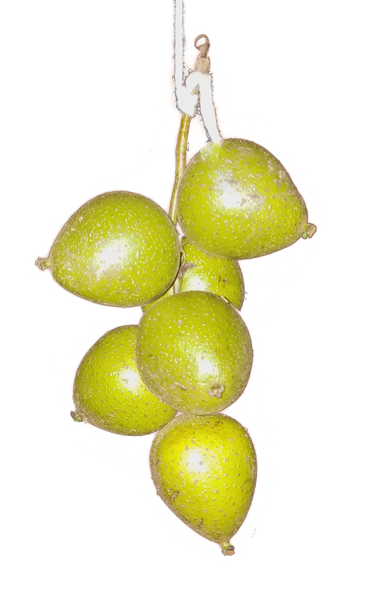

# Juglandaceae {.unnumbered}

## *Juglans jamaicensis* C. DC. {#juglans .unnumbered}

::: {.blackbox data-latex=""}
**Nogal, nuez, nogá**
:::

<br>

**Sinónimos:** *Juglans domingensis* Dode., *J. jamaicensis subsp. insularis* (Griseb.) H. Schaarshm. 

**Forma de vida:** árbol.

**Estatus biogeográfico:** nativa de La Española, Cuba y Puerto Rico.

**Estado de conservación:** [Pelígro Crítico (PC/CR).]{style="color:red"}

Las poblaciones se han reducido drásticamente debido al uso irracional de su madera y la destrucción de su hábitat. Actualmente es una especie muy rara de encontrar en República Dominicana.

**Usos:** medicinal, maderable y como frutal. La hoja y la corteza son astringentes y diaforéticas; la corteza de la raíz es purgante, el té es eficaz contra la lepra, los granos, nacido (forúnculo) y escrófulas. La madera compite con la caoba, es fuerte, compacta, de grano fino, usada en ebanistería. La nuez es comestible, aunque algo indigesta.

```{r,echo=FALSE,fig.cap="Fruto de *Juglans jamaicensis* (Foto: Y. Piña, JBN)",out.width = "100%"}

```

### DESCRIPCIÓN DE LA PLANTA {.unlisted -}

Árbol elevado de hasta 15 a 18 m, hojas imparipinnadas, folíolos con 7-9 pares, ovados-oblongos, acuminados, aserrulados de 7.5-10 cm. Las flores son estaminadas en amentos delgados, las pistiladas solitarias con largos péndulos. Fruto en drupa de 3.8 cm.

**Floración y fructificación:** flores de febrero a mayo y frutos de marzo a junio

**Distribución:** provincias de Azua, Espaillat, Hermanas Mirabal, Independencia, La Vega, Monte Plata, Puerto Plata, San José de Ocoa y Santiago.

**Hábitat:** bosque húmedo a mediana y alta elevación.

```{r,echo=FALSE,fig.cap="Árbol de *J. jamaicensis* (Foto: F. Jiménez, JBN)",out.width = "100%"}

```


### CONSERVACIÓN DE LAS SEMILLAS {.unlisted -}

**Colecta de semillas:** de julio a octubre.

**Procesamiento y manejo:** las semillas se extraen mecánicamente de los frutos con una despulpadora y agua potable. Finalmente, se separan con un tamiz de 5.60 mm de diámetro, frotándolas ligeramente con un tapón de goma.

**Tolerancia a la deshidratación:** no hay datos disponibles en la literatura, sin embargo, los bajos porcentajes de germinación (<30%) obtenidos en el JBN sugiere la necesidad de investigar más sobre el comportamiento de almacenamiento de éstas semillas.

```{r,echo=FALSE,fig.cap="Nueces y secciones de *J. jamaicensis* (Foto: P. Gómez Barreiro, RBG Kew)",out.width = "100%"}

```

### PROPAGACIÓN {.unlisted -}

**Dormancia y pretratamientos:** se sumergen las semillas limpias en agua durante un día antes de la siembra.

**Germinación, siembra y propagación:** en condiciones de laboratorio, las semillas frescas presentan una viabilidad del 93%, y se obtiene una germinación del 86%. La germinación comienza a los 25 días y finaliza a los 45-61 días.

**Propagación y comportamiento en vivero:** las semillas se siembran directamente en macetas (aprox. 30 cm) con un sustrato formado por tierra negra, aserrín y estiércol (2:1:1) o en camas con arena de 1.4 mm. Esta especie es muy exigente en términos de humedad para germinar, necesita suelos húmedos y arcillosos. Se puede sembrar todo el año. Cuando las plantas están bien desarrolladas, es posible moverlas a macetas más grandes si es necesario, o directamente en el suelo, lo que permite el correcto desarrollo de las raíces. Se sugiere aplicar riego cada 1 o 2 días para un buen desarrollo de las hojas y crecimiento de la planta. La adición de limo o fertilizantes orgánicos puede mejorar el establecimiento y crecimiento de las plantas. La siembra en campo se realiza entre los 3-4 meses (cuando alcanza una altura de 25-40 cm).

**Propagación vegetativa:** los árboles de nogal jóvenes rebrotan en abundancia. No se han sometido a estudios de propagación vegetativa, sin embargo, es probable que el nogal se pueda injertar de la misma manera que *J. nigra*.


### COMERCIO {.unlisted -}

Actualmente no tiene comercio debido a la escasez de plantas, pero en el pasado fue una madera muy demandada por su calidad, color y pulido.


