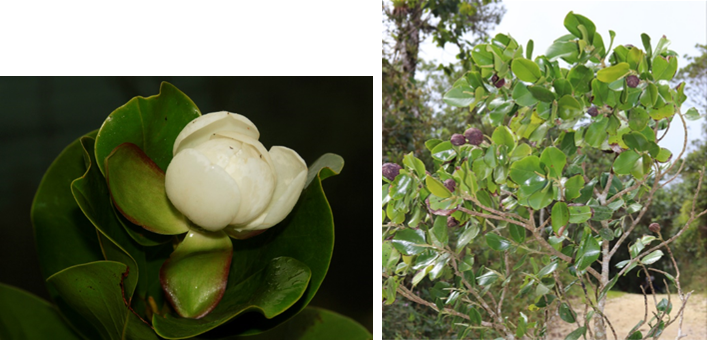
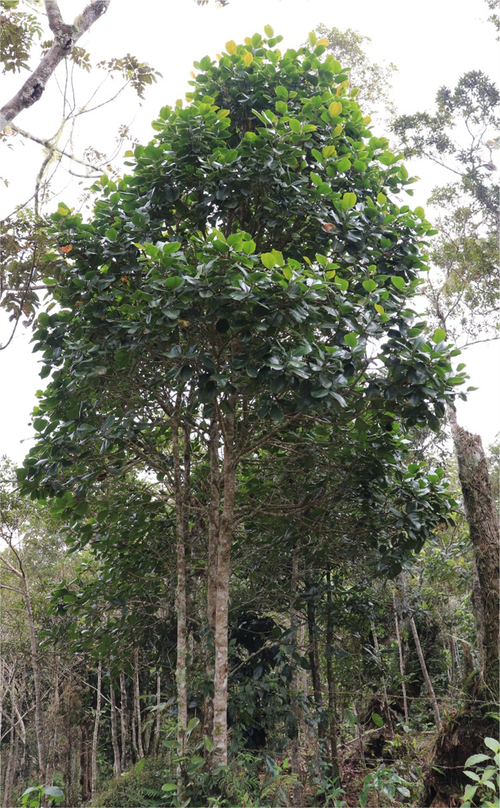
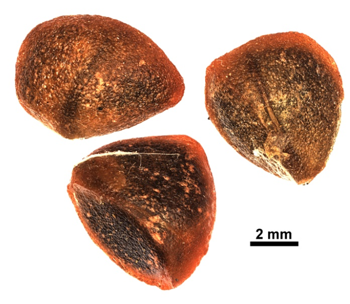
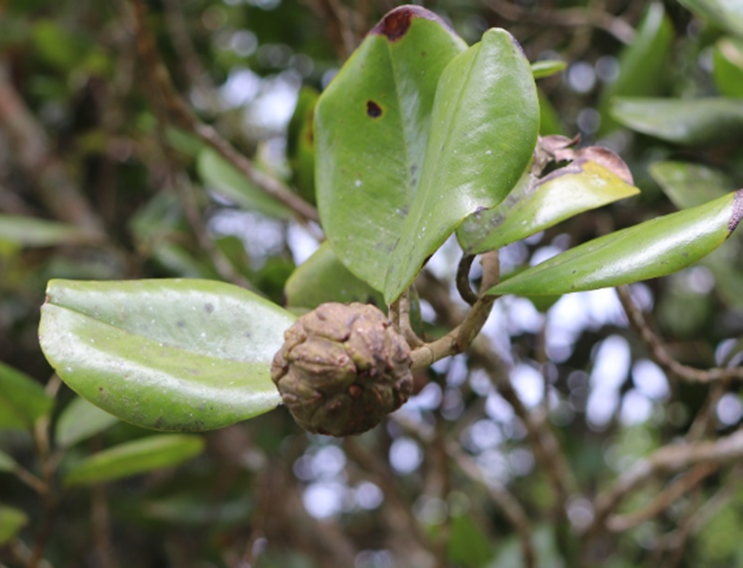

# Magnoliaceae {.unnumbered}

## *Magnolia hamorii* Howard {#magnolia .unnumbered}

::: {.blackbox data-latex=""}
**Tabacón, palo de tabaco, ébano amarillo**
:::

<br>

**Sinónimos:** *Dugandiodendron hamori* (Howard) Sima & S.G. Lu.

**Forma de vida:** árbol.

**Estatus biogeográfico:** endémica de la República Dominicana.

**Estado de conservación:** [Pelígro Crítico (PC/CR).]{style="color:red"}

Las poblaciones se han reducido drásticamente debido a la destrucción y fragmentación de sus ambientes, así como por el corte de los árboles para madera.

**Usos:** maderable y ornamental. El duramen (corazón) de la madera es bastante oscuro, casi negro y muy vistoso. Esta especie es rara y no parece haber sido objeto de explotación de madera a nivel del ébano verde.

```{r,echo=FALSE,fig.cap="Flor (izq) y rama con frutos (der) de *Magnolia hamorii* (Foto: F. Jiménez, JBN y Y. Piña, JBN)",out.width = "100%"}

```

### DESCRIPCIÓN DE LA PLANTA {.unlisted -}

Árbol de hasta 15 m. Ramas blanco-serícias, hojas ovaladas de 7-10 cm, coriáceas, emarginadas. Flores terminales, blancas y fragantes. Los segmentos del perianto son oblongos, de 4.5 cm, los interiores son obovados de 3.5 cm y tienen numerosos estambres. Los frutos son oblongos de 3.5-4 cm.

**Floración y fructificación:** flores en agosto y frutos de enero a marzo.

**Distribución:** provincia de Barahona (Bahoruco oriental).

**Hábitat:** en bosque nublado, en las altas montañas.

```{r,echo=FALSE,fig.cap="Árbol de *M. hamorii* (Foto: F. Jiménez, JBN)",out.width = "100%"}

```

### CONSERVACIÓN DE LAS SEMILLAS {.unlisted -}

**Colecta de semillas:** de enero a marzo.

**Procesamiento y manejo:** las semillas se extraen mecánicamente con un tamiz de 2.36 mm de diámetro y agua potable. Se separan los residuos de los frutos frotándolas suavemente con un tapón de hule o goma.

**Tolerancia a la deshidratación:** se obtuvieron porcentajes bajos de germinación en laboratorio (53%) en semillas secas y parecen tener una tolerancia intermedia. Sin embargo, se necesita investigar más sobre el comportamiento de almacenaje para esta especie.

```{r,echo=FALSE,fig.cap="Semillas de *M. hamorii* (Foto: P. Gómez-Barreiro, RBG Kew)",out.width = "100%"}

```

### PROPAGACIÓN {.unlisted -}

**Dormancia y pretratamientos:** las semillas se estratifican en frío a 15°C entre 1 y 2 meses y se sumergen en agua por un día antes de la siembra.

**Germinación, siembra y propagación:** en condiciones de laboratorio, las semillas frescas presentan una viabilidad del 91% y una germinación del 83%. La germinación se inicia a los 85-97 días y finaliza en 4-5 meses.

**Propagación y comportamiento en vivero:** las semillas se siembran directamente en macetas (aprox. 30 cm) con un sustrato formado por tierra negra, paja de coco molida y estiércol (2:1:1) o en camas con arena de 1.4 mm. Esta especie es muy exigente en términos de humedad del suelo y puede crecer en suelos húmedos y muy húmedos, arcillosos con roca caliza. Se puede sembrar entre diciembre y marzo. Cuando las plantas están bien desarrolladas, es posible moverlas a macetas más grandes si es necesario, o directamente en el suelo, lo que permite el correcto desarrollo de las raíces. Se sugiere aplicar riego cada 1-2 días. La adición de limo o fertilizantes orgánicos puede mejorar el establecimiento y crecimiento. La siembra en campo se realiza entre los meses 3-4, cuando alcanza una altura de 30 a 40 cm.

**Propagación vegetativa:** no se han sometido a estudios de propagación vegetativa y no se conocen protocolos.

```{r,echo=FALSE,fig.cap="Detalle del fruto de *M. hamorii* (Foto: Y. Piña, JBN)",out.width = "100%"}

```

### COMERCIO {.unlisted -}

No se conoce comercio registrado.


