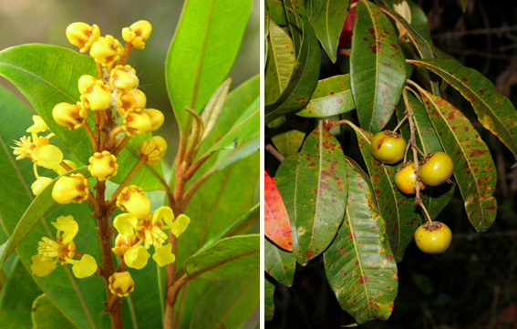
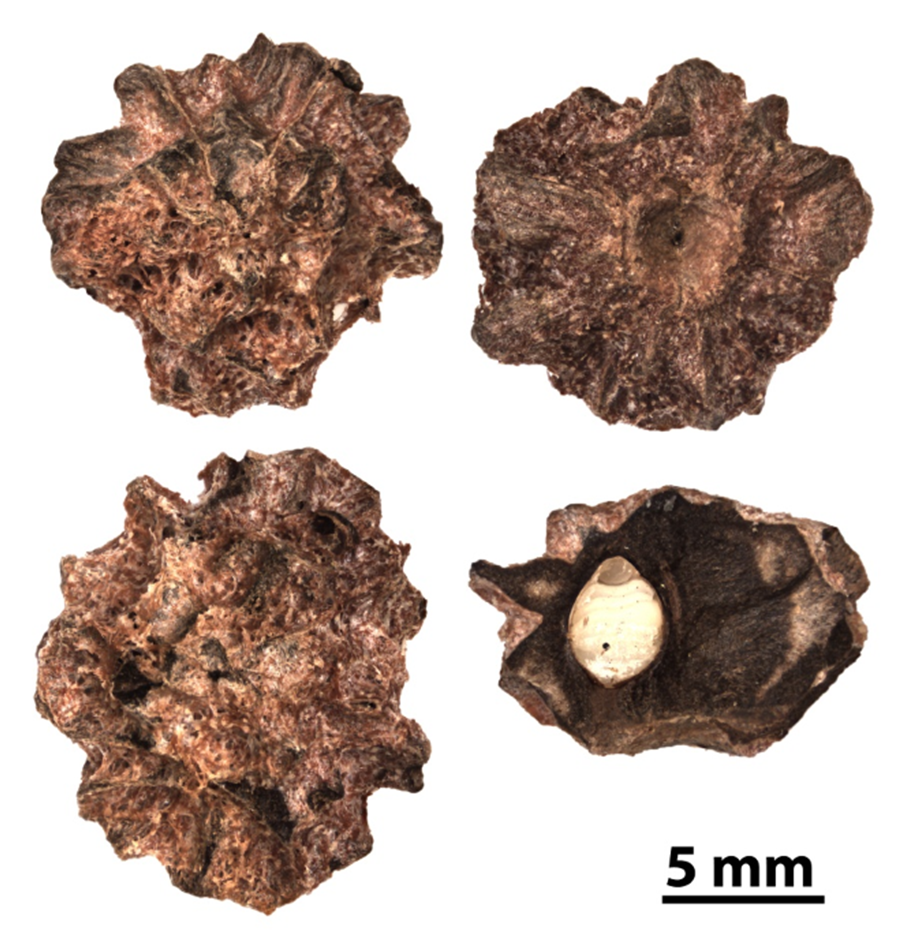

# Malpighiaceae {.unnumbered}

## *Byrsonima spicata* (Cav.) Rich. ex Kunth {#byrsonia .unnumbered}

::: {.blackbox data-latex=""}
**Peralejo, madroño, maricao, piragua**
:::

<br>

**Sinónimos:** *Malphighia guadalupensis* Spreng., *M. spicata* Cav.

**Forma de vida:** árbol.

**Estatus biogeográfico:** nativa de Cuba, Puerto Rico, La Española, las Antillas y el norte de América del Sur.

**Estado de conservación:** [Vulnerable (VU).]{style="color:red"}

Las poblaciones se han desaparecido o se han reducido debido a la destrucción de sus ambientes por el avance de la frontera agropecuaria.

**Usos:** medicinal y frutal. El fruto fresco y en conserva es comestible y también se usa para hacer licor (licor de maricao). La corteza de la madera sirve para curtir pieles y en la medicina local se usa como febrífugo.

```{r,echo=FALSE,fig.cap="Flor (izq) y frutos (der) de *Byrsonima spicata* (Foto: F. Jiménez, JBN)",out.width = "100%"}

```

### DESCRIPCIÓN DE LA PLANTA {.unlisted -}

Árbol de hasta 15 m. Hojas elípticas oblongas de 3-18 cm de largo, obtusas, acuminadas y reticuladas. Flores amarillas en panículas grandes, sépalos ovados de 2.5-3 mm. Fruta en drupa globosa de 8-10 mm de diámetro. La madera es de color pardo rojizo.

**Floración y fructificación:** flores de junio a diciembre y frutos de julio a marzo.

**Distribución:** provincias de Dajabón, Distrito Nacional, Duarte, El Seibo, Espaillat, Hato Mayor, La Altagracia, La Vega, María Trinidad Sánchez, Monseñor Nouel, Monte Plata, Puerto Plata, Samaná, San Cristóbal, San José de Ocoa, Sánchez Ramírez y Santiago.

**Hábitat:** en bosques húmedos y muy húmedos a baja y mediana altitud.

```{r,echo=FALSE,fig.cap="Árbol de *B. spicata* (Foto: F. Jiménez, JBN)",out.width = "100%"}
knitr::include_graphics("figures/byrsonima2.png")
```

### CONSERVACIÓN DE LAS SEMILLAS {.unlisted -}

**Colecta de semillas:** de noviembre a marzo.

**Procesamiento y manejo:** las semillas se extraen utilizando una despulpadora para eliminar la pulpa de los frutos con agua potable durante 30 segundos. Los residuos se separan con un tamiz de 3.35 mm de diámetro frotándo suavemente con un tapón de hule o goma.

**Tolerancia a la deshidratación:** el lote usado en el laboratorio tenía un porcentaje bajo de germinación en semillas frescas (33 %). En el ensayo de tolerancia a la desecación se obtuvo una germinación del 37% y por tanto se puede asumir que son tolerantes.

```{r,echo=FALSE,fig.cap="Semillas de *B. spicata* (Foto: P. Gómez Barreiro, RBG Kew)",out.width = "100%"}

```

### PROPAGACIÓN {.unlisted -}

**Dormancia y pretratamientos:** las semillas limpias se sumergen en agua durante 12-24 horas antes de la siembra.

**Germinación, siembra y propagación:** en condiciones de laboratorio, las semillas frescas presentan una viabilidad del 85% y una germinación del 85%. La germinación comienza a los 30-35 días y finaliza a los 60-65 días.

**Propagación y comportamiento en vivero:** las semillas se siembran directamente en macetas (aprox. 30 cm) con un sustrato formado por tierra negra, aserrín y estiércol (2:1:1) o en camas con arena de 1.4 mm. Esta especie es muy exigente en términos de humedad de suelo para germinar. Puede crecer en suelos húmedos y muy húmedos, arcillosos y arenosos. Se puede sembrar todo el año. Cuando las plantas están bien desarrolladas, es posible moverlas a macetas más grandes si es necesario, o directamente en el suelo, lo que permite el correcto desarrollo de las raíces. Se sugiere aplicar riego cada 2 días. La adición de limo o fertilizantes orgánicos puede mejorar el establecimiento y crecimiento. La siembra en campo se realiza entre los meses cuarto y quinto, cuando alcanza una altura de 30 a 40 cm.

**Propagación vegetativa:** no se han sometido a estudios de propagación vegetativa y no se conocen protocolos, aunque se han observado estacones retoñando.

### COMERCIO {.unlisted -}

No se conoce comercio registrado.