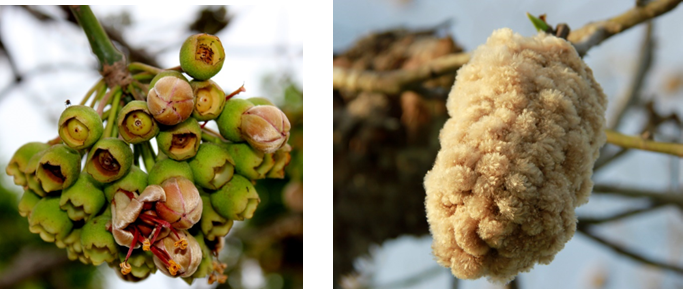
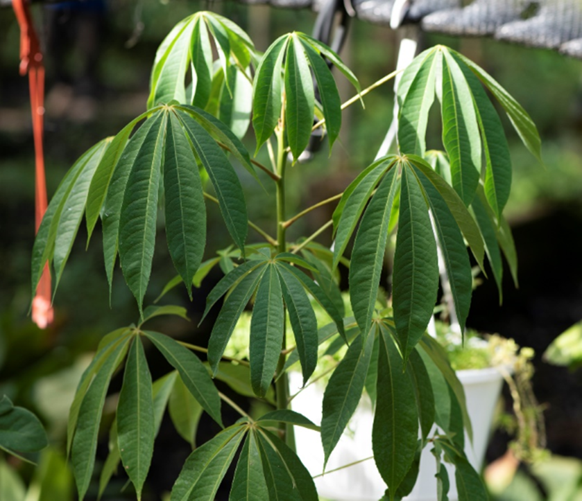
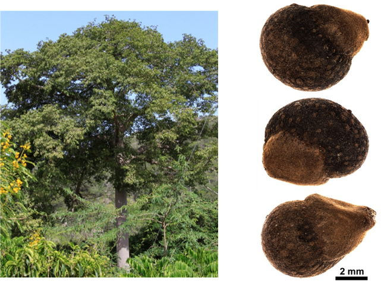

# Malvaceae {.unnumbered}

## *Ceiba pentandra* (L.) Gaertn. {#ceiba .unnumbered}

::: {.blackbox data-latex=""}
**Ceiba**
:::

<br>

**Sinónimos:** *Bombax cumanense* Kunth, *Bombax pentandrum* L., *Ceiba caribaea* (DC.) A. Chev.

**Forma de vida:** árbol.

**Estatus biogeográfico:** nativa del Caribe, Mesoamérica y el norte de América del Sur.

**Estado de conservación:** [Vulnerable (VU).]{style="color:red"}

Esta especie era muy abundante, pero sus poblaciones se han reducido drásticamente debido a la destrucción de su ambiente.

**Usos:** melífera y medicinal. La madera se usa para tambores, combustible y bateas. El contenido en aceite de la semilla se ha usado como combustible y para hacer jabón. Con el fuste de la planta, los indígenas construían sus cayucos o canoas.

```{r,echo=FALSE,fig.cap="Flor (izq) y fruto (der) de *Ceiba pentandra* (Foto: F. Jiménez, JBN)",out.width = "100%"}

```

### DESCRIPCIÓN DE LA PLANTA {.unlisted -}

Árbol de 50 m o superior. Tronco de 2 m de diámetro con copa ancha y extendida. Las ramas tienen aquijones cortos y agudos. Hojas compuestas con 5-7 folíolos oblanceolados, oblongos y obovados, palmeados de 8-12 cm con textura sedosa-pilosa. El fruto es capsular elíptico-oblongo de 10-12 cm. Las semillas son redondeadas curbiertas con una lana sedosa. La madera es rosada, ligera pero firme e irregular, fácil de cortar.

**Floración y fructificación:** flores de enero a marzo y frutos de marzo a mayo.

**Distribución:** provincias de Azua, Bahoruco, Dajabón, Duarte, El Seibo, Espaillat, Hato Mayor, Independencia, La Altagracia, La Romana, María Trinidad Sánchez, Monte Plata, Pedernales, Peravia, Puerto Plata, San Cristóbal, San Juan, San Pedro de Macorís, Sánchez Ramírez, Santiago, Santiago Rodríguez y Santo Domingo.

**Hábitat:** bosque muy húmedo y húmedo de transición a seco.

```{r,echo=FALSE,fig.cap="Detalle de la rama de *C. pentandra* (Foto: P. Gómez Barreiro, RBG Kew)",out.width = "100%"}

```


### CONSERVACIÓN DE LAS SEMILLAS {.unlisted -}

**Colecta de semillas:** de marzo a junio.

**Procesamiento y manejo:** las semillas se extraen mecánicamente de los frutos que están llenos de fibras delgadas y livianas. Usando un tamiz de 2.36 mm de diámetro se eliminan las cápsulas leñosas dehiscentes de los frutos. Se agita la mezcla restante en bolsas de yute para separar las fibras y residuos restantes.

**Tolerancia a la deshidratación:** el lote usado en el laboratorio tenía un bajo porcentaje de germinación y al realizar el ensayo de tolerancia a la desecación en semillas secas se obutvo una germinación del 59.1% y por tanto se cree que son tolerantes (ortodoxas). Sin embargo, se necesitarían más ensayos para proporcionar conclusiones definitivas.

```{r,echo=FALSE,fig.cap="Árbol (izq) y semillas (der) de *C. pentandra* (Foto: F. Jiménez, JBN y P. Gómez-Barreiro, RBG Kew)",out.width = "100%"}

```

### PROPAGACIÓN {.unlisted -}

**Dormancia y pretratamientos:** las semillas limpias se sumergen en agua durante un día antes de la siembra.

**Germinación, siembra y propagación:** en condiciones de laboratorio, las semillas presentan una viabilidad del 98% y una germinación del 87% en semillas frescas. La germinación se inicia entre los 6-9 días y finaliza a los 14-21 días.

**Propagación y comportamiento en vivero:** las semillas se siembran directamente en macetas (aprox. 30 cm) con un sustrato formado por tierra negra, aserrín y estiércol (2:1:1) o en camas con arena de 1.4 mm. Esta especie es muy exigente en términos de humedad del suelo, necesita suelos húmedos o muy húmedos preferiblemente en suelos arcillosos y calizos o cársticos sobre roca madre, calcáreos y arenosos. Se puede sembrar todo el año. Cuando las plantas están bien desarrolladas, es posible moverlas a macetas más grandes si es necesario, o directamente en el suelo, lo que permite el correcto desarrollo de las raíces. Se sugiere aplicar riego cada dos días. La adición de limo o fertilizantes orgánicos puede mejorar el establecimiento y crecimiento. La siembra en campo se realiza entre el tercer o cuarto mes, cuando alcanza una altura de 35 a 45 cm.

**Propagación vegetativa:** puede reproducirse por estacas o esquejes, injerto e injerto de yemas en forma de parche y escudete.

### COMERCIO {.unlisted -}

No tiene comercio reconocido.