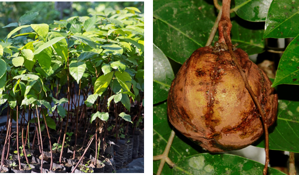
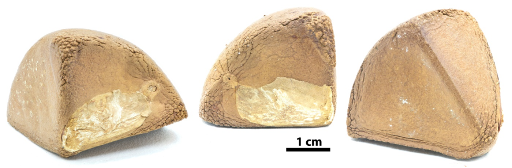
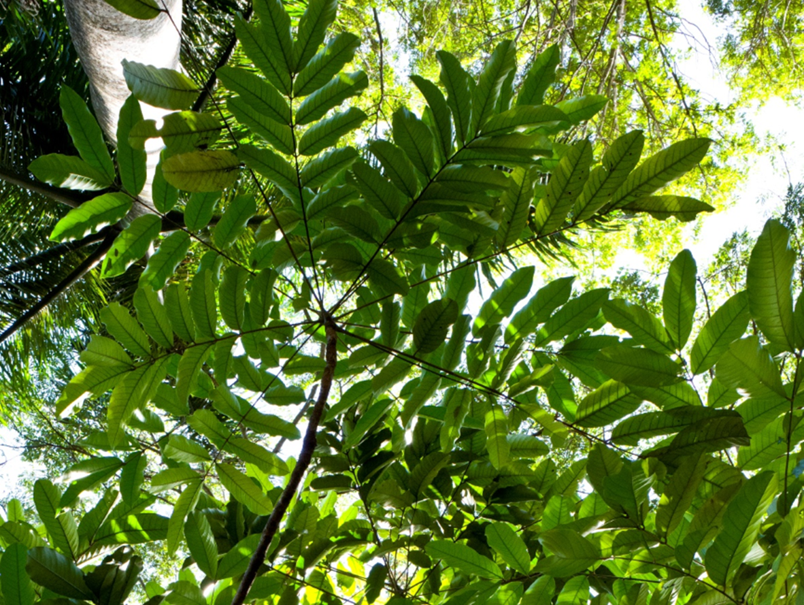

# Meliaceae {.unnumbered}

## *Carapa guianensis* Aubl. {#carapa .unnumbered}

::: {.blackbox data-latex=""}
**Cabirma de Guinea, andiroba^[nombre de la madera]**
:::
<br>

**Sinónimos:** *Carapa macrocarpa* Ducke, *Guarea mucronulata* C. DC., *Xylocarpus carapa* Spreng.

**Forma de vida:** árbol.

**Estatus biogeográfico:** nativa República Dominicana, Cuba y el norte de América del Sur.

**Estado de conservación:** [En Peligro (EP/EN).]{style="color:red"}

Esta especie se encuentra en peligro por la destrucción de sus ambientes y por la tala de la misma por su gran valor maderable.

**Usos:** maderable y medicinal. La madera se usa en las construcciones y para tablas.

```{r,echo=FALSE,fig.cap="Plántulas de vivero (izq) y fruto (der) de *Carapa guianensis* (Foto: P. Gómez Barreiro, RBG Kew y F. Jiménez, JBN)",out.width = "100%"}

```

### DESCRIPCIÓN DE LA PLANTA {.unlisted -}

Árbol grande de hasta 20 m. Hojas compuestas de hasta 1 m, con folíolios de 15-27 cm, oblongos o elíptico-oblongos, agudos o acuminados. Inflorescencias en panículas axilares; flores tetrámeras y el fruto cuadrangular de 7-10 cm.

**Floración y fructificación:** flores en agosto y frutos de enero a marzo.

**Distribución:** provincias de Distrito Nacional, Duarte, Espaillat, Hato Mayor, Monte Plata, Puerto Plata y San Cristóbal.

**Hábitat:** en bosque húmedo y ribereño a baja elevación.

```{r,echo=FALSE,fig.cap="Detalles de la copa de un árbol joven de *C. guianensis* (Foto: P. Gómez Barreiro, RBG Kew)",out.width = "100%"}

```

### CONSERVACIÓN DE LAS SEMILLAS {.unlisted -}

**Colecta de semillas:** de junio a enero.

**Procesamiento y manejo:** las semillas se extraen mecánicamente para eliminar las cápsulas leñosas y dehiscentes de los frutos.

**Tolerancia a la deshidratación:** las semillas no toleran la desecación, en el ensayo de germinación obtuvieron un porcentaje de 0%. Sin embargo se pueden almacenar durante 5 meses mediante secado al aire (65% humedad) a 15°C.

```{r,echo=FALSE,fig.cap="Semillas de *C. guianensis* (Foto: P. Gómez Barreiro, RBG Kew)",out.width = "100%"}

```

### PROPAGACIÓN {.unlisted -}

**Dormancia y pretratamientos:** esta especie no requieren tratamientos especiales para la germinación.

**Germinación, siembra y propagación:** en condiciones de laboratorio, las semillas frescas presentan una viabilidad del 99% y una germinación del 85 al 96%. La germinación comienza a los 13-16 días y finaliza a los 31 días.

**Propagación y comportamiento en vivero:** las semillas se siembran directamente en macetas (aprox. 30 cm) con un sustrato formado por tierra negra, aserrín y estiércol (2:1:1) o en camas con arena de 1.4 mm. Esta especie es muy exigente en términos de humedad del suelo. Puede crecer en suelos húmedos derivados de rocas sedimentarias e ígneas con nutrientes. Se puede sembrar entre diciembre y marzo. Cuando las plantas están bien desarrolladas, es posible moverlas a macetas más grandes si es necesario, o directamente en el suelo, lo que permite el correcto desarrollo de las raíces. Se sugiere aplicar riego cada 1-2 días. La adición de limo o fertilizantes orgánicos puede mejorar el establecimiento y crecimiento. La siembra en campo se realiza entre el primer y segundo mes, cuando alcanza una altura de 35 a 45 cm.

**Propagación vegetativa:** no se han sometido a estudios de propagación vegetativa y no se conocen protocolos.


### COMERCIO {.unlisted -}

Existe la venta de madera para ebanistería, carpintería y construcciones en general.
