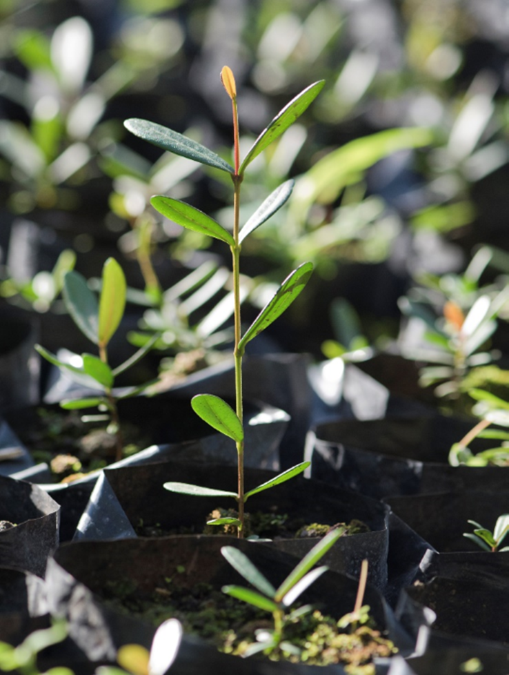
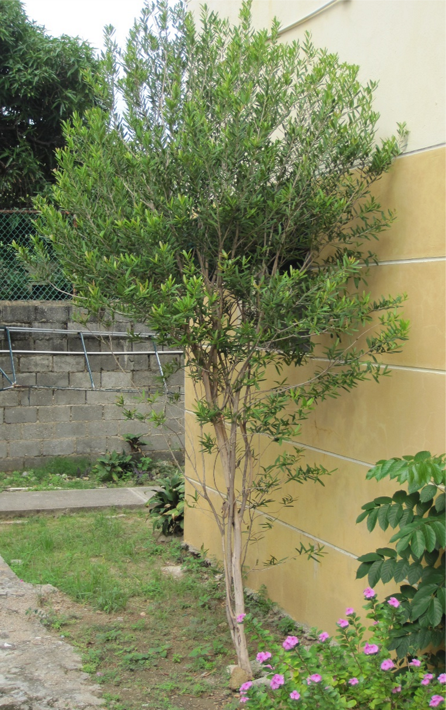
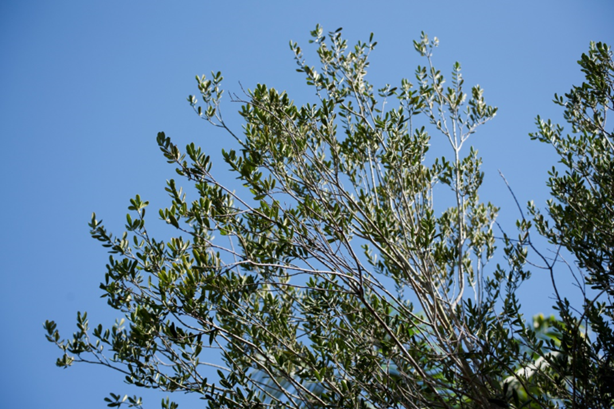

# Myrtaceae {.unnumbered}

## *Pimenta haitiensis* (Urb.) Landrum {#pimenta .unnumbered}

::: {.blackbox data-latex=""}
**Canelilla, canelillo, canelito, malaguette**
:::
<br>

**Sinónimos:** Cryptorhiza haitiensis Urb.

**Forma de vida:** árbol o arbusto.

**Estatus biogeográfico:** endémica de La Española.

**Estado de conservación:** [En Peligro (EP/EN).]{style="color:red"}

La principal amenaza es el uso irracional de sus hojas aromáticas (corte de ramas y árboles) para comercializar. También se ven afectadas por la destrucción del ambiente.

**Usos:** medicinal y aromática.

```{r,echo=FALSE,fig.cap="Plántula de vivero (izq) y frutos (der) de *Pimenta haitiensis* (Foto: P. Gómez Barreiro, RBG Kew y T. Clase, JBN)",out.width = "100%"}

```

### DESCRIPCIÓN DE LA PLANTA {.unlisted -}

DESCRIPCIÓN DE LA PLANTA
Árbol o arbusto aromático de hasta 7 m. Hojas obovado-oblongas a oblongo-lanceoladas, de 3 a 6 cm, glandulosas, coriáceas. Flores poco abundantes, cáliz de 1 mm. Fruto en baya de 8 mm de diámetro.

**Floración y fructificación:** flores de mayo a junio y frutos de mayo a agosto.

**Distribución:** dentro de La Española solo crece en la parte dominicana en la provincia de Pedernales y en la Isla Beata.

**Hábitat:** bosque seco a baja elevación sobre roca calcárea.

```{r,echo=FALSE,fig.cap="Árbol cultivado de *P. haitiensis* (Foto: B. Peguero, JBN)",out.width = "100%"}

```


### CONSERVACIÓN DE LAS SEMILLAS {.unlisted -}

**Colecta de semillas:** de agosto a septiembre.

**Procesamiento y manejo:** las semillas se extraen mecánicamente de los frutos extrayendo la pulpa con una despulpadora y agua potable. Usando un tamiz de 1.4 mm se separan de los desechos frotando suavemente con un tapón de goma o hule.

**Tolerancia a la deshidratación:** El género Pimenta tiene semillas que no toleran la desecación. En el JBN no se obtuvo germinación en ningún tratamiento (secas o húmedas), pero se ha observado que esta especie pierde viabilidad en poco tiempo.

### PROPAGACIÓN {.unlisted -}

**Dormancia y pretratamientos:** esta especie no requieren tratamientos especiales para germinar.

**Germinación, siembra y propagación:** en condiciones de laboratorio, las semillas limpias presentan una viabilidad del 98% y una germinación del 95%. La germinación se inicia a los 18 días y finaliza a los 38-45 días.

**Propagación y comportamiento en vivero:** las semillas se siembran directamente en macetas (aprox. 30 cm) con sustrato formado por tierra negra, paja de coco molida y sustrato orgánico (2:1:1). Esta especie es muy exigente en términos de humedad del suelo y puede crecer en suelos áridos, secos y pobres en nutrientes. Se puede sembrar en los meses de marzo o abril para evitar los meses de más calor. Cuando las plantas están bien desarrolladas, es posible moverlas a macetas más grandes si es necesario, o directamente en el suelo, lo que permite el correcto desarrollo de las raíces. Se sugiere aplicar riego cada 2-3 días. La adición de limo o fertilizantes orgánicos puede mejorar el establecimiento y crecimiento. La siembra en campo se realiza entre los meses cuarto y quinto, cuando alcanza una altura de 25 a 35 cm.

**Propagación vegetativa:** no se han sometido a estudios de propagación vegetativa y no se conocen protocolos.

```{r,echo=FALSE,fig.cap="Árbol cultivado de *P. haitiensis* (Foto: B. Peguero, JBN)",out.width = "100%"}

```

### COMERCIO {.unlisted -}

Las hojas secas tienen una gran demanda por su aroma y se venden en los mercados.

