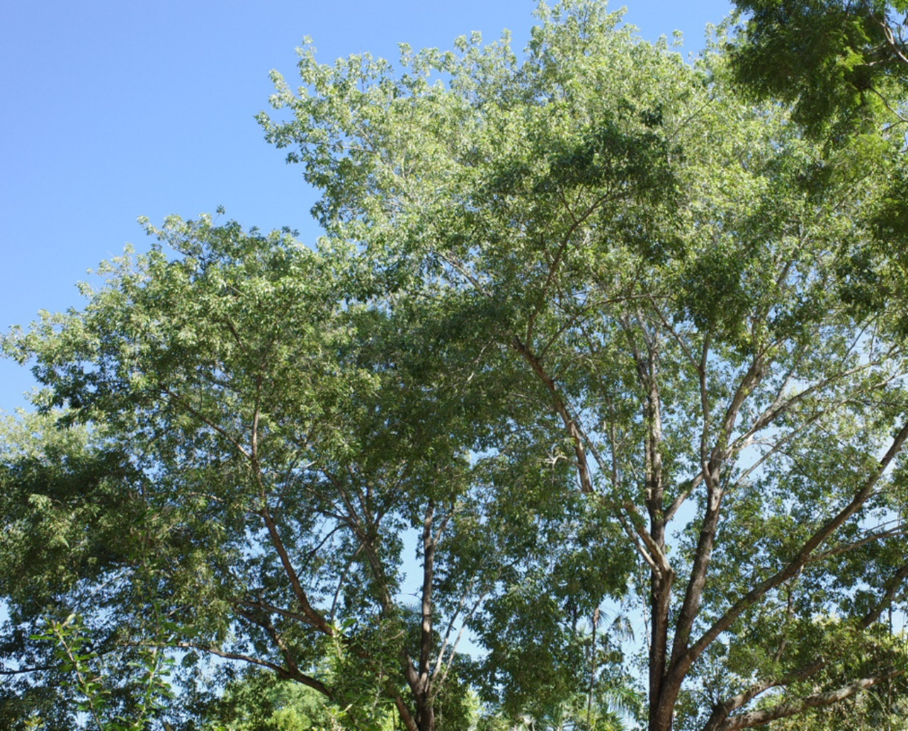
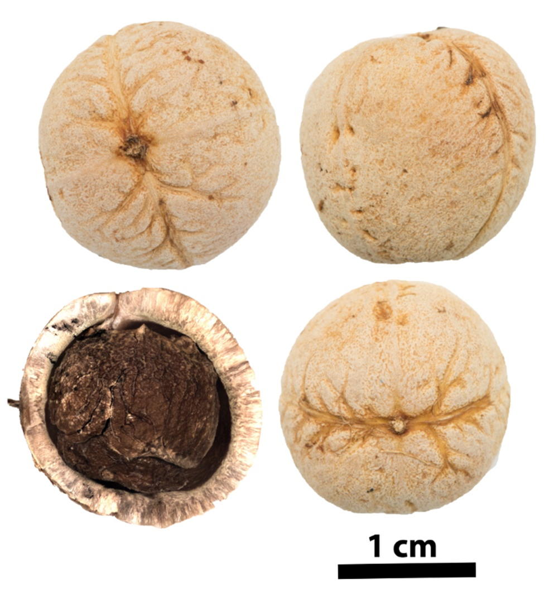

# Picrodendraceae {.unnumbered}

## *Picrodendron baccatum* (L.) Krug & Urb. {#picro .unnumbered}

::: {.blackbox data-latex=""}
**Algodón becerro, manzanilla, ahoga becerro**
:::
<br>

**Sinónimos:** *Juglans baccata* L., *Picrodendron macrocarpum* (A. Rich.) Britton, *Picrodendron medium* Small, *Schmidelia macrocarpa* A. Rich.

**Forma de vida:** árbol.

**Estatus biogeográfico:** nativa del Caribe.

**Estado de conservación:** sin evaluar.

**Usos:** maderable y forraje. Las hojas son comidas por el ganado vacuno.

```{r,echo=FALSE,fig.cap="Detalle de las ramas (izq) y frutos (der) de *Picrodendron baccatum* (Foto: F. Jiménez, JBN)",fig.show="hold", out.width = "49%"}
library(magick)
img1 <- image_read("figures/picrodendron1_1.png")
img2 <- image_read("figures/picrodendron1_2.png")
picrodendron1_1_border <- image_border(img1, "white", "5x0")
picrodendron1_2_border <- image_border(img2, "white", "5x0")
image_write(picrodendron1_1_border, "figures/picrodendron1_1_border.png")
image_write(picrodendron1_2_border, "figures/picrodendron1_2_border.png")
knitr::include_graphics(c("figures/picrodendron1_1_border.png","figures/picrodendron1_2_border.png"))
```

### DESCRIPCIÓN DE LA PLANTA {.unlisted -}

Árbol de más de 20 m. Las hojas son trifoliadas, folíolos oblongos, ovales u obovados y reticulados al final. El cáliz es amarillento, lóbulos linear-lanceolados de 2.5-3.5 cm. Pétalos ausentes, frutos en drupa ovoidea de 2-2.5 cm.

**Floración y fructificación:** flores de enero a febrero y frutos de abril a agosto.

**Distribución:** por toda la isla. También se encuentra en Bahamas, Cuba, Jamaica y las Islas Caimán.

**Hábitat:** bosque seco y semi húmedo, principalmente en la costa.

```{r,echo=FALSE,fig.cap="Detalle de la copa de *P. baccatum* (Foto: P. Gómez Barreiro, RBG Kew)",out.width = "100%"}

```

### CONSERVACIÓN DE LAS SEMILLAS {.unlisted -}

**Colecta de semillas:** de octubre a diciembre.

**Procesamiento y manejo:** las semillas se extraen utilizando una despulpadora para eliminar la pulpa de los frutos con agua potable durante 30 segundos. Con un tamiz de 5.6 mm de diámetro se separan los residuos frotando suavemente con un tapón de hule o goma.

**Tolerancia a la deshidratación:** las semillas secas obtuvieron un 42.3% de germinación. Se necesita más investigación para determinar la tolerancia a la desecación, aunque pueden considerarse intermedias.

```{r,echo=FALSE,fig.cap="Semillas de *P. baccatum* (Foto: P. Gómez Barreiro, RBG Kew)",out.width = "100%"}

```

### PROPAGACIÓN {.unlisted -}

**Dormancia y pretratamientos:** las semillas se sumergen en agua durante un día antes de la siembra.

**Germinación, siembra y propagación:** en condiciones de laboratorio, las semillas frescas presentan una viabilidad del 95% y una germinación del 89%. La germinación se inicia a los 18-22 días y finaliza 12-17 días después.

**Propagación y comportamiento en vivero:** las semillas se siembran directamente en macetas (aprox. 30 cm) con un sustrato formado por tierra negra, aserrín y estiércol (2:1:1) o en camas con arena de 1.4 mm. Esta especie es muy exigente en términos de humedad del suelo y puede crecer en suelos semi-húmedos a secos de roca caliza y arenosos. Se puede sembrar todo el año. Cuando las plantas están bien desarrolladas, es posible moverlas a macetas más grandes si es necesario, o directamente en el suelo, lo que permite el correcto desarrollo de las raíces. Se sugiere aplicar riego cada 1-2 días. La adición de limo o fertilizantes orgánicos puede mejorar el establecimiento y crecimiento. La siembra en campo se realiza entre el tercer y cuarto mes, cuando alcanza una altura de 35 a 45 cm.

**Propagación vegetativa:** no se han sometido a estudios de propagación vegetativa y no se conocen protocolos.

### COMERCIO {.unlisted -}

No se conoce comercio registrado. Su madera es extraída directamente del medio silvestre.


