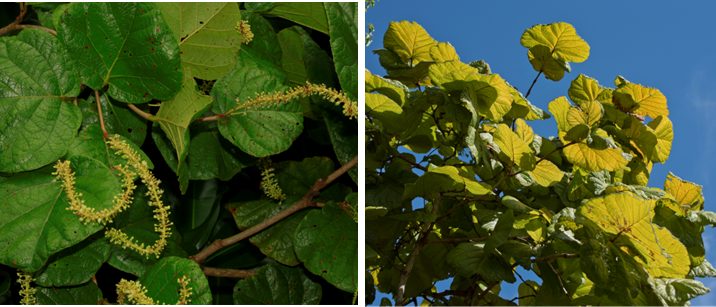
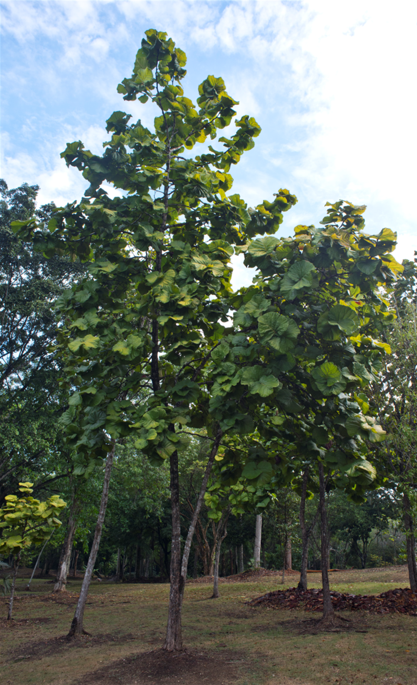
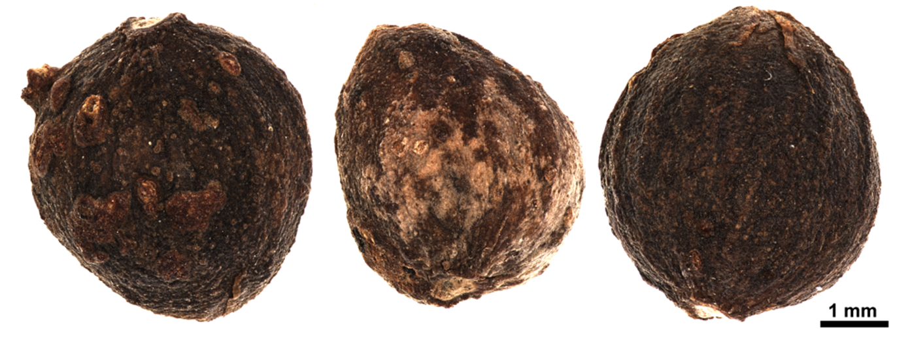

# Polygonaceae {.unnumbered}

## *Coccoloba pubescens* L. {#coccoloba .unnumbered}

::: {.blackbox data-latex=""}
**Hojancho, oreja de burro**
:::
<br>

**Sinónimos:** *Coccoloba antiguensis* Sandwith, *C. rubescens* L., *C. grandifolia* Jacq., *C. bonfilsiana* Stehlé & M. Stehlé.

**Forma de vida:** árbol.

**Estatus biogeográfico:** nativa de las islas La Española, Puerto Rico y las Antillas.

**Estado de conservación:** sin evaluar.

**Usos:** maderable, melífera y ornamental. Es una de las maderas más duras del mercado, es pesada y durable. Se emplea en construcción y para muebles. No se corroe dentro del agua.


```{r,echo=FALSE,fig.cap="Flor (izq) y detalle de las hojas (der) de *Coccoloba pubescens* (Foto: F. Jiménez, JBN y P. Gómez-Barreiro, RBG Kew)",out.width = "100%"}

```

### DESCRIPCIÓN DE LA PLANTA {.unlisted -}

Árbol de hasta 25 m. con un tronco simple poco ramificado. Las hojas son de hasta 0.5 m de diámetro, redondeadas a acorazonadas, reticuladas y pubescentes sobre todo en el envés. Flores en racimos solitarios terminales de 40-70 cm con el cáliz blanco de 2-3 mm. El fruto es globoso a ovoideo de 5 mm. El corazón de la madera es de color marrón rojizo con poros oscuros.

**Floración y fructificación:** flores de mayo a agosto y frutos de agosto a noviembre.

**Distribución:** por toda la isla. También se encuentra en Puerto Rico y las islas Antillas Menores. 

**Hábitat:** bosque húmedo a baja y mediana elevación. También se desarrolla en bosque nublado. 

```{r,echo=FALSE,fig.cap="Árboles de *C. pubescens* (Foto: P. Gómez-Barreiro, RBG Kew)",out.width = "100%"}

```

### CONSERVACIÓN DE LAS SEMILLAS {.unlisted -}

**Colecta de semillas:** de agosto a noviembre.

**Procesamiento y manejo:** las semillas se extraen utilizando una despulpadora para eliminar la pulpa de los frutos con agua potable durante 30 segundos. Con un tamiz de 1.4 mm de diámetro se separan los residuos frotando suavemente con un tapón de hule o goma. 

**Tolerancia a la deshidratación:** el lote usado en el laboratorio tenía un bajo porcentaje de germinación y al realizar el ensayo de tolerancia a la desecación en semillas secas se obutvo una germinación del 30.3 y por tanto se puede asumir que tienen cierta tolerancia. Sin embargo, se necesitarían más ensayos para proporcionar conclusiones definitivas


```{r,echo=FALSE,fig.cap="Semillas de *C. pubescens* (Foto: P. Gómez-Barreiro, RBG Kew)",out.width = "100%"}

```

### PROPAGACIÓN {.unlisted -}

**Dormancia y pretratamientos:** las semillas se sumergen en agua durante un día antes de la siembra.

**Germinación, siembra y propagación:** en condiciones de laboratorio, las semillas frescas presentan una viabilidad del 96% y una germinación del 83%. La germinación se inicia a los 18-22 días y finaliza 12-17 días después.
Propagación y comportamiento en vivero: las semillas se siembran directamente en macetas (aprox. 30 cm) con un sustrato formado por tierra negra, aserrín y estiércol (2:1:1) o en camas con arena de 1.4 mm. Esta especie crece en suelos húmedos a secos, pobres en nutrientes y materia orgánica, de roca caliza. Se puede sembrar todo el año. Cuando las plantas están bien desarrolladas, es posible moverlas a macetas más grandes si es necesario, o directamente en el suelo, lo que permite el correcto desarrollo de las raíces. Se sugiere aplicar riego cada día. La adición de limo o fertilizantes orgánicos puede mejorar el establecimiento y crecimiento. La siembra en campo se realiza entre el tercer y cuarto mes, cuando alcanza una altura de 30 a 40 cm.

**Propagación vegetativa:** no se han sometido a estudios de propagación vegetativa y no se conocen protocolos.


### COMERCIO {.unlisted -}

No se conoce comercio registrado. Antiguamente la madera se vendía para usarla en vigas de puentes y traviesas en las vías férreas. 
