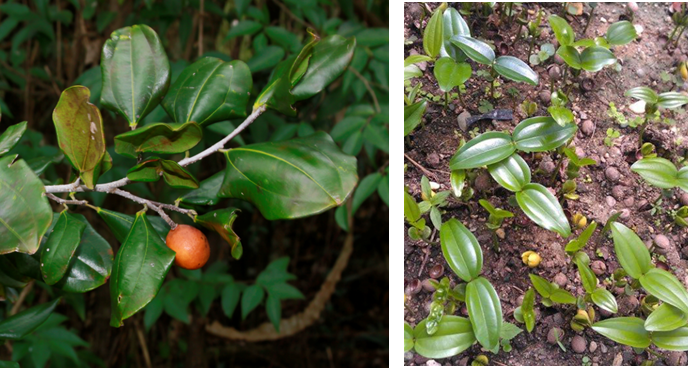
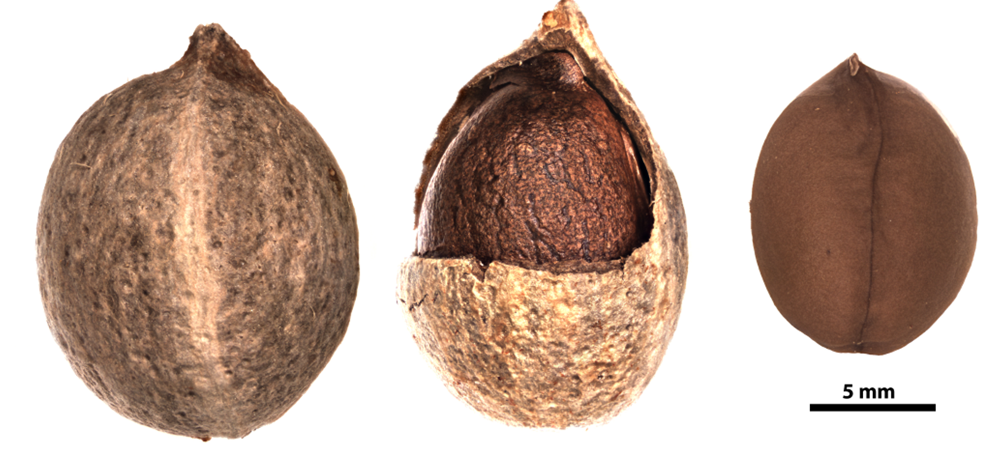

# Rhamnaceae {.unnumbered}

## *Ziziphus rhodoxylon* Urb.^[*Nomen conservandum* (nombre conservado)]  {#zizi .unnumbered}

::: {.blackbox data-latex=""}
**Pancho prieto, saona de gente, hoja ancha**
:::
<br>

**Nombre aceptado:** *Sarcomphalus rhodoxylon* (Urb.) Hauenschild

**Forma de vida:** árbol.

**Estatus biogeográfico:** nativa de las islas La Española y Cuba.

**Estado de conservación:** [Vulnerable (VU).]{style="color:red"}

Las poblaciones se han reducido drásticamente debido a la destrucción del hábitat.

**Usos:** comestible, maderable y melífera. La pulpa amarillenta de los frutos es dulce y posee buen sabor. Además la madera es usada en ebanistería y construcciones.


```{r,echo=FALSE,fig.cap="Detalle de rama con frutos (izq) y plántulas del vivero (der) de *Ziziphus rhodoxylon* (Foto: F. Jiménez y W. Encarnación JBN)",out.width = "100%"}

```

### DESCRIPCIÓN DE LA PLANTA {.unlisted -}

Árbol de hasta 16 m. Hojas elíptico-oblongas a obtusas de 8-13 cm. Las inflorescencias son axilares de 0.8 a 1.15 cm de color blanco con sépalos triangulares de 2.5 a 2.8 mm. La madera es blanca con el interior oscuro.

**Floración y fructificación:** flores y frutos de junio a septiembre.

**Distribución:** provincias de Elías Piña, Independencia,  Pedernales, Barahona, Azua, San José de Ocoa, San Cristóbal, La Altagracia, Hato Mayor, Samaná, María Trinidad Sánchez, Salcedo, Espaillat, Puerto Plata y Santiago.

**Hábitat:** bosque seco de transición a húmedo o muy húmedo a baja elevación.


```{r,echo=FALSE,fig.cap="Árbol de *Z. rhodoxylon* (Foto: F. Jiménez, JBN)",out.width = "100%"}
knitr::include_graphics("figures/zizi2.png")
```

### CONSERVACIÓN DE LAS SEMILLAS {.unlisted -}

**Colecta de semillas:** de octubre a diciembre.

**Procesamiento y manejo:** las semillas se extraen utilizando una despulpadora para eliminar la pulpa de los frutos con agua potable durante 30 segundos. Con un tamiz de 5.6 mm de diámetro se separan los residuos frotando suavemente con un tapón de hule o goma.

**Tolerancia a la deshidratación:** las semillas toleran la desecación con un porcentaje de germinación del 81.7 y por tanto son ortodoxas.

```{r,echo=FALSE,fig.cap="Fruto y semilla de *Z. rhodoxylon* (Foto: P. Gómez-Barreiro, RBG Kew)",out.width = "100%"}

```

### PROPAGACIÓN {.unlisted -}

**Dormancia y pretratamientos:** esta especie no requiere de ningún tratamiento previo para germinar.

**Germinación, siembra y propagación:** en condiciones de laboratorio, las semillas frescas presentan una viabilidad del 94% y una germinación del 86%. La germinación se inicia a los 21-27 días y finaliza después de 16-19 días.
Propagación y comportamiento en vivero: las semillas se siembran directamente en macetas (aprox. 30 cm) con un sustrato formado por tierra negra, aserrín y estiércol (2:1:1). Esta especie en suelos húmedos a semi-secos en roca caliza o arena. Se puede sembrar todo el año. Cuando las plantas están bien desarrolladas, es posible moverlas a macetas más grandes si es necesario, o directamente en el suelo, lo que permite el correcto desarrollo de las raíces. Se sugiere aplicar riego cada 2 días. La adición de limo o fertilizantes orgánicos puede mejorar el establecimiento y crecimiento. La siembra en campo se realiza entre el tercer y cuarto mes, cuando alcanza una altura de 25 a 30 cm.

**Propagación vegetativa:** no se han sometido a estudios de propagación vegetativa y no se conocen protocolos.


### COMERCIO {.unlisted -}

Aunque la madera es muy usada, no se conoce comercio registrado.