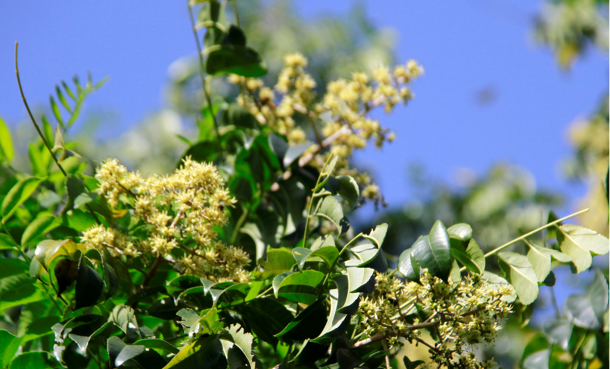
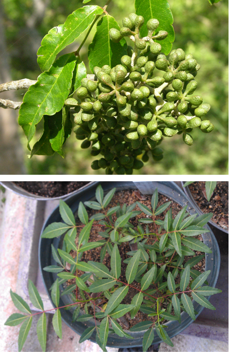
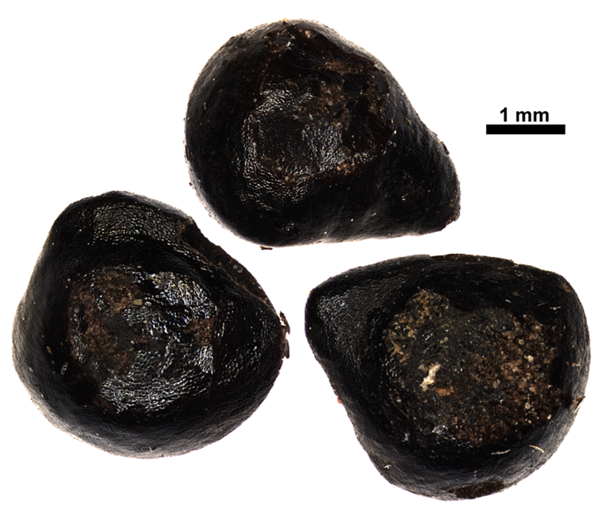

# Rutaceae {.unnumbered}

## *Zanthoxylum flavum* Vahl. {#zantho .unnumbered}

::: {.blackbox data-latex=""}
**Espinillo, espinilla**
:::
<br>
**Sinónimos:** *Fagara flava* (Vahl) Krug & Urb.

**Forma de vida:** árbol.

**Estatus biogeográfico:** nativa del Caribe, el sureste del Golfo de México y Florida.

**Estado de conservación:** [Vulnerable (VU).]{style="color:red"}

Las poblaciones se han reducido drásticamente debido al uso indiscriminado de su madera 

**Usos:** maderable, melífera y ornamental. Su madera es muy usada por su pulimiento y su olor. Se usa para la fabricación de muebles, en ebanistería y tornería. También es usado como árbol de sombra. 


```{r,echo=FALSE,fig.cap="Flores de *Zanthoxylum flavum* (Foto: F. Jiménez, JBN)",out.width = "100%"}

```

### DESCRIPCIÓN DE LA PLANTA {.unlisted -}

Árbol de hasta 12 m. Tronco de hasta 40 cm de diámetro. Las hojas son de 10 a 25 cm, imparipinnadas. Los folíolos miden de 3 a 11 cm, laceolados con puntos translúcidos. Las flores son terminals en panícula de 5 a 15 cm, cáliz de 1-1.4 mm de ancho y los pétalos son elíptico-oblongos de 2.5 a 4 mm. 

**Floración y fructificación:** flores de mayo a junio y frutos de enero a marzo.

**Distribución:** provincias de Independencia, Pedernales, Isla Beata, Azua, Peravia, Monte Plata, La Romana, La Altagracia, Isla Saona, Santiago, Santiago Rodríguez y Monte Cristi.

**Hábitat:** bosque seco de transición a húmedo.

```{r,echo=FALSE,fig.cap="Frutos (arriba) y plántula del vivero (abajo) de *Z. flavum* (Foto: F. Jiménez, y W. Encarnación, JBN)",out.width = "100%"}

```

### CONSERVACIÓN DE LAS SEMILLAS {.unlisted -}

**Colecta de semillas:** de octubre a enero.

**Procesamiento y manejo:** las semillas se extraen utilizando tamices con un diámetro de 2.36 mm para separarlas de los restos del fruto. Con una sopladora de flujo laminar se eliminan las partículas y residuos.

**Tolerancia a la deshidratación:** con la información obtenidaen el JBN, se cree que las semillas tienen tolerania intermedia a la desecación. Las semillas secas obtuvieron una germinación del 23.1%, pero las semillas húmedas tuvieron una germinación baja (38.5%). Se necesita más investigación sobre el comportamiento de almacenaje.


```{r,echo=FALSE,fig.cap="Semillas de *Z. flavum* (Foto: P. Gómez-Barreiro, RBG Kew)",out.width = "100%"}

```

### PROPAGACIÓN {.unlisted -}

**Dormancia y pretratamientos:** esta especie no requiere de ningún tratamiento previo para germinar.

**Germinación, siembra y propagación:** en condiciones de laboratorio, las semillas frescas presentan una viabilidad del 95% y una germinación del 93%. La germinación se inicia a los 20-23 días y finaliza a los 48 días.

**Propagación y comportamiento en vivero:** las semillas se siembran directamente en macetas (aprox. 30 cm) con un sustrato formado por tierra negra, aserrín y estiércol (2:1:1). Esta especie crece en suelos de roca caliza y arenosos con un sustrato rocoso. Se puede sembrar todo el año. Cuando las plantas están bien desarrolladas, es posible moverlas a macetas más grandes si es necesario, o directamente en el suelo, lo que permite el correcto desarrollo de las raíces. Se sugiere aplicar riego cada 2 días. La adición de limo o fertilizantes orgánicos puede mejorar el establecimiento y crecimiento. La siembra en campo se realiza entre el tercer y cuarto mes, cuando alcanza una altura de 25 a 30 cm.

**Propagación vegetativa:** no se han sometido a estudios de propagación vegetativa y no se conocen protocolos.

### COMERCIO {.unlisted -}

Existe la venta de frutos en los mercados populares.
