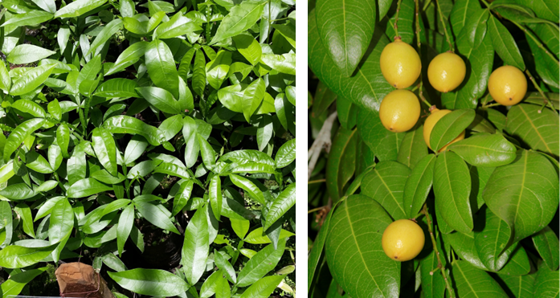
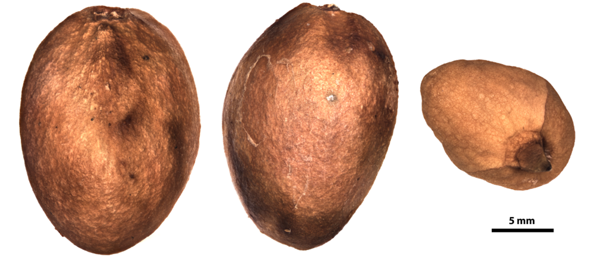

# Sapindaceae {.unnumbered}

## *Melicoccus jimenezii* (Alain) Acev.-Rodr.  {#meli .unnumbered}

::: {.blackbox data-latex=""}
**Cotoperí, limoncillo, rubio, jobo cigϋelo**
:::
<br>

**Sinónimos:** *Talisia jimenezii* Alain.

**Forma de vida:** árbol.

**Estatus biogeográfico:** endémica de República Dominicana.

**Estado de conservación:** [Peligro Crítico (PC/CR).]{style="color:red"} 

Las poblaciones se han reducido drásticamente debido a la destrucción del hábitat.

**Usos:** comestible y ornamental. Los frutos son comestibles y de color amarillo cuando están maduros, suculentos y muy azucarados. Se puede usar también para hacer sombra en patios. 


```{r,echo=FALSE,fig.cap="Plántulas en el vivero (izq) y frutos (der) de *Melicoccus jimenezii* (Foto: W. Encarnación y F. Jiménez, JBN)",out.width = "75%"}

```

### DESCRIPCIÓN DE LA PLANTA {.unlisted -}

Árbol de hasta 15 m con la copa piramidal e irregular. Hojas compuestas por 2-4 pares de 3 cm de largo. Flores en inflorescencias con corola blanca. El fruto es una drupa globose y la semilla está cubierta por un arilo blanco y dulce. Es una especie dioica y por tanto posee árboles macho y hembra. 

**Floración y fructificación:** flores de mayo a abril y frutos de  mayo a septiembre.

**Distribución:** provincias de San Pedro de Macorís y La Altagracia.

**Hábitat:** bosque costero húmedo y en roca caliza.


```{r,echo=FALSE,fig.cap="Árbol de *M. jimenezii* (Foto: P. Gómez-Barreiro, RBG Kew)",out.width = "100%"}
knitr::include_graphics("figures/melicoccus2.png")
```

### CONSERVACIÓN DE LAS SEMILLAS {.unlisted -}

**Colecta de semillas:** de junio a agosto.

**Procesamiento y manejo:** las semillas se extraen utilizando una despulpadora para eliminar la pulpa de los frutos con agua potable durante 30 segundos. Con un tamiz de 3.35 mm de diámetro se separan los residuos frotando suavemente con un tapón de hule o goma.

**Tolerancia a la deshidratación:** las semillas no toleran la desecación para la conservación, no se obtuvo germinación (0%) y por tanto se consideran recalcitrantes. Sin embargo, se puede almacenar a 15°C por cuatro meses sin pérdida significativa de viabilidad.


```{r,echo=FALSE,fig.cap="Semillas de *M. jimenezii* (Foto: P. Gómez-Barreiro, RBG Kew)",out.width = "100%"}

```

### PROPAGACIÓN {.unlisted -}

**Dormancia y pretratamientos:** esta especie no requiere de ningún tratamiento previo para germinar.

**Germinación, siembra y propagación:** en condiciones de laboratorio, las semillas frescas presentan una viabilidad del 95% y una germinación del 93%. La germinación se inicia a los 20-23 días y finaliza a los 48 días.

**Propagación y comportamiento en vivero:** las semillas se siembran directamente en macetas (aprox. 30 cm) con un sustrato formado por tierra negra, aserrín y estiércol (2:1:1). Esta especie crece en suelos de roca caliza y arenosos con un sustrato rocoso. Se puede sembrar todo el año. Cuando las plantas están bien desarrolladas, es posible moverlas a macetas más grandes si es necesario, o directamente en el suelo, lo que permite el correcto desarrollo de las raíces. Se sugiere aplicar riego cada 2 días. La adición de limo o fertilizantes orgánicos puede mejorar el establecimiento y crecimiento. La siembra en campo se realiza entre el tercer y cuarto mes, cuando alcanza una altura de 25 a 30 cm.

**Propagación vegetativa:** no se han sometido a estudios de propagación vegetativa y no se conocen protocolos.

### COMERCIO {.unlisted -}

Aunque la madera es muy usada, no se conoce comercio registrado.