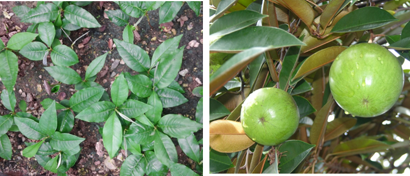
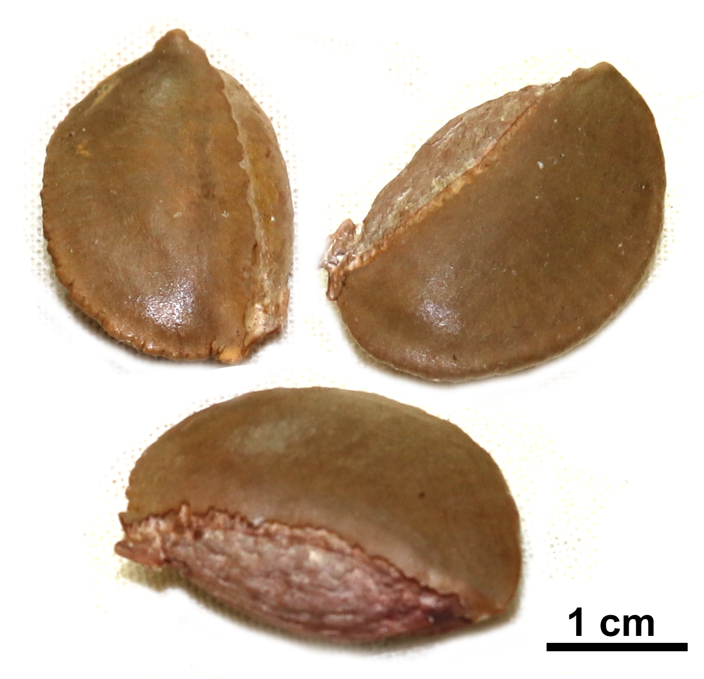
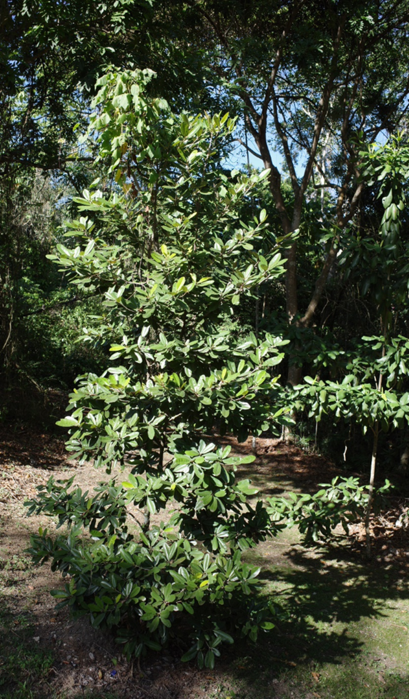
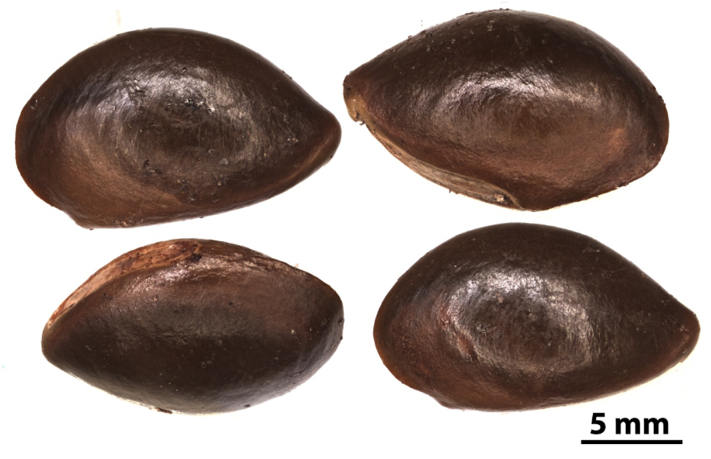

# Sapotaceae {.unnumbered}

## *Chrysophyllum cainito* L. {#chrys .unnumbered}

::: {.blackbox data-latex=""}
**Caimito, caimito grande**
:::
<br>

**Sinónimos:** *Cainito pomiferum* Tussac, *Chrysophyllum caurelum* Jacq., *C. jamaicense* Jacq.

**Forma de vida:** árbol.

**Estatus biogeográfico:** nativa de Panamá y naturalizada en Central América.

**Estado de conservación:** [En Peligro (EP/EN).]{style="color:red"} 

Las poblaciones se han reducido drásticamente debido a la destrucción del hábitat.

**Usos:** comestible, medicinal, ornamental, maderable y melífera. La madera se usa en contrucciones, es dura, pesada, fuerte y duradera. El fruto es comestible y muy apreciado, es astringente cuando está verde y laxante cuando está maduro. Se cree que las hojas tienen propiedades antidiabéticas.

```{r,echo=FALSE,fig.cap="Plántulas en el vivero (izq) y frutos (der) de *Chrysophyllum cainito* (Foto: W. Encarnación y F. Jiménez, JBN)",out.width = "100%"}

```
### DESCRIPCIÓN DE LA PLANTA {.unlisted -}

Árbol de hasta 30 m. Hojas elípticas u oblongas de 5-15 cm, ferrugíneo-sedosas en el envés. Glomérulos de flores axilares, con muchas flores. Corola verdosa o amarillenta de 3-5 mm, lóbulos ferrugineos. Fruto amarillo, verde o morado de 3-10 cm subgloboso.

**Floración y fructificación:** flores de junio a noviembre y frutos de octubre a mayo.

**Distribución:** provincias de Distrito Nacional, Duarte, Espaillat, La Altagracia, La Vega, María Trinidad Sánchez, Monseñor Nouel, Monte Plata, Perevia, Puerto Plata, Salcedo, Samaná, San Cristóbal, San José de Ocoa, Sánchez Ramirez y Santiago.

**Hábitat:** bosque húmedo a baja elevación.

```{r,echo=FALSE,fig.cap="Árbol de *C. cainito* (Foto: F. Jiménez, JBN)",out.width = "100%"}
knitr::include_graphics("figures/chrysophyllum2.png")
```

### CONSERVACIÓN DE LAS SEMILLAS {.unlisted -}

**Colecta de semillas:** de febrero a mayo.

**Procesamiento y manejo:** las semillas se extraen utilizando una despulpadora para eliminar la pulpa de los frutos con agua potable durante 30 segundos. Con un tamiz de 5.6 mm de diámetro se separan los residuos frotando suavemente con un tapón de hule o goma.

**Tolerancia a la deshidratación:** las semillas no toleran la desecación para la conservación, se obtuvo un porcentaje de germinación de 3.8 y se consideran recalcitrantes. Sin embargo, se puede almacenar a 5°C por seis meses sin pérdida significativa de viabilidad.

```{r,echo=FALSE,fig.cap="Semillas de *C. cainito* (Foto: W. Encarnación, JBN)",out.width = "100%"}

```

### PROPAGACIÓN {.unlisted -}

**Dormancia y pretratamientos:** esta especie no requiere de ningún tratamiento previo para germinar.

**Germinación, siembra y propagación:** en condiciones de laboratorio, las semillas frescas presentan una viabilidad del 96% y una germinación del 85%. La germinación se inicia a los 13-17 días y finaliza a los 25 días.

**Propagación y comportamiento en vivero:** las semillas se siembran directamente en macetas (aprox. 30 cm) con un sustrato formado por tierra negra, aserrín y estiércol (2:1:1) o en camas con arena de 1.4 mm. Esta especie es muy exigente en términos de humedad del suelo y requiere suelos húmedos y muy húmedos. Se puede sembrar todo el año. Cuando las plantas están bien desarrolladas, es posible moverlas a macetas más grandes si es necesario, o directamente en el suelo, lo que permite el correcto desarrollo de las raíces. Se sugiere aplicar riego cada 2 días. La adición de limo o fertilizantes orgánicos puede mejorar el establecimiento y crecimiento. La siembra en campo se realiza entre el tercer y cuarto mes, cuando alcanza una altura de 30 a 40 cm.

**Propagación vegetativa:** se puede propagar por esquejes y acodos.


### COMERCIO {.unlisted -}

Existe la venta de frutos en los mercados populares.

## *Manilkara valenzuelana* (A.Rich.) T.D. Penn. {#manilkara .unnumbered}

::: {.blackbox data-latex=""}
**Zapotillo, nisperillo, batalá, sapotille marrón**
:::
<br>

**Sinónimos:** *Manilkara albescens* (Griseb.) Cronquist, *Mimusops albescens* (Griseb.) Baill.

**Forma de vida:** árbol.

**Estatus biogeográfico:** nativa de Cuba, Puerto Rico y La Española.

**Estado de conservación:** [En Peligro (EP/EN).]{style="color:red"}

Las poblaciones se han reducido drásticamente debido al uso indiscriminado de su madera y la destrucción de su hábitat.

**Usos:** maderable, su madera se ha usado para diferentes tipos de construcciones como traviesas, para leña, carbón, postes o empalizadas. También para construcciones navales y horcones.

```{r,echo=FALSE,fig.cap="Detalle de las ramas (izq) y frutos (der) de *Manilkara valenzuelana* (Foto: P. Gómez Barreiro, RBG Kew y F. Jiménez, JBN)",out.width = "100%"}
knitr::include_graphics("figures/manilkara1.png")
```

### DESCRIPCIÓN DE LA PLANTA {.unlisted -}

Árbol de hasta 20 m. Hojas elípticas a elíptico-oblongas redondeadas, agudas o acuminadas en el ápice y en el envés tienen una pubescencia serícea muy fina, pálida o rojiza. De 2 a 8 flores en las axilas o en nudos defoliados. Sépalos de 4-5 mm seríceo-tomentosos, corola de 6-6.5 mm. Fruto globoso de 12-16 mm de color marrón, con 1-2 semillas de 10-12 mm, con una pestaña ventral conspicua.

**Floración y fructificación:** flores y frutos desde octubre a febrero.

**Distribución:** en la isla La Española (República Dominicana y Haití).

**Hábitat:** bosque húmedo a baja y mediana elevación.

```{r,echo=FALSE,fig.cap="Árbol joven de *M. valenzuelana* (Foto: P. Gómez Barreiro, RBG Kew)",out.width = "100%"}

```

### CONSERVACIÓN DE LAS SEMILLAS {.unlisted -}

**Colecta de semillas:** de noviembre a enero.

**Procesamiento y manejo:** las semillas se extraen utilizando una despulpadora para eliminar la pulpa de los frutos con agua potable durante 30 segundos. Con un tamiz de 3.35 mm de diámetro se separan los residuos frotando suavemente con un tapón de hule o goma.

**Tolerancia a la deshidratación:** las semillas no toleran la desecación para la conservación, no se obtuvo germinación (0%) y por tanto se consideran recalcitrantes. Sin embargo, se puede almacenar a 10°C (65% humedad) por cuatro meses sin pérdida significativa de viabilidad.

```{r,echo=FALSE,fig.cap="Semillas de *M. valenzuelana* (Foto: P. Gómez Barreiro, RBG Kew)",out.width = "100%"}

```

### PROPAGACIÓN {.unlisted -}

**Dormancia y pretratamientos:** esta especie no requiere de ningún tratamiento previo para germinar.

**Germinación, siembra y propagación:** en condiciones de laboratorio, las semillas frescas presentan una viabilidad del 97% y una germinación del 91%. La germinación comienza a los 14-17 días y finaliza a los 30 días.

**Propagación y comportamiento en vivero:** las semillas se siembran directamente en macetas (aprox. 30 cm) con un sustrato formazo por tierra negra, aserrín y estiércol (2:1:1) o en camas con arena de 1.4 mm. Esta especie es muy exigente en términos de humedad del suelo y requiere suelos húmedos y muy húmedos, de roca caliza y arcillosos. Se puede sembrar todo el año. Cuando las plantas están bien desarrolladas, es posible moverlas a macetas más grandes si es necesario, o directamente en el suelo, lo que permite el correcto desarrollo de las raíces. Se sugiere aplicar riego cada 2 días. La adición de limo o fertilizantes orgánicos puede mejorar el establecimiento y crecimiento. La siembra en campo se realiza entre los meses tercer y cuarto, cuando alcanza una altura de 30 a 35 cm.

**Propagación vegetativa:** se puede propagar por acodos.

### COMERCIO {.unlisted -}

Existe la venta de madera para diferentes usos.


