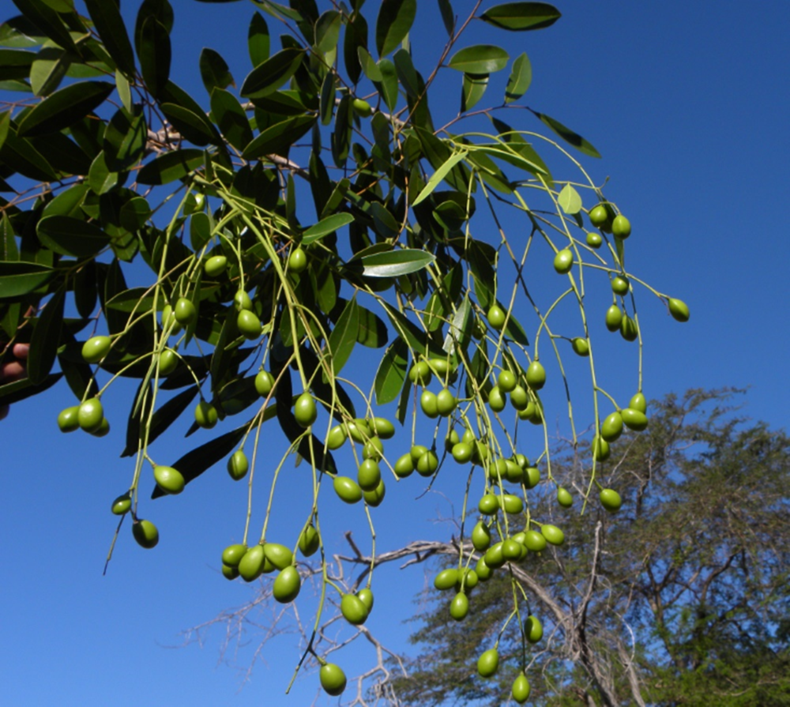
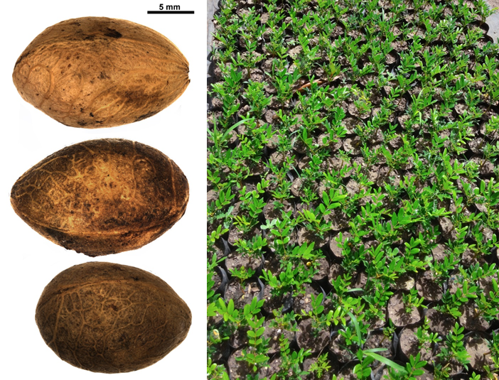

# Simaroubaceae {.unnumbered}

## *Simarouba berteroana* Krug & Urb. {#simarouba .unnumbered}

::: {.blackbox data-latex=""}
**Aceituna, daguilla, Juan Primero, olivo**
:::
<br>

**Forma de vida:** árbol.

**Estatus biogeográfico:** endémica de La Española.

**Estado de conservación:** [Vulnerable (VU).]{style="color:red"} 

Las poblaciones se han reducido drásticamente debido a la destrucción de su hábitat.

**Usos:** medicinal, maderable y frutal. La madera es usada para puertas y trabajos de interior. Aunque la corteza y las raíces son amargas, el té es considerado como un tónico y antidisentérico.

```{r,echo=FALSE,fig.cap="Frutos de *Simarouba berteroana* (Foto: F. Jiménez, JBN)",out.width = "100%"}

```

### DESCRIPCIÓN DE LA PLANTA {.unlisted -}

Árbol delgado de hasta más de 15 m. La corteza es gris-parduzca y tiene 7 folíolos, los superiores son lanceolados, obtusos de 8-10 cm, y los inferiores más cortos oblongos y obovados. Los frutos son en racimos simples, lóbulos del cáliz semi-ovales o suborbiculares, obtusos. La madera es blanca.

**Floración y fructificación:** flores de enero a julio y frutos de febrero a septiembre.

**Distribución:** provincias de Azua, Barahona, Independencia, Isla Beata, La Altagracia, Pedernales y Peravia.

**Hábitat:** bosque seco y semihúmedo a baja elevación.

```{r,echo=FALSE,fig.cap="Árbol de *S. berteroana* (Foto: F. Jiménez, JBN)",out.width = "100%"}
knitr::include_graphics("figures/simarouba2.png")
```

### CONSERVACIÓN DE LAS SEMILLAS {.unlisted -}

**Colecta de semillas:** de mayo a julio.

**Procesamiento y manejo:** las semillas se extraen utilizando una despulpadora para eliminar la pulpa de los frutos con agua potable durante 30 segundos. Luego se separan los residuos en tamices de 5.6 mm de diámetro, frotando suavemente con un tapón de goma o hule.

**Tolerancia a la deshidratación:** con la información obtenidaen el JBN, se cree que las semillas tienen tolerania intermedia a la desecación. El lote usado en el laboratorio tenía porcentajes de germinación bajos (57.7%) y se resalta la necesidad de realizar más investigación sobre el comportamiento de almacenaje.

```{r,echo=FALSE,fig.cap="Semillas (izq) y plántulas de vivero (der) de *S. berteroana* (Foto: P. Gómez Barreiro, RBG Kew y W. Encarnación, JBN)",out.width = "100%"}

```


### PROPAGACIÓN {.unlisted -}

**Dormancia y pretratamientos:** las semillas limpias se sumergen en agua durante un día.

**Germinación, siembra y propagación:** en condiciones de laboratorio, las semillas frescas presentan una viabilidad del 95% y una germinación del 87%. La germinación empieza entre los 14-21 días y finaliza a los 27-34 días.

**Propagación y comportamiento en vivero:** las semillas se siembran directamente en macetas (aprox. 30 cm) con sustrato formado por tierra negra, aserrín y estiércol (2:1:1) o en camas con arena de 1.4 mm. Esta especie es muy exigente en términos de humedad del suelo y requiere suelos de húmedos a secos cercanos a la costa normalmente arenosos y arcillosos. Se puede sembrar todo el año. Cuando las plantas están bien desarrolladas, es posible moverlas a macetas más grandes si es necesario, o directamente en el suelo, lo que permite el correcto desarrollo de las raíces. Se sugiere aplicar riego cada día. La adición de limo o fertilizantes orgánicos puede mejorar el establecimiento y crecimiento. La siembra en campo se realiza entre el segundo o tercer mes, cuando alcanza una altura de 30 a 40 cm.

**Propagación vegetativa:** no se han sometido a estudios de propagación vegetativa, pero algunas estacas pueden retoñar.

### COMERCIO {.unlisted -}

Aunque la madera es muy usada, normalmente se extrae directamente del medio silvestre y no se registra comercio.

