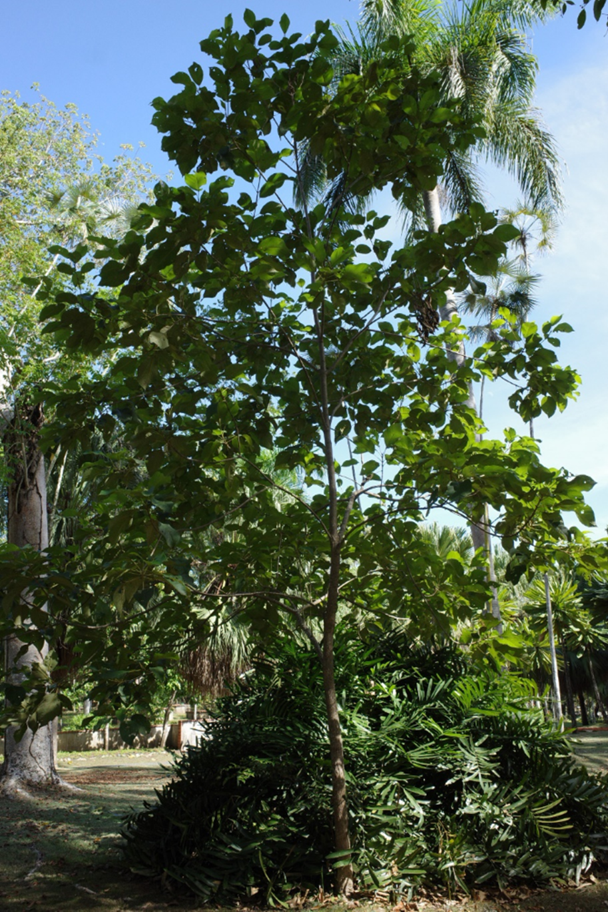
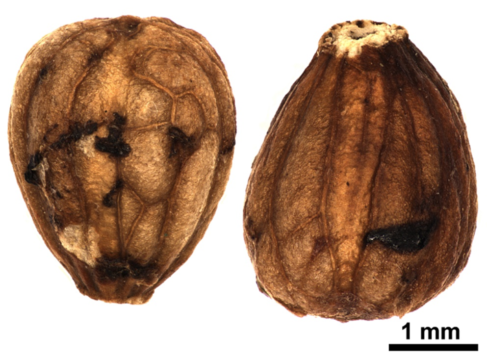

# Verbenaceae {.unnumbered}

## *Petitia domingensis* Jacq. {#petitia .unnumbered}

::: {.blackbox data-latex=""}
**Capá blanco, capá de sabana, capaz, guazumilla**
:::
<br>

**Sinónimos:** *Callicarpa cinerea* A.Rich., *Petitia poeppigii* Schauer, *Premna reticulata* Juss.

**Forma de vida:** árbol.

**Estatus biogeográfico:** nativa del Caribe y Florida.

**Estado de conservación:** [Vulnerable (VU).]{style="color:red"} 

Las poblaciones se han reducido drásticamente debido a la destrucción de su hábitat principalmente para establecer la ganadería.

**Usos:** maderable y melífera. La madera se usa para construcción y ebanistería y carpintería rural. 

```{r,echo=FALSE,fig.cap="Plántulas en el vivero (izq) y frutos (der) de *Petitia domingensis* (Foto: W. Encarnación y F. Jiménez, JBN)",,fig.show="hold", out.width = "49%"}
library(magick)
img1 <- image_read("figures/petitia1_1.png")
img2 <- image_read("figures/petitia1_2.png")
petitia1_1_border <- image_border(img1, "white", "5x0")
petitia1_2_border <- image_border(img2, "white", "5x0")
image_write(petitia1_1_border, "figures/petitia1_1_border.png")
image_write(petitia1_2_border, "figures/petitia1_2_border.png")
knitr::include_graphics(c("figures/petitia1_1_border.png","figures/petitia1_2_border.png"))
```

### DESCRIPCIÓN DE LA PLANTA {.unlisted -}

Árbol de hasta 22 m. Partes tiernas vellosas de color marrón. Hojas elíptico-oblongas a elíptico-lanceoladas de 7-15 cm, agudas a acuminadas. Flores fragantes y muy abundantes, cáliz de 1.5 cm de diám. Fruto en drupas casi negras cuando maduran, globosas de 4-5 mm.

**Floración y fructificación:** flores y frutos durante casi todo el año.

**Distribución:** común en toda la isla

**Hábitat:** bosque húmedo y de transición a húmedo a baja y mediana elevación.

```{r,echo=FALSE,fig.cap="Árbol de *P. domingensis* (Foto: P. Gómez Barreiro, RBG Kew)",out.width = "100%"}

```

### CONSERVACIÓN DE LAS SEMILLAS {.unlisted -}

**Colecta de semillas:** durante casi todo el año.

**Procesamiento y manejo:** las semillas se extraen de los frutos usando una despulpadora con agua potable durante 30 segundos. Luego se separan los residuos en tamices de 1.4 mm de diámetro, frotantdo suavemente con un tapón de goma o hule.

**Tolerancia a la deshidratación:** en el JBN no se han obtenido los datos todavía pero según la literatura esta especie tiene tolerancia intermedia a la desecación.

```{r,echo=FALSE,fig.cap="Semillas de *P. domingensis* (Foto: P. Gómez Barreiro, RBG Kew)",out.width = "100%"}

```

### PROPAGACIÓN {.unlisted -}

**Dormancia y pretratamientos:** las semillas limpias se sumergen en agua durante un día.

**Germinación, siembra y propagación:** en condiciones de laboratorio, las semillas frescas presentan una viabilidad del 91% y una germinación del 84%. La germinación se inicia entre los 18-23 días y finaliza a los 5-7 días después.

**Propagación y comportamiento en vivero:** las semillas se siembran directamente en macetas (aprox. 30 cm) con sustrato formado por tierra negra, aserrín y estiércol (2:1:1) o en camas con arena de 1.4 mm. No es muy exigente en términos de humedad del suelo para germinar y requiere suelos húmedos y de transición de seco a húmedo, pobre en nutrientes y materia orgánica de piedra caliza, carbonato húmico, ferralíticos rojos superficiales y en áreas de serpentinas. Se puede sembrar todo el año. Cuando las plantas están bien desarrolladas, es posible moverlas a macetas más grandes si es necesario, o directamente en el suelo, lo que permite el correcto desarrollo de las raíces. Se sugiere aplicar riego cada 1-2 días. La adición de limo o fertilizantes orgánicos puede mejorar el establecimiento y crecimiento. La siembra en campo se realiza entre los meses tercer y cuarto, cuando alcanza una altura de 30 a 40 cm.

**Propagación vegetativa:** no se han sometido a estudios de propagación vegetativa y no se conocen protocolos.

### COMERCIO {.unlisted -}

La madera tiene una gran demanda y se vende para ebanistería y carpintería debido a su calidad y buen pulido.


