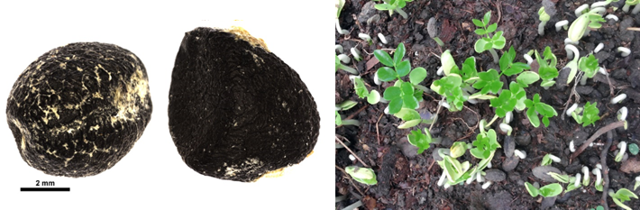

# Zygophyllaceae {.unnumbered}

## *Guaiacum officinale* L. {#guaiacum .unnumbered}

::: {.blackbox data-latex=""}
**Guayacán, guayacán colorado, guayacán prieto**
:::
<br>

**Sinónimos:** *Guaiacum breynii* Spreng., *Guaiacum bijugum* Stokes.

**Forma de vida:** árbol.

**Estatus biogeográfico:** nativa del Caribe. Florida y el norte de América del Sur.

**Estado de conservación:** [Vulnerable (VU).]{style="color:red"} 

Antiguamente, se exportó madera durante siglos, pero sus poblaciones se han reducido drásticamente debido a la tala y la destrucción de su hábitat.

**Usos:** maderable, medicinal, melífera y ornamental. La madera tiene propiedades lubricantes; es usada en trabajos especiales, como chumaceras para ejes hélices de buques, rodillos, mazas, poleas y trabajos al torno. Se conoce en farmacopea como Linum vitae por sus propiedades estimulantes y sudoríficas. La resina (guayacol) de color marrón rojizo, cambiando a azul verde azuloso, es también usada en medicamentos para fortificar las encías o calmar los dolores dentales. El aserrín de la madera, mezclado con alcohol se ha usado contra el reuma. El té de la madera se ha utilizado contra sífilis, las enfermedades de la piel entre otras.

```{r,echo=FALSE,fig.cap="Árbol de *Guaicum officinale* (Foto: F. Jiménez, JBN)",out.width = "100%"}

```

### DESCRIPCIÓN DE LA PLANTA {.unlisted -}

Árbol de hasta 10 m, a veces más alto; hojas de 3-9 cm, folíolos 4-6, mayormente 4, ovales u obovados de 1.5 cm, redondeados. Sépalos aovados a orbiculares de 5-7 mm, carpelares, obcodiformes, de 15-20 mm, anaranjados o amarillos. La madera es fuerte, duradera y resinosa.

**Floración y fructificación:** flores de junio a octubre y frutos de octubre a febrero.

**Distribución:** provincias de Azua, Bahoruco, Barahona, Elías Piña, Independencia, La Altagracia, La Romana, Monte Cristi, Pedernales, Peravia, San Cristóbal, San Juan, San Pedro de Macorís, Santiago y Santiago Rodríguez.

**Hábitat:** bosque seco de transición a húmedo y bosque húmedo (suelo con sequía fisiológica).

```{r,echo=FALSE,fig.cap="Flor (izq) y fruto (der) de *G. officinale* (Foto: F. Jiménez, JBN)",out.width = "100%"}

```

### CONSERVACIÓN DE LAS SEMILLAS {.unlisted -}

**Colecta de semillas:** de mayo a octubre.

**Procesamiento y manejo:** las semillas se extraen de los frutos mecánicamente utilizando una despulpadora con agua potable durante 30 segundos. Finalmente, se separan los residuos con un tamiz de 2.36 mm de diámetro, frotando ligeramente con un tapón de goma.

**Tolerancia a la deshidratación:** las semillas secas obtuvieron un porcentaje de germinación del 90.9%, por tanto, tienen tolerancia a la desecación y son ortodoxas.

```{r,echo=FALSE,fig.cap="Semillas (izq) y plántulas (der) de *G. officinale* (Foto: P. Gómez Barreiro, RBG Kew y W. Encarnación, JBN)",out.width = "100%"}

```

### PROPAGACIÓN {.unlisted -}

**Dormancia y pretratamientos:** las semillas limpias se sumergen en agua durante un día antes de la siembra.

**Germinación, siembra y propagación:** en condiciones de laboratorio, las semillas frescas presentan una viabilidad del 98% y una germinación del 100%. La germinación comienza a los 12-16 días y finaliza a los 26-31 días.

**Propagación y comportamiento en vivero:** las semillas se siembran directamente en macetas (aprox. 30 cm) con una mezcla de tierra negra, aserrín y estiércol (2:1:1) como sustrato, o en camas con arena 1.4 mm. No es muy exigente en términos de humedad del suelo para germinar, requiere suelos rocosos, arcillosos y arenosos, pobres en nutrientes y materia orgánica. Se puede sembrar todo el año. Cuando las plantas están bien desarrolladas, es posible moverlas a macetas más grandes si es necesario, o directamente en el suelo, lo que permite el correcto desarrollo de las raíces. Se sugiere aplicar riego todos los días para un buen desarrollo de las hojas y crecimiento general de la planta. La siembra en campo se realiza a los seis o siete meses, cuando alcanza una altura de 30-40 cm.

**Propagación vegetativa:** no se han sometido a estudios de propagación vegetativa y no se conocen protocolos, pero parece que se puede reproducir por estacones.

### COMERCIO {.unlisted -}

Existe la venta de artesanía en los mercados populares y como planta ornamental. Antiguamente también se vendía la madera.